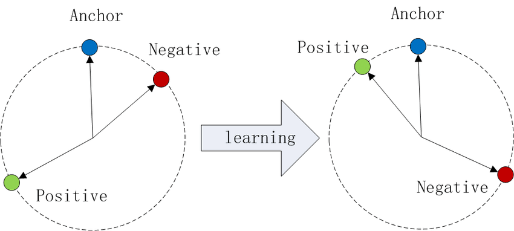
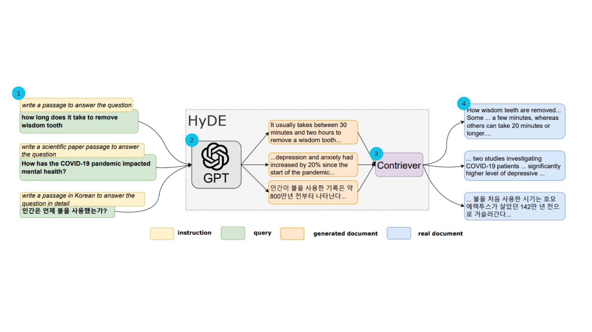
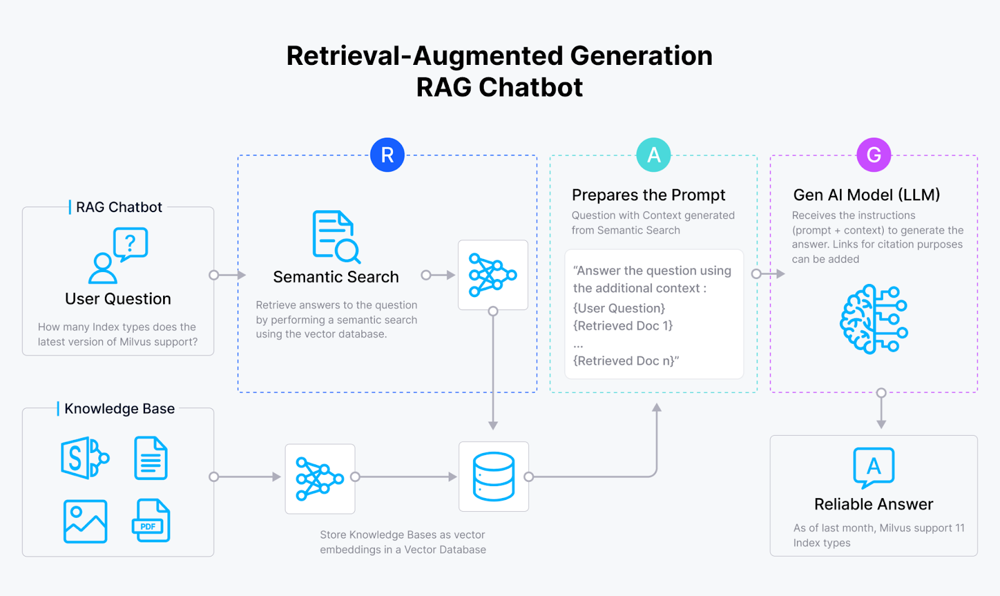

# 使用假设性文档嵌入（HyDE）改进信息检索和 RAG
# Improving Information Retrieval and RAG with Hypothetical Document Embeddings (HyDE)

近年来，由神经网络驱动的密集检索器已成为基于词频的传统信息检索方法的现代替代品。这些模型在有大量训练集可用的数据集和任务上取得了最先进的结果。然而，由于使用限制，通常没有大量的标记数据集，或者这些数据集不适合，因为它们通常不包括现实世界搜索场景的全部范围，限制了它们的有效性。

In recent years, neural network-driven dense retrievers have become modern alternatives to traditional information retrieval methods based on word frequency. These models have achieved state-of-the-art results on datasets and tasks where large training sets are available. However, due to usage limitations, there are often no large labeled datasets, or these datasets are unsuitable because they typically don't include the full scope of real-world search scenarios, limiting their effectiveness.

因此，零样本方法旨在通过使检索系统能够在不依赖显式相关性监督的情况下跨任务和领域泛化，从而超越这些限制。在没有针对特定任务数据的先前训练的情况下执行文档检索可以最小化训练开销并降低数据集创建的成本。

Therefore, zero-shot methods aim to overcome these limitations by enabling retrieval systems to generalize across tasks and domains without relying on explicit relevance supervision. Performing document retrieval without prior training on task-specific data can minimize training overhead and reduce the cost of dataset creation.

本博客将介绍一种零样本检索方法——假设性文档嵌入（HyDE），它的表现超过了无监督和微调的密集检索器。稍后，博客还将介绍如何使用 OpenAI 和 Milvus 向量数据库实现 HyDE 方法。

This blog will introduce a zero-shot retrieval method—Hypothetical Document Embeddings (HyDE)—which outperforms unsupervised and fine-tuned dense retrievers. Later, the blog will also introduce how to implement the HyDE method using OpenAI and the Milvus vector database.

HyDE，或假设性文档嵌入，是一种使用"假"（假设性）文档来改进大型语言模型（LLM）生成的答案的检索方法。

HyDE, or Hypothetical Document Embeddings, is a retrieval method that uses "fake" (hypothetical) documents to improve the answers generated by Large Language Models (LLMs).

具体来说，HyDE 使用一个 LLM（原始实现中使用了 GPT-3.5）来创建一个查询的假设性答案。这个答案被转换成一个向量嵌入，并放置在真实文档的相同空间中。当您搜索某物时，系统会找到与这个假设性答案最匹配的真实文档，即使它们与您搜索的确切词语不匹配。HyDE 的目标是捕捉您查询背后的意图，确保检索到的文档在上下文中相关。

Specifically, HyDE uses an LLM (GPT-3.5 was used in the original implementation) to create a hypothetical answer to a query. This answer is converted into a vector embedding and placed in the same space as real documents. When you search for something, the system finds real documents that best match this hypothetical answer, even if they don't match the exact words you searched for. HyDE aims to capture the intent behind your query, ensuring that the retrieved documents are contextually relevant.

HyDE 检索提供了几个好处：

HyDE retrieval provides several benefits:

*   零样本检索：它有效地检索相关文档，而不需要相关标签或事先在特定数据集上的训练。
*   生成方法：生成假设性文档可以捕捉相关性模式，即使细节不准确。
*   多功能性：它在各种任务中表现良好，如网络搜索、问题回答和事实验证，并支持多种语言。

*   Zero-shot retrieval: It effectively retrieves relevant documents without requiring relevant labels or prior training on specific datasets.
*   Generative approach: Generating hypothetical documents can capture relevance patterns even if the details are inaccurate.
*   Versatility: It performs well across various tasks such as web search, question answering, and fact verification, and supports multiple languages.

接下来的部分将详细说明 HyDE 的工作原理。

The following sections will explain how HyDE works in detail.

在深入了解 HyDE 的工作方式之前，让我们看看它解决的问题：

Before diving into how HyDE works, let's look at the problem it solves:

问题：在传统的密集检索方法中，我们通常将查询和文档编码成单向量表示——嵌入。然后，我们通过在高维向量空间中搜索近似最近邻（ANN）来进行数据检索。

Problem: In traditional dense retrieval methods, we typically encode queries and documents into single-vector representations—embeddings. Then, we perform data retrieval by searching for approximate nearest neighbors (ANN) in a high-dimensional vector space.

通常基于神经网络的密集检索模型，如基于变换器的编码器，旨在为语义相关的实体（如查询和文档）产生固定维度的向量。使用像孪生网络这样的架构，这些模型被训练以最小化相似对（正例）之间的距离，并最大化不相似对（负例）之间的距离，通常采用三元组损失。这是三元组损失公式：

Dense retrieval models commonly based on neural networks, such as transformer-based encoders, are designed to produce fixed-dimensional vectors for semantically related entities (such as queries and documents). Using architectures like siamese networks, these models are trained to minimize the distance between similar pairs (positive examples) and maximize the distance between dissimilar pairs (negative examples), typically using triplet loss. This is the triplet loss formula:


_三元组损失公式_
_Triplet Loss Formula_

其中 a 是锚点，p 是正例，n 是负例，d 是距离函数，λ 是确保负例之间足够距离的边际值。

Where a is the anchor, p is the positive example, n is the negative example, d is the distance function, and λ is the margin value that ensures sufficient distance between negative examples.



_图 1：在余弦相似性中的三元组损失说明_
_Figure 1: Illustration of Triplet Loss in Cosine Similarity_

这些密集检索系统的主要挑战是需要大量的标记数据集，通常是查询和文档对（q,d），这是劳动和成本密集型的。另一个挑战是单向量表示无法捕捉查询和文档在相关性匹配中的不同方面。

The main challenges of these dense retrieval systems are the need for large labeled datasets, typically query-document pairs (q,d), which are labor and cost-intensive. Another challenge is that single-vector representations cannot capture the different aspects of queries and documents in relevance matching.

解决方案：HyDE 解决方案结合了生成性大型语言模型（LLM）和对比编码器的优势。HyDE 核心是使用大型语言模型生成对查询的假设性答案；然后这些答案被嵌入到向量空间中。这种方法允许根据它们与生成的假设性文档的相似性有效地检索实际文档，绕过了对特定任务训练数据的需求。让我们看看架构并逐步了解它：

Solution: The HyDE solution combines the advantages of generative Large Language Models (LLMs) and contrastive encoders. At the core of HyDE is using a large language model to generate hypothetical answers to queries; these answers are then embedded into vector space. This approach allows for the effective retrieval of actual documents based on their similarity to the generated hypothetical documents, bypassing the need for task-specific training data. Let's look at the architecture and understand it step by step:



_图 2：HyDE 模型说明_
_Figure 2: HyDE Model Illustration_

这里是架构的分解：

Here is a breakdown of the architecture:

查询输入：

Query Input:

*   这个过程从将查询输入到遵循指令的大型语言模型（LLM），如 GPT-3.5 开始。
*   模型被指示生成一个回答查询的假设性文档。

*   This process begins by inputting the query into a Large Language Model (LLM) that follows instructions, such as GPT-3.5.
*   The model is instructed to generate a hypothetical document that answers the query.

生成假设性文档：

Generating Hypothetical Document:

*   LLM 作为对查询的假设性答案生成一个文档。
*   这个生成的文档尽管可能包含事实错误，但捕捉了相关性的精髓。

*   The LLM generates a document as a hypothetical answer to the query.
*   This generated document, despite potentially containing factual errors, captures the essence of relevance.

嵌入假设性文档：

Embedding Hypothetical Document:

*   使用对比编码器将假设性文档编码成向量嵌入。
*   编码器通过删除不必要的细节并保留基本含义来简化文本。

*   The hypothetical document is encoded into vector embeddings using a contrastive encoder.
*   The encoder simplifies the text by removing unnecessary details and retaining the basic meaning.

搜索和检索：

Search and Retrieval:

*   使用假设性文档的向量嵌入在语料库中对预先编码的真实文档嵌入进行搜索。
*   根据它们与假设性文档向量的相似性检索文档。

*   Using the vector embeddings of the hypothetical document, search is performed on pre-encoded real document embeddings in the corpus.
*   Documents are retrieved based on their similarity to the hypothetical document vector.

按照这个过程，最相似的真实文档被返回为检索结果。

Following this process, the most similar real documents are returned as retrieval results.

接下来，让我们在 Python 中实现 HyDE。

Next, let's implement HyDE in Python.

我将这个指南分解为以下步骤：

I'll break down this guide into the following steps:

首先，我们导入必要的库并设置我们的环境。代码使用 OpenAI 库访问 GPT-3.5 API，作为我们的 LLM，并使用 pymilvus 与 Milvus 向量数据库交互，用于文档存储和相似性搜索。此外，我们导入了如 json 和 numpy 这样的标准库。

First, we import the necessary libraries and set up our environment. The code uses the OpenAI library to access the GPT-3.5 API as our LLM, and uses pymilvus to interact with the Milvus vector database for document storage and similarity search. Additionally, we import standard libraries such as json and numpy.

```python
from openai import OpenAI
from pymilvus import MilvusClient
import json
import numpy as np
```

Milvus 是一个针对十亿规模向量相似性搜索、存储和查询优化的向量数据库。在这里，我们连接到 Milvus 并创建一个新的集合 hyde_retrieval 来存储我们的文档嵌入。

Milvus is a vector database optimized for billion-scale vector similarity search, storage, and querying. Here, we connect to Milvus and create a new collection hyde_retrieval to store our document embeddings.

```python
# Set up OpenAI GPT-3.5
openai_client = OpenAI()
# Connect to Milvus
client = MilvusClient("milvus_demo.db")
```

```python
# Create a Milvus collection
if client.has_collection(collection_name="hyde_retrieval"):
    client.drop_collection(collection_name="hyde_retrieval")
client.create_collection(
    collection_name="hyde_retrieval",
    dimension=1536)
```

我们定义了一个虚拟语料库来演示检索过程。这个语料库包括几个样本文本。

We define a dummy corpus to demonstrate the retrieval process. This corpus includes several sample texts.

```python
# Dummy corpus of documents
corpus = [
    "It usually takes between 30 minutes and two hours to remove a wisdom tooth.",
    "The COVID-19 pandemic has significantly impacted mental health, increasing depression and anxiety.",
    "Humans have used fire for approximately 800,000 years.",
    "Milvus is a cloud based database for vector storage."
]
```

这一节定义了一个函数 get_embeddings，用于使用 OpenAI 的嵌入模型（text-embedding-ada-002）为语料库文档获取向量嵌入。这些嵌入对于基于向量的相似性搜索至关重要。请注意，原始的 HyDE 实现使用了 Contriever 模型进行嵌入。

This section defines a function get_embeddings that uses OpenAI's embedding model (text-embedding-ada-002) to obtain vector embeddings for corpus documents. These embeddings are crucial for vector-based similarity search. Note that the original HyDE implementation used the Contriever model for embedding.

```python
def get_embeddings(texts, model="text-embedding-ada-002"):
    response = openai_client.embeddings.create(
        input=texts,
        model=model
    )
    embeddings = [data.embedding for data in response.data]
    return embeddings
```

在定义了嵌入生成模块之后，我们将对语料库文档进行编码并将它们插入到 Milvus 中。

After defining the embedding generation module, we encode the corpus documents and insert them into Milvus.

```python
vectors = get_embeddings(corpus)
data = [
    {"id": i, "vector": vectors[i], "text": corpus[i]}
    for i in range(len(vectors))
]
client.insert(collection_name="hyde_retrieval", data=data)
```

我们创建了一个函数 generate_hypothetical_document，它利用 GPT-3.5 根据查询生成一个假设性文档。这个文档捕捉了查询的精髓，为相似性搜索提供了上下文。

We created a function generate_hypothetical_document that uses GPT-3.5 to generate a hypothetical document based on a query. This document captures the essence of the query and provides context for similarity search.

```python
# Function to generate a hypothetical document using GPT-3.5
def generate_hypothetical_document(query):
    response = openai_client.chat.completions.create(
        model="gpt-3.5-turbo-0125",
        messages=[{"role": "system", "content": "Write a document that answers the question:"},
        {"role": "user", "content": f"{query}"}],
        max_tokens=100
    )
    return response.choices[0].message.content
```

我们 HyDE 实现的核心涉及为给定查询生成一个假设性文档，嵌入此文档，并在 Milvus 中执行相似性搜索以检索语料库中最相关的真正文档。

The core of our HyDE implementation involves generating a hypothetical document for a given query, embedding this document, and performing similarity search in Milvus to retrieve the most relevant real documents from the corpus.

```python
# Function to perform HyDE-based retrieval
def hyde_retrieve(query):
    hypo_doc = generate_hypothetical_document(query)
    hypo_embedding = get_embeddings([hypo_doc])
    results = client.search(collection_name="hyde_retrieval", data=[hypo_embedding], limit=4)
    return [corpus[hit['id']] for hit in results[0]]
```

最后，我们用一个示例查询测试我们的实现并打印检索到的文档。

Finally, we test our implementation with an example query and print the retrieved documents.

```python
# Example query
query = "What is Milvus?"
retrieved_docs = hyde_retrieve(query)
print("Retrieved Documents:", retrieved_docs)
```

这是检索的结果：

This is the result of the retrieval:

```python
Retrieved Documents: ['Milvus is a cloud based database for vector storage.', 'The COVID-19 pandemic has significantly impacted mental health, increasing depression and anxiety.', 'Humans have used fire for approximately 800,000 years.', 'It usually takes between 30 minutes and two hours to remove a wisdom tooth.']
```

我们首先设置环境和 Milvus 向量数据库，定义我们的语料库，使用 OpenAI 的嵌入模型获取嵌入，使用 GPT-3.5 生成假设性文档，并执行相似性搜索以检索相关文档。这种方法通过生成上下文相关的假设性答案，有效地弥合了查询和文档检索之间的差距。

We first set up the environment and Milvus vector database, defined our corpus, obtained embeddings using OpenAI's embedding model, generated hypothetical documents using GPT-3.5, and performed similarity search to retrieve relevant documents. This approach effectively bridges the gap between queries and document retrieval by generating contextually relevant hypothetical answers.

检索增强生成（RAG）将生成性大型语言模型（LLM）与传统信息检索系统集成。这种方法允许 LLM 用自然语言生成有上下文信息的回答、解释或指令。一个基本的 RAG（包括像 Milvus 这样的向量数据库、一个嵌入模型和一个 LLM）通常更容易实现，但其在现实世界应用程序中的性能和准确性取决于优化检索元素。

Retrieval-Augmented Generation (RAG) integrates generative Large Language Models (LLMs) with traditional information retrieval systems. This approach allows LLMs to generate contextually informed answers, explanations, or instructions in natural language. A basic RAG (including a vector database like Milvus, an embedding model, and an LLM) is usually easier to implement, but its performance and accuracy in real-world applications depend on optimizing retrieval elements.



_图 3：RAG 的基本架构_
_Figure 3: Basic Architecture of RAG_

RAG 利用两个核心组件：一个生成器，通常是一个 LLM，和一个类似于向量数据库的检索器。以下是 HyDE 如何改进 RAG 流程的：

RAG utilizes two core components: a generator, typically an LLM, and a retriever, such as a vector database. Here's how HyDE improves the RAG process:

*   生成假设性文档：HyDE 的创新之处在于根据查询生成一个假设性文档，并基于此检索文档。因此，与其直接依赖于语料库中检索到的文档，HyDE 使用这个生成的文档来捕捉相关性的精髓。
*   回答难题：当遇到一个模糊或上下文模糊不清的问题时，得出一个精确的答案可能是棘手的。HyDE 通过 LLM 的帮助，用更多上下文丰富查询，从而改进了这一点。
*   优化文档查询：由于大多数数据库包含答案而不是问题，因此使用假设性答案作为文档的查询是有意义的。

*   Generating hypothetical documents: HyDE's innovation lies in generating a hypothetical document based on a query and retrieving documents based on this. Rather than directly relying on documents retrieved from the corpus, HyDE uses this generated document to capture the essence of relevance.
*   Answering difficult questions: When encountering a vague or contextually unclear question, deriving an accurate answer can be tricky. HyDE improves this by enriching the query with more context with the help of an LLM.
*   Optimizing document queries: Since most databases contain answers rather than questions, it makes sense to use hypothetical answers as queries for documents.

实验表明了在性能、鲁棒性和多功能性方面的改进：

Experiments have shown improvements in performance, robustness, and versatility:

*   改进性能：HyDE 在各种数据集和指标上一致性地超过了经典的 BM25 和无监督的 Contriever，例如 nDCG@10、召回率。
*   鲁棒性：即使在像 TREC DL19/20 这样有大量监督的任务上，HyDE 即使面对微调模型也保持竞争力。
*   多功能性：它在网络搜索和资源较少的任务上表现出色，为基线模型提供了显著的增益。
*   多语言能力：它在多种语言上显示出增强的结果，在韩语和日语等语言上超过了 mContriever。
*   效率：HyDE 在不需要大量微调的情况下提高了检索质量，使其成为各种检索任务的有效和高效选择。

*   Improved performance: HyDE consistently outperforms classic BM25 and unsupervised Contriever across various datasets and metrics, such as nDCG@10 and recall.
*   Robustness: Even on heavily supervised tasks like TREC DL19/20, HyDE remains competitive even against fine-tuned models.
*   Versatility: It performs well on web search and resource-scarce tasks, providing significant gains over baseline models.
*   Multilingual capability: It shows enhanced results across multiple languages, outperforming mContriever in languages like Korean and Japanese.
*   Efficiency: HyDE improves retrieval quality without requiring extensive fine-tuning, making it an effective and efficient choice for various retrieval tasks.

如果不了解其局限性，HyDE 在 RAG 流程中可能弊大于利。下一节将揭示这一点。

Without understanding its limitations, HyDE may do more harm than good in the RAG process. The next section will reveal this.

假设性文档检索带来了一些挑战和局限性。以下是其中的一些：

Hypothetical document retrieval brings some challenges and limitations. Here are some of them:

*   知识瓶颈：HyDE 生成的文档可能包含事实错误，并且不是真实的，这可能影响检索结果的准确性。例如，如果主题对语言模型来说是全新的，这种方法可能无效。它可能导致更频繁地生成不正确的信息。
*   多语言挑战：多语言检索对 HyDE 带来了几个额外的挑战。随着语言数量的增加，小尺寸的对比编码器会饱和。与此同时，生成性 LLM 面临相反的问题：对于资源不如英语或法语丰富的语言，高容量的 LLM 可能训练不足。

*   Knowledge bottleneck: Documents generated by HyDE may contain factual errors and are not real, which may affect the accuracy of retrieval results. For example, if the topic is new to the language model, this approach may be ineffective. It may lead to more frequent generation of incorrect information.
*   Multilingual challenges: Multilingual retrieval brings several additional challenges to HyDE. As the number of languages increases, small-sized contrastive encoders become saturated. Meanwhile, generative LLMs face the opposite problem: high-capacity LLMs may be under-trained for languages with fewer resources than English or French.

研究人员正在积极解决这些挑战，处理模糊查询，改进特定任务的指令，并探索将 HyDE 与微调编码器集成以实现更好的性能。其他关于零样本的研究涉及搜索代理和混合环境，专注于基于代理的查询优化和集成混合检索系统。

Researchers are actively addressing these challenges, handling ambiguous queries, improving task-specific instructions, and exploring the integration of HyDE with fine-tuned encoders to achieve better performance. Other zero-shot research involves search agents and hybrid environments, focusing on agent-based query optimization and integrated hybrid retrieval systems.

总结来说，让我们回顾一下讨论的关键点：

In summary, let's review the key points discussed:

*   HyDE 通过生成假设性文档实现零样本检索。
*   HyDE 结合了生成性 LLM 和对比编码器，以实现有效的检索。
*   HyDE 在各种任务上的表现超过了传统和一些微调模型。

*   HyDE achieves zero-shot retrieval by generating hypothetical documents.
*   HyDE combines generative LLMs and contrastive encoders to achieve effective retrieval.
*   HyDE outperforms traditional and some fine-tuned models across various tasks.

HyDE 通过优化文档查询和处理模糊问题来改进 RAG 流程。

HyDE improves the RAG process by optimizing document queries and handling ambiguous questions.

HyDE 的重要性对于自然语言处理（NLP）也很重要，因为它可以在没有事先训练或标签的情况下找到相关文档。它使用假设性文档捕捉相关性，并在多种语言的网络搜索和问题回答等任务中表现出色。本文还介绍了使用 OpenAI 和 Milvus 在 Python 中实现 HyDE 的简单逐步指南。

The importance of HyDE for Natural Language Processing (NLP) is also significant because it can find relevant documents without prior training or labels. It captures relevance using hypothetical documents and performs excellently in tasks such as web search and question answering in multiple languages. This article also introduced a simple step-by-step guide to implementing HyDE using OpenAI and Milvus in Python.

注：本文为AI翻译，[查看原文](https://zilliz.com/learn/improve-rag-and-information-retrieval-with-hyde-hypothetical-document-embeddings)