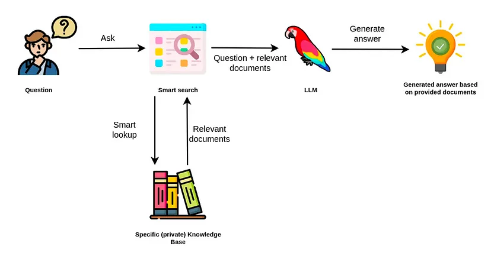
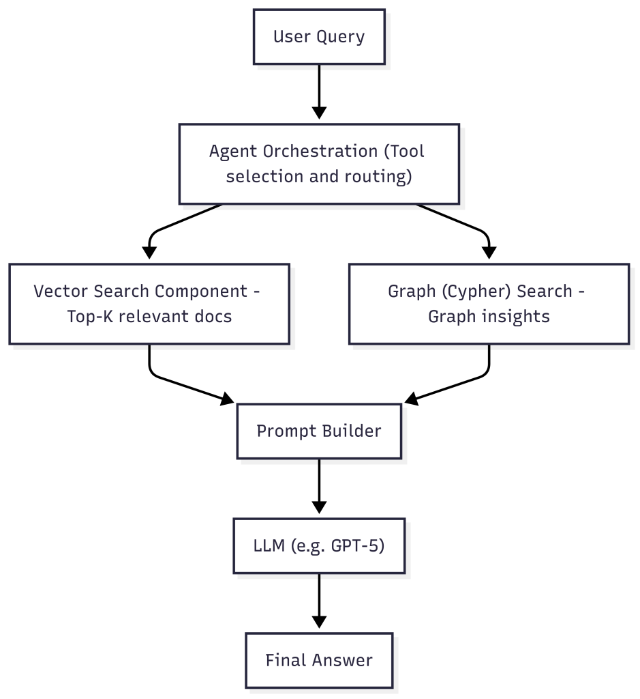
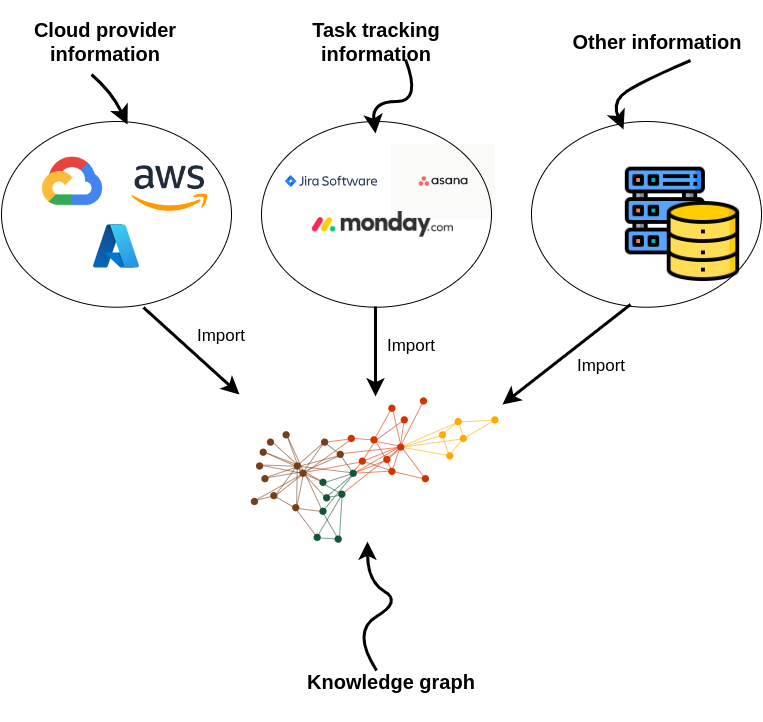
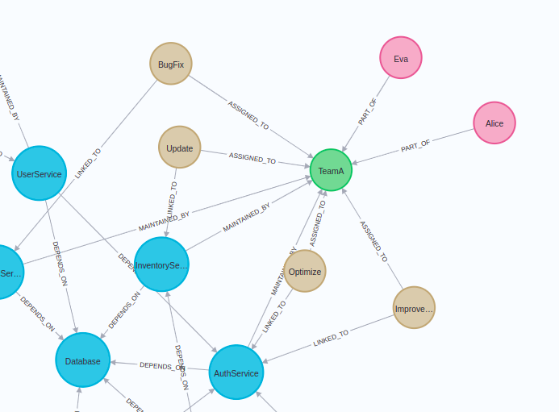
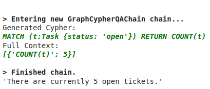
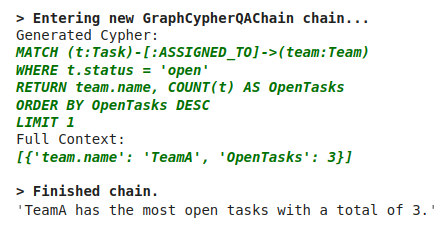
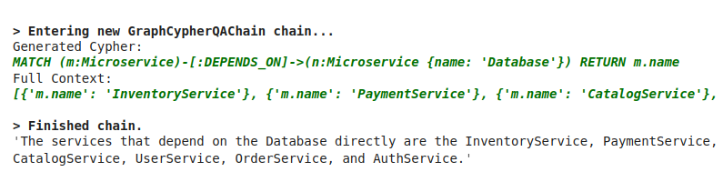
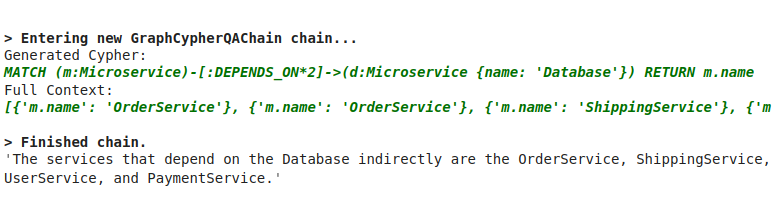
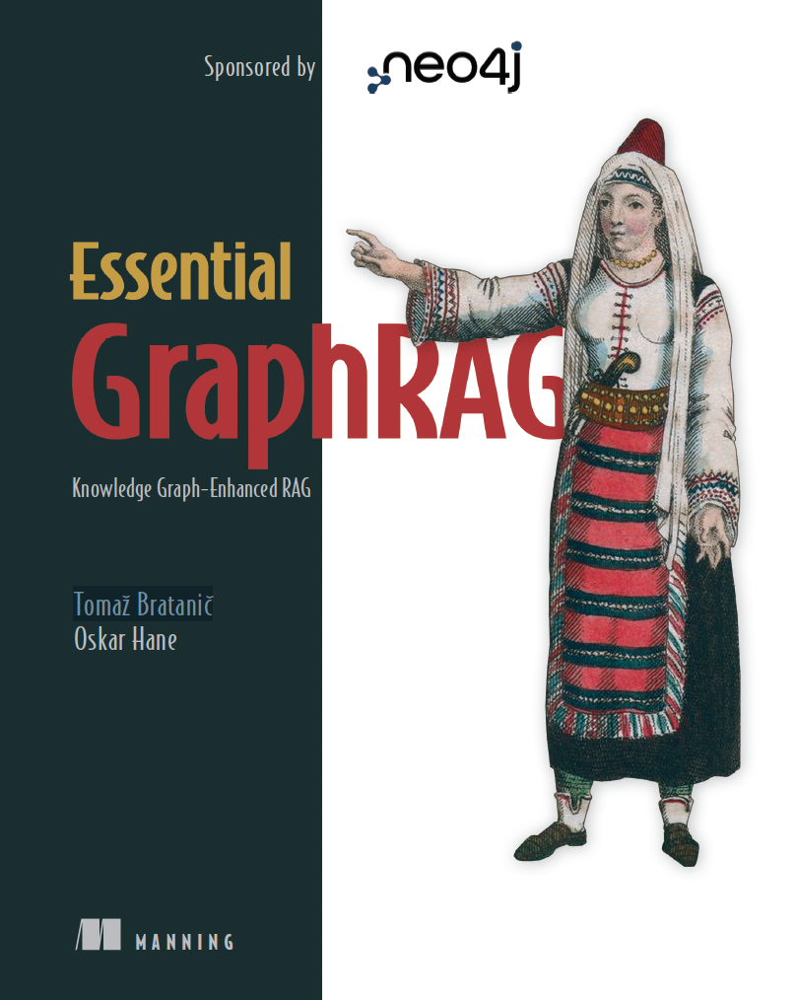

# RAG Tutorial: How to Build a RAG System on a Knowledge Graph
# RAG教程：如何在知识图谱上构建RAG系统

Building a retrieval-augmented generation (RAG application for your LLM doesn't have to be hard, especially when you follow the right steps. Whether you're a developer exploring advanced GenAI workflows or an AI engineer seeking a better retrieval system for handling structured and unstructured data, this RAG tutorial is your go-to guide.

为您的大语言模型构建检索增强生成（RAG）应用并不困难，特别是当您遵循正确的步骤时。无论您是探索高级生成式AI工作流程的开发人员，还是寻求更好检索系统来处理结构化和非结构化数据的AI工程师，本RAG教程都是您的首选指南。

In this walkthrough, you'll learn how to build a RAG app using knowledge graphs and vector search, combining the best of both structured and semantic retrieval. We'll explain the basic RAG process, explore how knowledge graphs can supercharge your results, and show you how to implement a real-world example using Neo4j and LangChain.

在本教程中，您将学习如何使用知识图谱和向量搜索构建RAG应用，结合结构化和语义检索的最佳特性。我们将解释基本的RAG过程，探索知识图谱如何增强您的结果，并向您展示如何使用Neo4j和LangChain实现一个真实世界的示例。

Along the way, you'll also learn about [GraphRAG](https://neo4j.com/blog/genai/what-is-graphrag/), a RAG implementation on a graph database. GraphRAG is a structured, explainable, and scalable upgrade from traditional RAG workflows.

在此过程中，您还将了解[GraphRAG](https://neo4j.com/blog/genai/what-is-graphrag/)，这是一种在图数据库上的RAG实现。GraphRAG是对传统RAG工作流程的结构化、可解释和可扩展的升级。

This tutorial covers everything you need to know to get started, including:

本教程涵盖了您需要了解的所有入门知识，包括：

*   The major components of a typical RAG architecture
*   A step-by-step guide to implementing RAG with a knowledge graph
*   Code snippets you can use immediately
*   Guidance on best practices and common pitfalls when building a RAG app

*   典型RAG架构的主要组件
*   使用知识图谱实现RAG的逐步指南
*   您可以立即使用的代码片段
*   构建RAG应用时的最佳实践和常见陷阱指导

## What Is Retrieval-Augmented Generation (RAG)?
## 什么是检索增强生成（RAG）？

Before we dive into implementation, let's clarify what a RAG system actually is — and why it's become one of the most popular strategies for making large language models (LLMs) more accurate, transparent, and context-aware.

在我们深入实现之前，让我们先明确什么是RAG系统——以及为什么它成为使大语言模型（LLMs）更准确、透明和具有上下文感知能力的最受欢迎策略之一。

This section lays the foundation for the rest of the RAG tutorial. Vector databases, orchestration frameworks like LangChain, and graph-based techniques such as GraphRAG all rely on these same fundamentals to work effectively together.

本节为RAG教程的其余部分奠定了基础。向量数据库、编排框架（如LangChain）和基于图的技术（如GraphRAG）都依赖于这些相同的基础原理来有效协作。

### What Is the Basic RAG Process?
### 什么是基本的RAG过程？

Retrieval-augmented generation is a technique that enhances Large Language Model (LLM) responses by retrieving source information from external data stores to augment generated responses.

检索增强生成是一种通过从外部数据存储中检索源信息来增强大语言模型（LLM）响应的技术。

This retrieval augmented generation (RAG) workflow involves three key stages: understanding queries, retrieving information, and generating responses. These steps remain consistent across use cases, from building a basic RAG app to scaling into a production-ready pipeline.

这种检索增强生成（RAG）工作流程涉及三个关键阶段：理解查询、检索信息和生成响应。这些步骤在各种用例中保持一致，从构建基本的RAG应用到扩展为生产就绪的管道。



1.   **Retrieval:** The retrieval system uses embedding models to retrieve relevant information from external sources — such as documents, wikis, task systems, or databases — based on a user's query. The retrieval process often uses semantic similarity (via vector search) or structured filtering to identify the most pertinent content. The system ranks and scores these results for relevance.

2.   **检索：** 检索系统使用嵌入模型根据用户的查询从外部源（如文档、维基、任务系统或数据库）中检索相关信息。检索过程通常使用语义相似性（通过向量搜索）或结构化过滤来识别最相关的内容。系统会对这些结果进行排名和评分以确定相关性。

3.   **Augmentation:** The system combines the retrieved data with the original user input to form a richer prompt. This is called an _augmented prompt_. It can include multiple document chunks, metadata, and task-specific instructions — all aimed at grounding the LLM's response in accurate, real-world information.

3.   **增强：** 系统将检索到的数据与原始用户输入结合，形成更丰富的提示。这被称为_增强提示_。它可以包括多个文档块、元数据和特定任务的指令——所有这些都旨在将LLM的响应建立在准确的现实世界信息基础上。

4.   **Generation:** In the final phase, the augmented prompt generates a response based on the retrieved context. A well-structured RAG pipeline can also include metadata, citations, or source traceability to increase user trust.

4.   **生成：** 在最后阶段，增强提示基于检索到的上下文生成响应。结构良好的RAG管道还可以包括元数据、引用或来源可追溯性，以增加用户信任。

### Why Does RAG Work?
### 为什么RAG有效？

LLMs like GPT-4 are powerful, but they're only as good as their training data, which is static and limited. Retrieval augmented generation helps you move beyond those limitations by letting your model:

像GPT-4这样的LLMs很强大，但它们的好坏取决于训练数据，而训练数据是静态且有限的。检索增强生成通过让您的模型：

*   Access real-time or domain-specific content
*   Ground answers in verifiable, structured knowledge
*   Reduce hallucinations and improve factual accuracy
*   Adapt quickly to new datasets without retraining the model

*   访问实时或领域特定的内容
*   将答案建立在可验证的结构化知识基础上
*   减少幻觉并提高事实准确性
*   快速适应新数据集而无需重新训练模型

By retrieving relevant external context at query time, RAG enables the model to generate responses that are both more current and better aligned with the specifics of your domain or context. Instead of relying solely on what the model "knows" (i.e., the training data), RAG supplements its outputs with grounded, purpose-fit information, which makes it especially valuable for high-stakes or dynamic use cases.

通过在查询时检索相关的外部上下文，RAG使模型能够生成既更及时又更好地与您的领域或上下文特定要求对齐的响应。RAG不依赖于模型"知道"的内容（即训练数据），而是用基于现实、适合目的的信息来补充其输出，这使得它在高风险或动态用例中特别有价值。

### Core Components of a RAG System
### RAG系统的核心组件

To build a RAG LLM application, you need a retrieval system, embedding models, and a generation pipeline. Here's what the typical RAG architecture looks like:

要构建RAG LLM应用，您需要检索系统、嵌入模型和生成管道。以下是典型的RAG架构：

1.   **User Query**: A user submits a natural language question (e.g., "What's the status of the new billing system rollout?").
1.   **用户查询**：用户提交一个自然语言问题（例如，"新计费系统部署的状态是什么？"）。

2.   **Embedding & Vector Search**: The query is transformed into an embedding using embedding models, which allow the retrieval system to compare queries against precomputed document vectors. The retrieval system then compares it against precomputed embeddings stored in a vector database to find the most relevant matches.
2.   **嵌入和向量搜索**：使用嵌入模型将查询转换为嵌入，这使得检索系统能够将查询与预计算的文档向量进行比较。然后检索系统将其与存储在向量数据库中的预计算嵌入进行比较，以找到最相关的匹配项。

3.   **Document Retrieval**: The system returns the top-k most relevant chunks of content based on vector similarity (usually cosine similarity).
3.   **文档检索**：系统基于向量相似性（通常是余弦相似性）返回前k个最相关的内容块。

4.   **Prompt Construction**: These documents are stitched together with the original query to create an augmented prompt. This prompt may use techniques like "stuff," "map-reduce," or "refine."
4.   **提示构建**：这些文档与原始查询结合在一起，创建增强提示。此提示可能使用"stuff"、"map-reduce"或"refine"等技术。

5.   **LLM Response Generation**: The prompt is passed to an LLM (e.g., GPT-4 or Claude), which generates a grounded, context-aware response.
5.   **LLM响应生成**：提示被传递给LLM（例如GPT-4或Claude），它生成基于现实、具有上下文意识的响应。

## What Is the Best Way to Implement RAG?
## 实现RAG的最佳方式是什么？

Now that you understand the basic RAG process, you might be wondering how you can make it even better. A stronger RAG system doesn't just retrieve relevant information; it integrates structured data, embedding models, and retrieval system logic to deliver more accurate, explainable, and scalable results.

现在您了解了基本的RAG过程，您可能想知道如何使其变得更好。一个更强大的RAG系统不仅仅是检索相关信息；它集成了结构化数据、嵌入模型和检索系统逻辑，以提供更准确、可解释和可扩展的结果。

Most RAG systems today use a vector database as the grounding data source. A vector database can work well for retrieving chunks of unstructured text, like help articles, emails, documentation, and PDFs. But when you want to add data that's strewn across documents, or has structured elements, the GraphRAG approach is the best way to strengthen a RAG pipeline.

如今大多数RAG系统使用向量数据库作为基础数据源。向量数据库可以很好地检索非结构化文本块，如帮助文章、电子邮件、文档和PDF。但是当您想要添加分布在文档中的数据，或具有结构化元素的数据时，GraphRAG方法是增强RAG管道的最佳方式。

By combining vector search with a knowledge graph, your retrieval system can capture both semantic meaning and structured relationships, making retrieval augmented generation RAG far more accurate and trustworthy.

通过将向量搜索与知识图谱结合，您的检索系统可以捕捉语义含义和结构化关系，使检索增强生成RAG更加准确和可信。

### Introducing GraphRAG
### 介绍GraphRAG

GraphRAG is a graph-enhanced approach to RAG that integrates:

GraphRAG是一种图增强的RAG方法，它集成了：

*   Vector search (for semantic similarity)
*   Graph search (for relational and structured queries)
*   A unified retriever-agent framework using LangChain and other LLM tools

*   向量搜索（用于语义相似性）
*   图搜索（用于关系和结构化查询）
*   使用LangChain和其他LLM工具的统一分检索器-代理框架

**Note:** While GraphRAG uses LangChain for orchestration, it is _not_ a LangChain feature. It's an architectural pattern designed around Neo4j's graph database that brings together structured graph reasoning and unstructured text retrieval, enabling LLMs to generate more accurate and explainable responses.

**注意：** 虽然GraphRAG使用LangChain进行编排，但它_不是_LangChain的功能。它是一种围绕Neo4j图数据库设计的架构模式，将结构化图推理和非结构化文本检索结合在一起，使LLM能够生成更准确和可解释的响应。

Unlike vector-only RAG, this hybrid design provides both semantic understanding (via vector similarity) and symbolic reasoning (via knowledge graphs). The result is a retrieval system that is more accurate, explainable, and scalable—yet just as easy to implement as traditional vector-only pipelines.

与仅向量的RAG不同，这种混合设计提供了语义理解（通过向量相似性）和符号推理（通过知识图谱）。结果是一个更准确、可解释和可扩展的检索系统——但实现起来与传统的仅向量管道一样简单。

### GraphRAG Architecture Overview
### GraphRAG架构概述

Let's take a look at what the GraphRAG architecture looks like:

让我们看看GraphRAG架构是什么样的：



This combination of a knowledge graph and vector search is particularly effective when your application requires:

当您的应用需要以下功能时，这种知识图谱和向量搜索的结合特别有效：

*   Reasoning over complex architectures (e.g., microservices, IT assets, workflows)
*   Querying both structured metadata and unstructured documentation
*   Combining multiple sources into one coherent system

*   对复杂架构进行推理（例如，微服务、IT资产、工作流）
*   查询结构化元数据和非结构化文档
*   将多个源组合成一个连贯的系统

### **Why Go Beyond Vector-Only RAG?**
### **为什么要超越仅向量的RAG？**

Vector search excels at finding semantically similar content, but it struggles with:

向量搜索在查找语义相似内容方面表现出色，但在以下方面存在困难：

*   **Aggregation**: e.g., "How many unresolved tickets are assigned to Team A?"
*   **Explainability**: It's difficult to trace why a particular document was retrieved.
*   **Fine-grained control**: All retrieval is based on nearest-neighbor matching, with little room for business logic or reasoning.

*   **聚合**：例如，"有多少未解决的工单分配给了A团队？"
*   **可解释性**：很难追踪为什么检索到特定文档。
*   **细粒度控制**：所有检索都基于最近邻匹配，几乎没有业务逻辑或推理的空间。

Beyond vector search, knowledge graphs bring additional strengths that make your data GenAI-ready:

除了向量搜索，知识图谱还带来了额外的优势，使您的数据为生成式AI做好准备：

*   Store data as nodes and relationships, not text blobs
*   Support structured queries using Cypher or SPARQL
*   Combine structured and unstructured data in one system
*   Provide explainability: you can follow the relationships that support an answer

*   将数据存储为节点和关系，而不是文本块
*   支持使用Cypher或SPARQL进行结构化查询
*   在一个系统中结合结构化和非结构化数据
*   提供可解释性：您可以跟踪支持答案的关系

Think of it this way: A vector database is like a "semantic search engine" — great at finding passages that _sound similar_ to your question, but not always great at showing _how things are connected_.

可以这样想：向量数据库就像一个"语义搜索引擎"——擅长找到与您的问题_听起来相似_的段落，但并不总是擅长显示_事物是如何连接的_。

A knowledge graph, by contrast, is like a semantic map: it doesn't just tell you what's relevant, it shows you how concepts, entities, and data points relate to one another. That means you can ask complex questions like "Which services are at risk if X fails?" or "Who owns all unresolved tickets in Region A?" and get grounded, structured answers with explainable paths.

相比之下，知识图谱就像一张语义地图：它不仅告诉您什么是相关的，还向您展示概念、实体和数据点如何相互关联。这意味着您可以问复杂的问题，如"如果X失败，哪些服务会面临风险？"或"谁拥有A地区所有未解决的工单？"并获得基于现实、结构化的答案以及可解释的路径。

Many baseline RAG systems rely solely on vector search over text embeddings for information retrieval. To capture the semantic meaning of content, source documents are often chunked into fragments and embedded. However, this can lead to incomplete or fragmented answers. For example, if a user asks a question about a specific product feature, a vector-only RAG system might retrieve chunks that mention the product but miss crucial supporting details from elsewhere in the documentation.

许多基础RAG系统仅依赖于文本嵌入的向量搜索进行信息检索。为了捕捉内容的语义含义，源文档通常被分割成片段并嵌入。然而，这可能导致不完整或碎片化的答案。例如，如果用户询问有关特定产品功能的问题，仅向量的RAG系统可能会检索到提及产品的块，但会错过文档中其他地方的关键支持细节。

Due to the black-box nature of vector similarity, these systems often lack transparency — developers and users can't always see why something was retrieved or how it contributes to the generated answer. This is especially problematic in regulated environments like finance, healthcare, or legal, where traceability and accuracy matter most.

由于向量相似性的黑盒性质，这些系统往往缺乏透明度——开发人员和用户无法总是看到为什么检索到某些内容或它如何贡献于生成的答案。这在金融、医疗保健或法律等受监管的环境中尤其成问题，在这些环境中可追溯性和准确性最为重要。

GraphRAG addresses these limitations by incorporating structured domain knowledge. By tapping into the semantic relationships inside a knowledge graph, GraphRAG enhances retrieval accuracy, supports reasoning, and delivers more trustworthy results while still maintaining the flexibility of vector search.

GraphRAG通过结合结构化领域知识来解决这些限制。通过利用知识图谱中的语义关系，GraphRAG提高了检索准确性，支持推理，并提供更可信的结果，同时仍保持向量搜索的灵活性。

## A Step-by-Step Tutorial for Implementing GraphRAG
## 实现GraphRAG的逐步教程

Ready to build your own RAG application? In this hands-on tutorial, we'll walk you through how to set up a working GraphRAG system using:

准备好构建自己的RAG应用了吗？在这个实践教程中，我们将引导您如何使用以下工具设置一个工作的GraphRAG系统：

*   Neo4j as the knowledge graph and vector store
*   LangChain, an LLM application framework, to coordinate retrieval and generation steps
*   OpenAI for embeddings and generative responses

*   Neo4j作为知识图谱和向量存储
*   LangChain，一个LLM应用框架，用于协调检索和生成步骤
*   OpenAI用于嵌入和生成响应

Even if you're new to Neo4j or knowledge graphs, don't worry, we'll keep things simple and practical. In this example, you'll build a chatbot that can answer both unstructured and structured questions about a synthetic DevOps environment.

即使您是Neo4j或知识图谱的新手，也不要担心，我们将保持简单和实用。在这个例子中，您将构建一个能够回答关于合成DevOps环境的非结构化和结构化问题的聊天机器人。

### Prerequisites
### 先决条件

Before we dive in, make sure you have:

在我们深入之前，请确保您有：

*   A Neo4j Aura instance or Neo4j Desktop running (version 5.11+)
*   An OpenAI API key
*   Python installed (with `langchain`, `neo4j`, `openai`, etc.)

*   运行中的Neo4j Aura实例或Neo4j Desktop（版本5.11+）
*   OpenAI API密钥
*   安装了Python（带有`langchain`、`neo4j`、`openai`等）

### Neo4j Environment Setup
### Neo4j环境设置

First, you'll need to set up a Neo4j 5.11 instance or greater to follow along with the examples. The easiest way is to start a free cloud instance of the Neo4j database on [Neo4j Aura](https://neo4j.com/product/auradb/). Or, you can set up a local instance of the Neo4j database by downloading the [Neo4j Desktop](https://neo4j.com/download/) application and creating a local database instance.

首先，您需要设置一个Neo4j 5.11或更高版本的实例来跟随示例。最简单的方法是在[Neo4j Aura](https://neo4j.com/product/auradb/)上启动一个免费的Neo4j数据库云实例。或者，您可以通过下载[Neo4j Desktop](https://neo4j.com/download/)应用程序并创建本地数据库实例来设置Neo4j数据库的本地实例。

```
from langchain_neo4j import Neo4jGraph

url = "neo4j+s://databases.neo4j.io"
username = "neo4j"
password = ""

graph = Neo4jGraph(
    url=url,
    username=username,
    password=password
)
```

### Preparing the Dataset
### 准备数据集

Knowledge graphs excel at connecting information from multiple data sources. When developing a DevOps RAG application, you can fetch information from cloud services, task management tools, and more.

知识图谱擅长连接来自多个数据源的信息。在开发DevOps RAG应用时，您可以从云服务、任务管理工具等获取信息。



Combining multiple data sources into a knowledge graph. Image by author.

将多个数据源组合到知识图谱中。作者图片。

Since this kind of microservice and task information is not public, we created a synthetic dataset with ChatGPT. It's a small dataset with only 100 nodes, but that's a big enough sample for this tutorial. Use this code to import the sample graph into Neo4j:

由于这种微服务和任务信息不是公开的，我们使用ChatGPT创建了一个合成数据集。这是一个只有100个节点的小数据集，但对于本教程来说已经足够大了。使用此代码将示例图导入Neo4j：

```
import requests

url = "https://gist.githubusercontent.com/tomasonjo/08dc8ba0e19d592c4c3cde40dd6abcc3/raw/da88822"
import_query = requests.get(url).json()['query']
graph.query(
    import_query
)
```

You should see a similar visualization of the graph in the Neo4j Browser:

您应该在Neo4j浏览器中看到类似的图可视化：



Subset of the DevOps graph. Image by author.

DevOps图的子集。作者图片。

Blue nodes describe microservices. These microservices may have dependencies on one another. The relationships show that one microservice's ability to function or provide an outcome may be reliant on another's operation.

蓝色节点描述微服务。这些微服务可能相互依赖。关系显示一个微服务的功能或提供结果的能力可能依赖于另一个微服务的操作。

The brown nodes represent tasks that directly link to these microservices. This visualization of the graph shows how microservices are set up, how their tasks depend on one another, and the teams associated with each.

棕色节点表示直接链接到这些微服务的任务。这种图的可视化显示了微服务是如何设置的，它们的任务如何相互依赖，以及与每个微服务相关的团队。

### Neo4j Vector Index
### Neo4j向量索引

We'll begin by implementing a vector index search to find relevant tasks by their name and description. If you're unfamiliar with vector similarity search, here's a quick refresher. The key idea is to calculate the text embedding values for each task based on its description and name. Then, at query time, find the most similar tasks to the user input using a similarity metric like cosine distance.

我们将首先实现向量索引搜索，通过任务的名称和描述来查找相关任务。如果您不熟悉向量相似性搜索，这里是一个快速复习。关键思想是根据任务的描述和名称计算每个任务的文本嵌入值。然后，在查询时，使用余弦距离等相似性度量找到与用户输入最相似的任务。

The information retrieved from the vector index can then be used as context for the LLM so it can generate accurate, up-to-date answers.

从向量索引检索到的信息可以作为LLM的上下文，以便它能够生成准确、最新的答案。

The tasks are already stored in our knowledge graph, but we still need to calculate their embeddings and build a vector index. We'll do this using the `from_existing_graph` method:

任务已经存储在我们的知识图谱中，但我们仍需要计算它们的嵌入并构建向量索引。我们将使用`from_existing_graph`方法来完成：

```
os.environ['OPENAI_API_KEY'] = "OPEN_API_KEY"

vector_index = Neo4jVector.from_existing_graph(
    OPENAIEmbeddings(),
    url=url,
    username=password,
    index_name='tasks',
    node_label="Task",
    text_node_properties=['name', 'description', 'status'],
    embedding_node_property= 'embedding',
)
```

In this example, we used the following graph-specific parameters for the from_existing_graph method.

在这个例子中，我们为from_existing_graph方法使用了以下图特定参数。

*   `index_name`: name of the vector index.
*   `node_label`: node label of relevant nodes.
*   `text_node_properties`: properties to be used to calculate embeddings and retrieve from the vector index.
*   `embedding_node_property`: Which property to store the embedding values in.

*   `index_name`：向量索引的名称。
*   `node_label`：相关节点的节点标签。
*   `text_node_properties`：用于计算嵌入和从向量索引检索的属性。
*   `embedding_node_property`：在哪个属性中存储嵌入值。

Now that the vector index is initiated, we can use it like any other vector index in LangChain:

现在向量索引已经初始化，我们可以像使用LangChain中的任何其他向量索引一样使用它：

```
response = vector_index.similarity_search(
    "How will RecommendationService be updated?"
)
print(response[0].page_content)
```

You'll see that we construct a response of a map or dictionary-like string with defined properties in the `text_node_properties` parameter.

您会看到我们构建了一个具有在`text_node_properties`参数中定义的属性的映射或字典式字符串响应。

Now we can easily create a chatbot response by wrapping the vector index into a RetrievalQA module:

现在我们可以通过将向量索引包装到RetrievalQA模块中轻松创建聊天机器人响应：

```
vector_qa = RetrievalQA.from_chain_type(
    llm=ChatOpenAI(),
    chain_type="stuff",
    retriever=vector_index.as_retriever()
)
vector_qa.run(
    "How will recommendation service be updated?"
)
```

A limitation of vector indexes is that they can't aggregate information like you can with a structured query language like Cypher. Consider this example:

向量索引的一个限制是它们无法像使用Cypher这样的结构化查询语言那样聚合信息。考虑这个例子：

```
vector_qa.run(
    "How many open tickets are there?"
)
```

The response seems valid, in part because the LLM uses assertive language. Yet, the response directly correlates to the number of retrieved documents from the vector index, which is four by default. When the vector index retrieves four open tickets, the LLM concludes there are no additional open tickets. You can then validate this result with a Cypher statement.

响应似乎是有效的，部分原因是LLM使用了断言性语言。然而，响应直接与从向量索引检索到的文档数量相关，默认情况下是四个。当向量索引检索到四个未完工单时，LLM得出结论认为没有其他未完工单。然后您可以使用Cypher语句验证此结果。

```
graph.query(
    "MATCH (t:Task {status: 'Open'}) RETURN count (*)"
)
```

Our toy graph has five open tasks. Vector similarity search works well for sifting through relevant information in unstructured text, yet it struggles with analyzing and aggregating structured information. Using Neo4j, this problem is easily solved with Cypher, a structured query language for graph databases.

我们的玩具图有五个未完成任务。向量相似性搜索在筛选非结构化文本中的相关信息方面效果很好，但在分析和聚合结构化信息方面存在困难。使用Neo4j，这个问题可以通过Cypher（图数据库的结构化查询语言）轻松解决。

### Graph Cypher Search
### 图Cypher搜索

Cypher is a structured query language designed to interact with graph databases. It offers a visual way of matching patterns and relationships and relies on the following ASCII–art type of syntax:

Cypher是一种设计用于与图数据库交互的结构化查询语言。它提供了一种可视化的方式来匹配模式和关系，并依赖于以下ASCII艺术类型的语法：

```
(:Person {name: "Oskar"}]-[:LIVES_IN]->(:Country {name:"Slovenia"}]
```

This pattern describes a node with the label Person and the name property Oskar that has a LIVES_IN relationship with the Country node of Slovenia.

此模式描述了一个带有Person标签和name属性Oskar的节点，该节点与斯洛文尼亚国家节点具有LIVES_IN关系。

The neat thing about LangChain is that it provides a [GraphCypherQAChain](https://python.langchain.com/api_reference/neo4j/chains/langchain_neo4j.chains.graph_qa.cypher.GraphCypherQAChain.html), which generates the Cypher queries for you, so you don't have to learn Cypher syntax to retrieve information from a graph database like Neo4j.

LangChain的优点是它提供了一个[GraphCypherQAChain](https://python.langchain.com/api_reference/neo4j/chains/langchain_neo4j.chains.graph_qa.cypher.GraphCypherQAChain.html)，它为您生成Cypher查询，因此您无需学习Cypher语法即可从Neo4j等图数据库中检索信息。

The following code will refresh the graph schema and instantiate the Cypher chain.

以下代码将刷新图模式并实例化Cypher链。

```
from langchain.chains import GraphCypherQAChain

graph.refresh_schema()

cypher_chain = GraphCypherQAChain.from_llm(
    cypher_llm = ChatOpenAI(temperature=0, model_name='gpt-4'),
    qa_llm = ChatOpenAI(temperature=0), graph=graph, verbose=True,
)
```

Cypher generation isn't trivial, so we recommend using GPT-4 to handle the queries and leaning on GPT-3.5-Turbo to generate the final answers.

Cypher生成并不简单，因此我们建议使用GPT-4来处理查询，并依靠GPT-3.5-Turbo来生成最终答案。

Now, you can ask the same question about the number of open tickets.

现在，您可以询问相同的问题关于未完工单的数量。

```
cypher_chain.run(
    "How many open tickets there are?"
)
```

The result is the following:

结果如下：



You can also ask the chain to aggregate the data using various grouping keys:

您还可以要求链使用各种分组键聚合数据：

```
cypher_chain.run(
    "Which team has the most open tasks?"
)
```

The result is the following:

结果如下：



You might say these aggregations are not graph-based operations, and that's correct. We can, of course, perform more graph-based operations like traversing the dependency graph of microservices.

您可能会说这些聚合不是基于图的操作，这是正确的。当然，我们可以执行更多基于图的操作，如遍历微服务的依赖图。

```
cypher_chain.run(
    "Which services depend on Database directly?"
)
```

The result is the following:

结果如下：



Of course, you can also ask the chain to produce [variable-length path traversals](https://graphaware.com/graphaware/2015/05/19/neo4j-cypher-variable-length-relationships-by-example.html) by asking questions like:

当然，您也可以通过询问以下问题要求链生成[可变长度路径遍历](https://graphaware.com/graphaware/2015/05/19/neo4j-cypher-variable-length-relationships-by-example.html)：

```
cypher_chain.run(
    "Which services depend on Database indirectly?"
)
```

The result is the following:

结果如下：



The overlap in mentioned services comes from the structure of the dependency graph, not from an invalid Cypher statement.

提到的服务中的重叠来自依赖图的结构，而不是来自无效的Cypher语句。

## Challenges and Best Practices of Building a RAG Application
## 构建RAG应用的挑战和最佳实践

Even though RAG systems are powerful, you might run into problems as you build them in the real world. Below, we break down some of the most common issues you'll face, along with expert tips and best practices to overcome them.

尽管RAG系统很强大，但在现实世界中构建它们时可能会遇到问题。下面，我们分解了一些最常见的问题，以及专家提示和最佳实践来克服它们。

**Why is my RAG app hallucinating information even after retrieval?**

**为什么我的RAG应用在检索后仍在产生幻觉信息？**

This usually happens when the retrieved context doesn't fully answer the user's question, or when the LLM prioritizes fluency over factuality.

这通常发生在检索到的上下文没有完全回答用户问题时，或者当LLM优先考虑流畅性而不是事实性时。

_Best Practices:_

_最佳实践：_

• Improve retrieval quality: Optimize embedding models and retrieval system logic to retrieve relevant information more consistently. Refine chunking strategies (e.g., overlap chunks, adjust window sizes) as part of this process.

• 提高检索质量：优化嵌入模型和检索系统逻辑以更一致地检索相关信息。在此过程中完善分块策略（例如，重叠块，调整窗口大小）。

• Score & filter context: Use metadata or ranking heuristics to ensure only the most relevant chunks are passed to the LLM.

• 评分和过滤上下文：使用元数据或排名启发式方法确保只有最相关的块传递给LLM。

• Use GraphRAG: Structured graph queries (e.g., via Cypher) allow exact answers when vector search falls short.

• 使用GraphRAG：结构化图查询（例如，通过Cypher）在向量搜索不足时允许精确答案。

**How do I prevent redundant or irrelevant documents from being retrieved?**

**如何防止检索到冗余或不相关的文档？**

This often happens when embeddings fail to capture the true meaning of your query or documents. That can result from generic embeddings, noisy source text, or missing filters during retrieval.

这通常发生在嵌入无法捕捉查询或文档的真实含义时。这可能由通用嵌入、嘈杂的源文本或检索期间缺少过滤器导致。

_Best Practices:_

_最佳实践：_

• Use domain-specific embeddings: OpenAI, Cohere, or even fine-tuned models, depending on your context.

• 使用领域特定嵌入：OpenAI、Cohere，甚至根据您的上下文微调的模型。

• Pre-clean your text: Remove boilerplate, headers, and navigation content from source documents.

• 预清洁文本：从源文档中删除样板、标题和导航内容。

• Use node-level filters in Neo4j: For example, restrict to Task nodes with a certain status.

• 在Neo4j中使用节点级过滤器：例如，限制为具有特定状态的任务节点。

**How can I handle both structured and unstructured data in my RAG app?**

**如何在我的RAG应用中处理结构化和非结构化数据？**

Most basic RAG systems only support unstructured data via vector search. If you want to ask questions like "How many tasks are open?" or "Which services depend on X?", you'll need structure.

大多数基本RAG系统仅通过向量搜索支持非结构化数据。如果您想问"有多少任务是未完成的？"或"哪些服务依赖于X？"，您需要结构。

_Best Practices:_

_最佳实践：_

• Use a knowledge graph with native vector search. In Neo4j, you can build a knowledge graph with vector search and can apply structured query tools.

• 使用具有原生向量搜索的知识图谱。在Neo4j中，您可以构建具有向量搜索的知识图谱并应用结构化查询工具。

• Use the LangChain-Neo4j package for structured questions and vector search for semantic ones.

• 对于结构化问题使用LangChain-Neo4j包，对于语义问题使用向量搜索。

• Wrap both in an agent: This lets the system choose the best retrieval method based on the question type.

• 将两者包装在代理中：这使系统能够根据问题类型选择最佳检索方法。

**How do I know which tool (vector vs. graph) to use for a query?**

**我如何知道对查询使用哪种工具（向量vs图）？**

This is where tool routing comes into play. LangChain supports agents that can decide which retriever to invoke.

这就是工具路由发挥作用的地方。LangChain支持可以决定调用哪个检索器的代理。

_Best Practices:_

_最佳实践：_

• Describe each tool clearly in the agent's Tool(s) definitions.

• 在代理的工具定义中清楚地描述每个工具。

• Use descriptive prompts in your agent to nudge it toward the right tool.

• 在代理中使用描述性提示以引导其使用正确的工具。

• Fine-tune or customize tool selection logic if necessary.

• 如有必要，微调或自定义工具选择逻辑。

**Why are my vector search results limited or misleading?**

**为什么我的向量搜索结果有限或误导？**

Many vector search libraries return a fixed number of top-k results, even when the semantic match is weak.

许多向量搜索库返回固定数量的前k个结果，即使语义匹配很弱。

_Best Practices:_

_最佳实践：_

• Increase k cautiously and filter based on the similarity threshold.

• 谨慎增加k并基于相似性阈值进行过滤。

• Combine vector scores with business logic or metadata constraints.

• 将向量分数与业务逻辑或元数据约束结合。

• Complement with Cypher queries to validate or cross-reference results.

• 通过Cypher查询补充以验证或交叉引用结果。

**What's the best way to test and debug a RAG pipeline?**

**测试和调试RAG管道的最佳方式是什么？**

Since you're working with both retrieval and generation, isolate problems by testing them separately.

由于您同时处理检索和生成，请通过分别测试来隔离问题。

_Best Practices:_

_最佳实践：_

• Log all intermediate steps: query embeddings, retrieved docs, prompt construction, and final response.

• 记录所有中间步骤：查询嵌入、检索到的文档、提示构建和最终响应。

• Use synthetic queries with known answers to validate retrieval.

• 使用已知答案的合成查询来验证检索。

• Ask your system, "Why did you say that?" This helps debug hallucinations and verify grounding.

• 询问您的系统，"你为什么这么说？"这有助于调试幻觉并验证基础。

**What about latency and scalability?**

**那延迟和可扩展性呢？**

Retrieval can be fast, but LLM calls (especially to GPT-4) can introduce lag.

检索可以很快，但LLM调用（特别是对GPT-4）可能引入延迟。

_Best Practices:_

_最佳实践：_

• Cache query results and embedding calculations

• 缓存查询结果和嵌入计算

• Use lightweight models (like GPT-3.5) for retrieval and GPT-4 for final answers

• 对于检索使用轻量级模型（如GPT-3.5），对于最终答案使用GPT-4

• Consider batching or asynchronous calls when serving multiple users

• 在为多个用户提供服务时考虑批处理或异步调用

These best practices help you build faster, more reliable RAG apps, whether for internal tools, chatbots, or enterprise search.

这些最佳实践帮助您构建更快、更可靠的RAG应用，无论是用于内部工具、聊天机器人还是企业搜索。

## The Future of RAG Is Structured
## RAG的未来是结构化的

As you move from experiments to production, you'll find that retrieval is what makes LLMs scalable, adaptable, and trustworthy.

当您从实验转向生产时，您会发现检索是使LLM可扩展、可适应和可信的原因。

If you want RAG systems that are:

如果您想要RAG系统：

*   Accurate and grounded in real data
*   Flexible across use cases
*   Transparent and explainable
*   Future-proof for enterprise scale

*   准确且基于真实数据
*   在各种用例中灵活
*   透明且可解释
*   面向企业规模的未来证明

…then adding structure—via a knowledge graph—is the next logical step.

…那么通过知识图谱添加结构是下一个合乎逻辑的步骤。

GraphRAG represents the evolution of retrieval-augmented generation RAG, which makes retrieval systems more accurate by combining semantic vector search with structured graph reasoning. It is emerging as a powerful next step in retrieval-augmented generation, combining structured and unstructured data to improve reasoning, retrieval precision, and response quality.

GraphRAG代表了检索增强生成RAG的演进，它通过将语义向量搜索与结构化图推理结合使检索系统更加准确。它正在成为检索增强生成的强大下一步，结合结构化和非结构化数据以改善推理、检索精度和响应质量。

The question isn't just how to build a RAG system. It's how to build one that actually works for your business logic, your users, and your data reality.

问题不仅仅是如何构建RAG系统。而是如何构建一个真正适用于您的业务逻辑、用户和数据现实的系统。

With tools like Neo4j, LangChain, and OpenAI, you can balance flexibility with performance instead of trading one for the other.

使用Neo4j、LangChain和OpenAI等工具，您可以在灵活性和性能之间取得平衡，而不是用一个换取另一个。

## Ready to Build Your Own GraphRAG App?
## 准备好构建您自己的GraphRAG应用了吗？

Start with the tutorial above and try running your own questions through the DevOps example. From there, plug in your own data — support tickets, product specs, sales content, or workflows — and see what a smarter RAG system can unlock.

从上面的教程开始，尝试通过DevOps示例运行您自己的问题。从那里，插入您自己的数据——支持工单、产品规格、销售内容或工作流——看看更智能的RAG系统能解锁什么。



**Additional Resources**
**附加资源**

To deepen your understanding or get hands-on with other aspects of RAG and knowledge graphs, check out the following:

要加深您的理解或亲身体验RAG和知识图谱的其他方面，请查看以下内容：

*   [What is GraphRAG?](https://neo4j.com/blog/genai/what-is-graphrag/)
*   [Knowledge Graphs & LLMs: Multi-Hop Question Answering](https://neo4j.com/blog/developer/knowledge-graphs-llms-multi-hop-question-answering/)
*   [The Developer's Guide to Building a Knowledge Graph](https://neo4j.com/whitepapers/developers-guide-how-to-build-knowledge-graph/)
*   [LangChain Library Adds Full Support for Neo4j Vector Index](https://neo4j.com/blog/developer/langchain-library-full-support-neo4j-vector-index/)
*   [Implementing Advanced Retrieval Strategies with Neo4j](https://neo4j.com/blog/developer/advanced-rag-strategies-neo4j/)
*   [Neo4j GraphAcademy –](https://graphacademy.neo4j.com/)[Neo4j & Generative AI Fundamentals](https://graphacademy.neo4j.com/courses/genai-fundamentals/?category=generative-ai)
*   [GraphRAG DevOps Example on GitHub](https://github.com/tomasonjo/langchain-neo4j)


