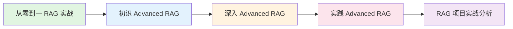

# RAG 从入门到实战完整教程

欢迎来到 RAG（Retrieval-Augmented Generation，检索增强生成）完整教程！本教程提供从基础概念到生产落地的全方位学习路径，适合不同阶段的学习者。

## 什么是 RAG？

RAG 是一种通过整合外部知识检索来增强大语言模型能力的技术。它可以：

- ✅ **提高准确性**：通过检索相关知识，减少模型幻觉
- ✅ **保持时效性**：访问最新信息，突破训练数据的时间限制
- ✅ **增强专业性**：整合领域知识，适配垂直场景
- ✅ **降低成本**：无需重新训练模型即可更新知识

---

## 🎯 学习路径（按读者等级）

### 📚 Level 0：新手入门（0基础）

<Cards>
  <Card title="从零到一 RAG 实战" href="/docs/brag-tutorial">
    
<strong>适合人群</strong>：完全零基础，想快速上手 RAG 的开发者

    
<strong>内容</strong>：从环境搭建到完整 RAG 系统的手把手教程

    <ul>
      <li>✅ 查询理解与转换</li>
      <li>✅ RAG Fusion 高级查询</li>
      <li>✅ 多模态检索</li>
      <li>✅ Agent RAG 系统</li>
    </ul>
  </Card>
</Cards>

---

### 📖 Level 1：理论建立（入门）

<Cards>
  <Card title="初识 Advanced RAG" href="/docs/advanced-rag-intro">
    
<strong>适合人群</strong>：有 AI/LLM 基础，想系统了解 RAG 技术的学习者

    
<strong>内容</strong>：RAG 核心概念、发展历程和技术综述

    <ul>
      <li>📄 面向大语言模型的 RAG 技术综述</li>
      <li>📄 RAG 的起源与发展</li>
      <li>📄 RAG vs Fine-tuning 对比分析</li>
    </ul>
  </Card>
</Cards>

---

### 🔬 Level 2：深入原理（进阶）

<Cards>
  <Card title="深入 Advanced RAG" href="/docs/advanced-rag-deep-dive">
    
<strong>适合人群</strong>：想深入理解 RAG 优化策略和实现细节的工程师

    
<strong>内容</strong>：核心技术原理、算法实现和性能调优

    <ul>
      <li>🔍 向量搜索与索引算法</li>
      <li>✂️ 文本分块策略（Chunking）</li>
      <li>🎯 混合检索（Hybrid Search）</li>
      <li>📊 Rerank 重排序技术</li>
      <li>🧠 查询转换（HyDE, Query Rewriting）</li>
      <li>⚡ RAG 管道失败原因分析</li>
    </ul>
  </Card>
</Cards>

---

### 💻 Level 3：动手实践（高级）

<Cards>
  <Card title="实践 Advanced RAG" href="/docs/advanced-rag-practice">
    
<strong>适合人群</strong>：准备落地 RAG 系统的开发者

    
<strong>内容</strong>：真实案例、代码实现和工程最佳实践

    <ul>
      <li>🛠️ Milvus BM25 混合检索</li>
      <li>🎨 多模态 RAG 实现</li>
      <li>🔗 知识图谱 + RAG（GraphRAG）</li>
      <li>🤖 Agent RAG 架构</li>
      <li>📝 Context Caching 优化</li>
    </ul>
  </Card>
</Cards>

---

### 🏗️ Level 4：项目落地（实战）

<Cards>
  <Card title="RAG 项目实战分析" href="/docs/rag-project-analysis">
    
<strong>适合人群</strong>：负责系统架构设计和技术选型的架构师/TL

    
<strong>内容</strong>：9个生产级开源项目的深度剖析

    <ul>
      <li>🏛️ 架构设计模式</li>
      <li>🔧 技术栈选型指南</li>
      <li>💼 应用场景分析（企业知识库/代码问答/客服）</li>
      <li>📊 核心项目剖析（LightRAG, Dify, Quivr）</li>
    </ul>
  </Card>
</Cards>

---

## 🗺️ 推荐学习顺序

### 快速通道（针对不同目标）

<Callout type="tip" title="根据你的目标选择路径">
  <ul>
    <li><strong>🎯 快速上手</strong>：从零到一 RAG 实战 → 实践 Advanced RAG</li>
    <li><strong>📚 系统学习</strong>：初识 → 深入 → 实践（完整路径）</li>
    <li><strong>🏗️ 生产落地</strong>：深入 Advanced RAG → RAG 项目实战分析</li>
    <li><strong>🔧 技术选型</strong>：直接查看 RAG 项目实战分析</li>
  </ul>
</Callout>

---

## 📊 补充资源

<Cards>
  <Card title="RAG 架构图谱参考" href="/docs/rag-charts-reference">
    
可视化 RAG 系统架构、流程图和技术栈对比

  </Card>
</Cards>

---

## 💡 如何使用本教程

1. **评估你的当前水平**：根据上述分类选择适合你的起点
2. **按需深入**：可以跳过已掌握的内容，直接进入感兴趣的章节
3. **动手实践**：每个章节都提供代码示例，建议边学边做
4. **参考项目**：实战部分分析了真实开源项目，可直接借鉴架构

<Callout type="warn" title="学习建议">
  不要试图一次性学完所有内容！根据你的项目需求和时间，选择最相关的章节深入学习。理论和实践结合效果最佳。
</Callout>

---

## 🤝 贡献与反馈

如果你在学习过程中发现问题或有改进建议，欢迎通过 GitHub 提交 Issue 或 PR！

祝你学习愉快！🚀
