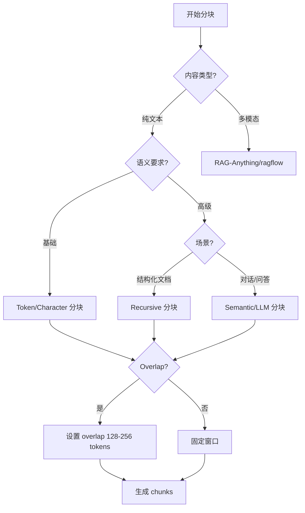

<Callout type="success" title="为什么 Chunking 至关重要">
分块策略直接决定检索召回上限、上下文利用率与成本。过大的 chunk 会导致无关信息噪声，过小的 chunk 则会丢失上下文连贯性。合理的分块是构建高质量 RAG 系统的第一步。
</Callout>

# 分块（Chunking）策略实现

## 背景与核心问题

### 什么是 Chunking？

Chunking 是将长文档切分成更小、语义连贯的片段的过程。在 RAG 系统中，这些片段（chunks）会被转换为向量嵌入并存储到向量数据库中，供检索时使用。

### 核心挑战

1. **粒度权衡**：chunk 太大 → 噪声多、成本高；chunk 太小 → 上下文不足、召回差
2. **语义边界**：如何在自然的语义边界处切分（段落、句子、主题）
3. **重叠策略**：如何设置 overlap 避免关键信息被切断
4. **跨结构保持**：如何处理表格、代码块、列表等结构化内容
5. **多模态处理**：图像、公式等非文本内容如何与文本协同分块

## 关键决策树



### 何时选择哪种策略？

| 策略 | 适用场景 | 优势 | 劣势 |
|------|---------|------|------|
| **Token-based** | 通用场景、成本敏感 | 精确控制、与 LLM token 限制对齐 | 可能在词中间切断 |
| **Character-based** | 简单文本、快速原型 | 实现简单、快速 | 语义边界差 |
| **Sentence-based** | 对话、问答 | 语义完整、可读性好 | chunk 大小不均 |
| **Semantic** | 长篇文档、主题明确 | 语义连贯、召回质量高 | 计算成本高 |
| **Recursive** | 结构化文档（Markdown/HTML） | 保持结构层次 | 配置复杂 |
| **LLM-based** | 高质量要求、成本不敏感 | 最优语义边界 | 成本极高、延迟高 |

## 跨项目实现对照

### 依赖库对比

| 项目 | 第三方库 | 实现方式 | 质量评级 |
|------|---------|---------|---------|
| **LightRAG** | 无（自研 + tiktoken） | 内置实现 | ⭐⭐⭐⭐⭐ |
| **RAG-Anything** | 继承 LightRAG + 模板 | 扩展实现 | ⭐⭐⭐⭐⭐ |
| **onyx** | tiktoken + 自研 SentenceChunker | 企业级实现 | ⭐⭐⭐⭐⭐ |
| **Verba** | LangChain Text Splitters | 直接依赖 | ⭐⭐⭐⭐ |
| **kotaemon** | LlamaIndex Splitters | 包装器 | ⭐⭐⭐⭐ |
| **UltraRAG** | Chonkie | 直接依赖 | ⭐⭐⭐⭐ |
| **SurfSense** | Docling + Chonkie | 直接依赖 | ⭐⭐⭐⭐ |
| **ragflow** | 自研 naive_merge | 内置实现 | ⭐⭐⭐ |

### 核心实现对比

#### 1. LightRAG：Token-based 精确分块

**特点**：使用 tiktoken 进行 token 级精确控制，支持字符分隔符辅助切分。

```python title="lightrag/operate.py" path=null start=null
def chunking_by_token_size(
    tokenizer: Tokenizer,
    content: str,
    split_by_character: str | None = None,
    split_by_character_only: bool = False,
    overlap_token_size: int = 128,
    max_token_size: int = 1024,
) -> list[dict[str, Any]]:
    """
    Token-based chunking with configurable overlap
    
    Args:
        tokenizer: Tiktoken tokenizer instance
        content: Raw text content
        split_by_character: Optional character delimiter (e.g., '\n\n')
        overlap_token_size: Overlap between chunks
        max_token_size: Maximum tokens per chunk
    """
    tokens = tokenizer.encode(content)
    results: list[dict[str, Any]] = []
    
    if split_by_character:
        # Character-based splitting logic with token control
        raw_chunks = content.split(split_by_character)
        # ... processing logic
    else:
        # Pure token-based splitting with overlap
        for index, start in enumerate(
            range(0, len(tokens), max_token_size - overlap_token_size)
        ):
            chunk_content = tokenizer.decode(tokens[start : start + max_token_size])
            results.append({
                "tokens": min(max_token_size, len(tokens) - start),
                "content": chunk_content.strip(),
                "chunk_order_index": index,
            })
    
    return results
```

**优势**：
- ✅ Token 级精确控制，与 LLM 限制完美对齐
- ✅ 支持异步处理，性能优秀
- ✅ 可扩展自定义分块函数

**劣势**：
- ❌ 不支持语义感知分块
- ❌ 需要 RAG-Anything 扩展才能处理多模态

#### 2. RAG-Anything：多模态模板分块

**特点**：在 LightRAG 基础上增加多模态内容处理，为不同内容类型应用专门模板。

```python title="rag_anything/chunking.py" path=null start=null
def _apply_chunk_template(
    self, content_type: str, original_item: Dict[str, Any], description: str
) -> str:
    """
    Apply specialized templates for different content types
    
    Ensures optimal chunking for images, tables, equations, code
    """
    templates = {
        "text": self.text_template,
        "image": self.image_template,        # 图像描述模板
        "table": self.table_template,        # 表格结构化模板
        "equation": self.equation_template,  # 公式语义化模板
        "code": self.code_template           # 代码块模板
    }
    
    template = templates.get(content_type, self.default_template)
    return template.format(
        content=original_item.get('content', ''), 
        description=description
    )

# 缓存机制优化性能
async def _get_from_parse_cache(self, cache_key: str, file_path: Path) -> Optional[tuple]:
    """Retrieve parsed content from cache to avoid redundant processing"""
    cache_file = self.cache_dir / f"{cache_key}.json"
    if cache_file.exists():
        try:
            with open(cache_file, 'r') as f:
                return json.load(f)
        except Exception as e:
            self.logger.warning(f"Cache read failed: {e}")
    return None
```

**优势**：
- ✅ 完整多模态支持（图像/表格/公式）
- ✅ 灵活模板设计，易于扩展
- ✅ 智能缓存机制

**劣势**：
- ❌ 强依赖 LightRAG
- ❌ 模板维护成本高

#### 3. onyx：企业级上下文感知分块

**特点**：多通道分块、上下文 RAG、大 chunk 支持，面向企业级部署。

```python title="onyx/chunking.py" path=null start=null
class Chunker:
    def __init__(
        self,
        tokenizer: BaseTokenizer,
        enable_multipass: bool = False,        # 多通道索引
        enable_large_chunks: bool = False,     # 大 chunk 支持
        enable_contextual_rag: bool = False,   # 上下文 RAG
        blurb_size: int = BLURB_SIZE,
        chunk_token_limit: int = 1024,
        chunk_overlap: int = 128,
        mini_chunk_size: int = 256,            # Mini-chunk 大小
    ) -> None:
        # Token 计数器
        def token_counter(text: str) -> int:
            return len(tokenizer.encode(text))
        
        # 主分块器：基于句子的语义边界
        self.chunk_splitter = SentenceChunker(
            tokenizer_or_token_counter=token_counter,
            chunk_size=chunk_token_limit,
            chunk_overlap=chunk_overlap,
            return_type="texts",
        )
        
        # Mini-chunk 分块器（用于多通道索引）
        self.mini_chunk_splitter = (
            SentenceChunker(
                tokenizer_or_token_counter=token_counter,
                chunk_size=mini_chunk_size,
                chunk_overlap=0,
                return_type="texts",
            )
            if enable_multipass
            else None
        )
```

**上下文 RAG（Contextual RAG）原理**：
1. 为每个 chunk 生成文档级上下文摘要
2. 在检索时将上下文与 chunk 内容一起提供给 LLM
3. 预留 token 空间给上下文信息

这比传统语义分块更先进，因为：
- 考虑整个文档的全局上下文
- 使用 LLM 主动生成上下文信息
- 在检索时保留上下文利用空间

**优势**：
- ✅ 最先进的上下文感知分块
- ✅ Token 级精确控制
- ✅ 企业级配置选项

**劣势**：
- ❌ 实现复杂度高
- ❌ 配置参数多，学习曲线陡

#### 4. Chonkie 库（UltraRAG/SurfSense）

**特点**：专业分块库，提供多种策略。

```python title="chonkie_example.py" path=null start=null
import chonkie

# Token-based chunking
if chunk_strategy == "token":
    chunker = chonkie.TokenChunker(
        tokenizer=tokenizer_name_or_path, 
        chunk_size=chunk_size
    )

# Sentence-based chunking
elif chunk_strategy == "sentence":
    chunker = chonkie.SentenceChunker(
        tokenizer_or_token_counter=tokenizer_name_or_path, 
        chunk_size=chunk_size
    )

# Recursive chunking for structured content
elif chunk_strategy == "recursive":
    chunker = chonkie.RecursiveChunker(
        tokenizer=tokenizer_name_or_path,
        chunk_size=chunk_size,
        separators=["\n\n", "\n", " ", ""]
    )
```

**SurfSense 配置示例**：

```python title="surfsense/config/__init__.py" path=null start=null
# 根据 embedding 模型自动配置 chunk 大小
EMBEDDING_MODEL = os.getenv("EMBEDDING_MODEL")
embedding_model_instance = AutoEmbeddings.get_embeddings(EMBEDDING_MODEL)

chunker_instance = RecursiveChunker(
    chunk_size=getattr(embedding_model_instance, "max_seq_length", 512)
)

code_chunker_instance = CodeChunker(
    chunk_size=getattr(embedding_model_instance, "max_seq_length", 512)
)
```

**优势**：
- ✅ 专业库，经过充分测试
- ✅ 多种策略选择
- ✅ 与 embedding 模型自动对齐

**劣势**：
- ❌ 外部依赖
- ❌ 缺乏高级语义分块

## 实现要点与最佳实践

### 参数配置指南

<Callout type="warn" title="推荐初始参数">
基于 9 个项目的实践经验，以下是通用推荐参数：

- **chunk_size**: 512-1024 tokens（对应约 384-768 英文词或 256-512 中文字）
- **overlap**: 128-256 tokens（约 20-25% overlap）
- **separators**: `["\n\n", "\n", ". ", "。", "!", "！", "?", "？"]`
</Callout>

#### 不同场景的参数调整

| 场景 | chunk_size | overlap | 分隔符策略 |
|------|-----------|---------|----------|
| **短文本问答** | 256-512 | 64-128 | 句子级分隔 |
| **长文档检索** | 1024-2048 | 256-512 | 段落级分隔 |
| **代码文档** | 512-1024 | 128-256 | 函数/类边界 |
| **对话历史** | 512 | 128 | 轮次边界 |
| **学术论文** | 1024-2048 | 256-512 | 章节/段落 |

### 最佳实践清单

#### 1. 预处理清洗

```python title="preprocessing.py" path=null start=null
def preprocess_text(text: str) -> str:
    """文本预处理最佳实践"""
    # 1. 移除多余空白
    text = re.sub(r'\s+', ' ', text)
    
    # 2. 统一换行符
    text = text.replace('\r\n', '\n').replace('\r', '\n')
    
    # 3. 移除特殊控制字符
    text = ''.join(char for char in text if ord(char) >= 32 or char in '\n\t')
    
    # 4. 处理中英文混排空格
    text = re.sub(r'([一-龥])\s+([a-zA-Z])', r'\1 \2', text)
    text = re.sub(r'([a-zA-Z])\s+([一-龥])', r'\1 \2', text)
    
    return text.strip()
```

#### 2. 结构感知分块

```python title="structure_aware_chunking.py" path=null start=null
def chunk_with_structure_awareness(content: str, max_tokens: int = 1024):
    """保持 Markdown 结构的分块"""
    sections = []
    current_section = []
    current_tokens = 0
    
    for line in content.split('\n'):
        # 检测标题
        if line.startswith('#'):
            # 如果当前 section 不为空且即将超出，先保存
            if current_tokens > max_tokens * 0.8:
                sections.append('\n'.join(current_section))
                current_section = []
                current_tokens = 0
        
        line_tokens = len(tokenizer.encode(line))
        current_section.append(line)
        current_tokens += line_tokens
        
        # 超过限制则切分
        if current_tokens > max_tokens:
            sections.append('\n'.join(current_section))
            current_section = []
            current_tokens = 0
    
    # 保存最后一个 section
    if current_section:
        sections.append('\n'.join(current_section))
    
    return sections
```

#### 3. 质量评估与迭代

```python title="evaluation.py" path=null start=null
def evaluate_chunking_quality(chunks: List[str]) -> Dict[str, float]:
    """分块质量评估指标"""
    metrics = {}
    
    # 1. Size 分布均匀度（标准差/平均值）
    sizes = [len(tokenizer.encode(c)) for c in chunks]
    metrics['size_cv'] = np.std(sizes) / np.mean(sizes)
    
    # 2. 语义连贯性（相邻 chunk embedding 相似度）
    embeddings = [get_embedding(c) for c in chunks]
    similarities = [
        cosine_similarity(embeddings[i], embeddings[i+1])
        for i in range(len(embeddings)-1)
    ]
    metrics['avg_coherence'] = np.mean(similarities)
    
    # 3. 覆盖率（chunk 边界是否覆盖关键信息）
    # 提取关键句并检查是否被完整包含在某个 chunk 中
    key_sentences = extract_key_sentences(original_text)
    coverage = sum(
        any(sent in chunk for chunk in chunks)
        for sent in key_sentences
    ) / len(key_sentences)
    metrics['key_coverage'] = coverage
    
    return metrics
```

### 常见问题与解决方案

<Cards>
  <Card title="关键信息被切断" href="#solution-1">
    <p><strong>症状</strong>：检索时找不到完整的答案段落</p>
    <p><strong>原因</strong>：chunk 边界正好切在关键信息中间</p>
    <p><strong>解决</strong>：增加 overlap（建议 20-25%）或使用 sentence-based 分块</p>
  </Card>
  
  <Card title="Chunk 大小不均" href="#solution-2">
    <p><strong>症状</strong>：有的 chunk 很小（&lt;100 tokens），有的很大（&gt;2000 tokens）</p>
    <p><strong>原因</strong>：文档结构不均（如大段表格后跟短段文字）</p>
    <p><strong>解决</strong>：使用 recursive chunking 或设置 min/max chunk size 阈值</p>
  </Card>
  
  <Card title="跨页表格断裂" href="#solution-3">
    <p><strong>症状</strong>：表格被切分成多个 chunk，丢失列关系</p>
    <p><strong>原因</strong>：未识别表格结构</p>
    <p><strong>解决</strong>：使用 RAG-Anything/ragflow 的结构化解析，将表格作为单独单元处理</p>
  </Card>
  
  <Card title="中文分块效果差" href="#solution-4">
    <p><strong>症状</strong>：中文 chunk 语义断裂严重</p>
    <p><strong>原因</strong>：默认分隔符为英文标点</p>
    <p><strong>解决</strong>：添加中文标点符号到分隔符列表</p>
  </Card>
</Cards>

### 高级技巧

#### 1. 动态 Chunk Size 调整

根据文档类型动态调整：

```python title="dynamic_chunking.py" path=null start=null
def get_adaptive_chunk_size(doc_type: str, doc_length: int) -> int:
    """根据文档类型和长度自适应调整 chunk 大小"""
    base_size = 512
    
    if doc_type == "code":
        return 1024  # 代码需要更大上下文
    elif doc_type == "dialogue":
        return 256   # 对话可以较小
    elif doc_type == "academic":
        # 长文档用更大 chunk 减少总数
        return min(2048, base_size + (doc_length // 10000) * 128)
    
    return base_size
```

#### 2. 与 Retrieval 协同优化

```python title="retrieval_aware_chunking.py" path=null start=null
# 为混合检索优化：生成 chunk 变体
def create_chunk_variants(chunk: str) -> Dict[str, str]:
    """为混合检索创建 chunk 变体"""
    return {
        "original": chunk,
        "summary": summarize(chunk, max_length=128),  # 用于粗排
        "keywords": extract_keywords(chunk),          # 用于 BM25
        "questions": generate_questions(chunk)        # 用于 HyDE
    }
```

## 延伸阅读

相关教程文档：
- [Text Chunking Strategies](/docs/advanced-rag-deep-dive/text-chunking-strategies) - 分块策略理论详解
- [HyDE 假设性文档嵌入](/docs/advanced-rag-deep-dive/hyde-hypothetical-document-embeddings) - 分块与检索的协同
- [如何提高 RAG 性能](/docs/advanced-rag-deep-dive/how-to-improve-rag-performance) - 包含分块调优部分

## 参考文献

- LangChain Text Splitters - RecursiveCharacterTextSplitter design
- LlamaIndex Splitters - Sentence/Markdown/Code splitters
- Chonkie - General-purpose chunking library

**下一步**：进入 [存储方案对比](/docs/rag-project-analysis/02-pipeline-deep-dive/./05-存储方案对比) 了解如何存储和管理这些 chunks。
