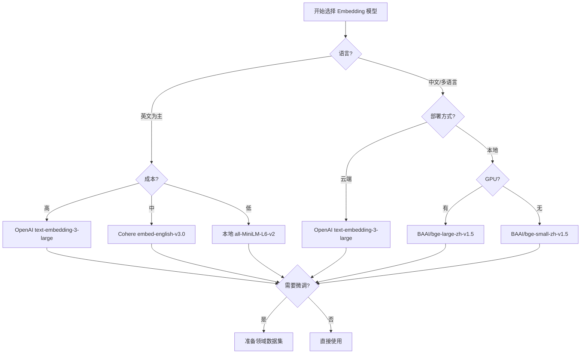

<Callout type="success" title="为什么 Embedding 质量决定 RAG 上限">
Embedding 模型将文本转换为向量表示，直接决定了语义检索的质量。好的 embedding 能准确捕捉语义相似性，而差的 embedding 会导致检索结果文不对题。选择合适的模型、维度和部署方式是构建高质量 RAG 的基础。
</Callout>

# Embedding 技术选型

## 背景与核心问题

### Embedding 的本质

Embedding 是将离散的文本（或图像、音频）映射到连续向量空间的过程。在 RAG 中，embedding 有两个关键作用：

1. **索引阶段**：将文档 chunks 转换为向量并存储
2. **查询阶段**：将用户查询转换为向量进行相似度检索

### 关键选型维度

| 维度 | 考量因素 | 影响 |
|------|---------|------|
| **模型质量** | MTEB 分数、领域适配性 | 直接影响检索准确率 |
| **向量维度** | 128-3072 维 | 存储成本 vs 表达能力 |
| **部署方式** | 云端 API / 本地部署 | 成本、延迟、隐私 |
| **多语言支持** | 单语 / 多语 / 跨语言 | 国际化需求 |
| **推理速度** | QPS、延迟 | 用户体验 |
| **成本** | API 费用 / GPU 成本 | TCO |

## 九大项目 Embedding 方案全景

| 项目 | 主要方案 | 多提供商支持 | 本地部署 | 技术成熟度 |
|------|---------|------------|---------|-----------|
| **LightRAG** | Provider-agnostic | ✅ OpenAI/HF/Ollama | ✅ | ⭐⭐⭐⭐⭐ |
| **RAG-Anything** | 继承 LightRAG | ✅ | ✅ | ⭐⭐⭐⭐⭐ |
| **onyx** | 企业多提供商 | ✅ OpenAI/Cohere/Voyage | ✅ 模型服务器 | ⭐⭐⭐⭐⭐（企业） |
| **SurfSense** | 灵活配置 | ✅ OpenAI/HF | ✅ sentence-transformers | ⭐⭐⭐⭐ |
| **kotaemon** | LlamaIndex 集成 | ✅ 多提供商 | ✅ | ⭐⭐⭐⭐ |
| **Verba** | 插件架构 | ✅ OpenAI/Cohere/Ollama | ✅ Ollama | ⭐⭐⭐⭐ |
| **ragflow** | 多提供商 | ✅ OpenAI/Jina/Mistral | 有限 | ⭐⭐⭐⭐ |
| **UltraRAG** | OpenAI 兼容 | OpenAI API | 有限 | ⭐⭐⭐ |
| **Self-Corrective-Agentic-RAG** | 本地优先 | sentence-transformers | ✅ BAAI/bge-m3 | ⭐⭐⭐ |

<Callout type="warn" title="关键洞察">
<ul>
  <li><strong>最灵活</strong>：LightRAG 的 provider-agnostic 设计支持任意 embedding 函数</li>
  <li><strong>最企业化</strong>：onyx 的模型服务器架构 + 精度控制 + 多租户</li>
  <li><strong>最简单</strong>：Self-Corrective-Agentic-RAG 的 sentence-transformers 本地方案</li>
  <li><strong>趋势</strong>：从单一提供商向多提供商 + 混合部署演进</li>
</ul>
</Callout>

## 模型选择决策树



## 核心实现深度对比

### 1. LightRAG：Provider-Agnostic 灵活架构

**设计理念**：统一接口适配任意 embedding 提供商

```python title="lightrag/embedding_func.py" path=null start=null
class EmbeddingFunc:
    """
    LightRAG 的核心 Embedding 抽象
    
    特点：
    1. 维度与 token 限制明确
    2. 支持自定义 embedding 函数
    3. 内置批处理优化
    4. 异步处理支持
    """
    def __init__(
        self,
        embedding_dim: int,
        max_token_size: int = 8192,
        func: callable = None,
    ):
        self.embedding_dim = embedding_dim
        self.max_token_size = max_token_size
        self.func = func
        self.embedding_batch_num = 64  # 批处理大小
    
    async def __call__(self, texts: list[str]) -> np.ndarray:
        """
        执行 embedding，自动批处理
        
        Returns:
            shape: (len(texts), embedding_dim)
        """
        if self.func is None:
            raise ValueError("Embedding function not configured")
        
        # 批处理优化（避免 API 限流）
        batches = [
            texts[i : i + self.embedding_batch_num]
            for i in range(0, len(texts), self.embedding_batch_num)
        ]
        
        # 异步并发处理
        results = await asyncio.gather(*[self.func(batch) for batch in batches])
        
        # 展平结果
        embeddings = [emb for batch_result in results for emb in batch_result]
        
        # 验证维度
        assert len(embeddings) == len(texts), "Embedding count mismatch"
        assert all(len(emb) == self.embedding_dim for emb in embeddings), \
            "Embedding dimension mismatch"
        
        return np.array(embeddings)

# 示例：OpenAI Embedding 函数
async def openai_embedding_func(texts: list[str]) -> list[list[float]]:
    """OpenAI API 调用"""
    from openai import AsyncOpenAI
    
    client = AsyncOpenAI(api_key=os.getenv("OPENAI_API_KEY"))
    
    response = await client.embeddings.create(
        model="text-embedding-3-large",
        input=texts,
        dimensions=3072  # 可配置维度（3072/1536/256）
    )
    
    return [item.embedding for item in response.data]

# 示例：本地 HuggingFace 模型
async def huggingface_embedding_func(texts: list[str]) -> list[list[float]]:
    """本地 sentence-transformers 模型"""
    from sentence_transformers import SentenceTransformer
    
    # 模型可缓存复用
    if not hasattr(huggingface_embedding_func, "model"):
        huggingface_embedding_func.model = SentenceTransformer(
            "BAAI/bge-base-en-v1.5",
            device="cuda" if torch.cuda.is_available() else "cpu"
        )
    
    embeddings = huggingface_embedding_func.model.encode(
        texts,
        batch_size=32,
        show_progress_bar=False,
        normalize_embeddings=True  # 归一化便于余弦相似度
    )
    
    return embeddings.tolist()

# 使用示例
embedding_func = EmbeddingFunc(
    embedding_dim=3072,
    max_token_size=8192,
    func=openai_embedding_func
)

# 执行 embedding
texts = ["What is RAG?", "Explain vector search"]
embeddings = await embedding_func(texts)
```

**优势**：
- ✅ 极高灵活性，支持任意 embedding 来源
- ✅ 批处理 + 异步提升吞吐
- ✅ 维度验证确保一致性

**劣势**：
- ❌ 需要用户实现具体 provider 函数
- ❌ 缺少开箱即用的模型配置

### 2. onyx：企业级模型服务器架构

**设计理念**：分布式模型服务器 + 精度控制 + 多租户隔离

```python title="onyx/embedding_model.py" path=null start=null
class EmbeddingModel:
    """
    onyx 企业级 Embedding 模型
    
    企业特性：
    1. 模型服务器架构（独立部署）
    2. 精度控制（BFLOAT16/FLOAT32）
    3. 多租户隔离
    4. 性能监控与追踪
    5. 自动重试与降级
    """
    def __init__(
        self,
        model_name: str,
        provider_type: EmbeddingProvider,
        # 企业特性
        server_host: str = "localhost",
        server_port: int = 9000,
        normalize: bool = True,
        precision: str = "FLOAT32",  # BFLOAT16/FLOAT16/FLOAT32
        reduced_dimension: int | None = None,
        # 多租户
        tenant_id: str | None = None,
        # 监控
        enable_tracing: bool = True,
        callback: IndexingHeartbeatInterface | None = None,
    ):
        self.model_name = model_name
        self.provider_type = provider_type
        self.server_host = server_host
        self.server_port = server_port
        self.normalize = normalize
        self.precision = precision
        self.reduced_dimension = reduced_dimension
        self.tenant_id = tenant_id
        self.enable_tracing = enable_tracing
        self.callback = callback
        
        # 初始化模型服务器连接
        self._init_model_server()
    
    def _init_model_server(self):
        """连接到模型服务器（独立进程）"""
        self.client = ModelServerClient(
            host=self.server_host,
            port=self.server_port,
            timeout=30.0
        )
        
        # 健康检查
        if not self.client.health_check():
            raise ConnectionError(f"Model server unavailable: {self.server_host}:{self.server_port}")
    
    def encode(
        self,
        texts: list[str],
        text_type: EmbedTextType,  # PASSAGE / QUERY
        large_chunks_present: bool = False,
        request_id: str | None = None,
    ) -> list[Embedding]:
        """
        执行 embedding with 企业特性
        """
        # 1. 追踪开始
        trace_id = None
        if self.enable_tracing:
            trace_id = self._start_trace(request_id, len(texts))
        
        try:
            # 2. 预处理（token 限制检查）
            processed_texts = self._preprocess_texts(
                texts, 
                large_chunks_present=large_chunks_present
            )
            
            # 3. 调用模型服务器
            embeddings = self.client.embed(
                texts=processed_texts,
                model_name=self.model_name,
                text_type=text_type.value,
                tenant_id=self.tenant_id,
                normalize=self.normalize
            )
            
            # 4. 精度管理（降低存储成本）
            if self.precision != "FLOAT32":
                embeddings = self._convert_precision(embeddings)
            
            # 5. 维度缩减（可选，进一步降低成本）
            if self.reduced_dimension:
                embeddings = self._reduce_dimensions(embeddings)
            
            # 6. 记录指标
            self._record_metrics(trace_id, len(texts), embeddings[0].shape[0])
            
            return embeddings
            
        except Exception as e:
            # 错误追踪
            self._record_error(trace_id, e)
            
            # 重试逻辑
            if self._should_retry(e):
                return self._retry_with_backoff(texts, text_type, request_id)
            
            raise
    
    def _convert_precision(self, embeddings: list[np.ndarray]) -> list[np.ndarray]:
        """精度转换（降低内存/存储）"""
        if self.precision == "BFLOAT16":
            # bfloat16: 节省 50% 空间，精度损失小
            return [emb.astype(np.bfloat16) for emb in embeddings]
        elif self.precision == "FLOAT16":
            # float16: 节省 50% 空间，精度损失中等
            return [emb.astype(np.float16) for emb in embeddings]
        return embeddings
    
    def _reduce_dimensions(self, embeddings: list[np.ndarray]) -> list[np.ndarray]:
        """
        维度缩减（Matryoshka Representation Learning）
        
        某些模型（如 OpenAI embedding-3）支持动态维度：
        - 3072 维：最高精度
        - 1536 维：平衡
        - 256 维：高效存储
        """
        if self.reduced_dimension and embeddings[0].shape[0] > self.reduced_dimension:
            return [emb[:self.reduced_dimension] for emb in embeddings]
        return embeddings

# 模型服务器（独立部署）
class ModelServer:
    """
    独立的 Embedding 模型服务器
    
    优势：
    1. GPU 资源集中管理
    2. 多个 API 服务器共享模型
    3. 热加载/热更新模型
    4. 批处理优化
    """
    def __init__(self, host: str = "0.0.0.0", port: int = 9000):
        self.host = host
        self.port = port
        self.models = {}  # 模型缓存
    
    def load_model(self, model_name: str, device: str = "cuda"):
        """预加载模型到显存"""
        from sentence_transformers import SentenceTransformer
        
        if model_name not in self.models:
            self.models[model_name] = SentenceTransformer(
                model_name,
                device=device
            )
    
    async def embed_batch(
        self, 
        texts: list[str], 
        model_name: str,
        batch_size: int = 64
    ) -> np.ndarray:
        """批处理 embedding（优化 GPU 利用率）"""
        model = self.models.get(model_name)
        if model is None:
            raise ValueError(f"Model not loaded: {model_name}")
        
        # 动态批处理
        embeddings = model.encode(
            texts,
            batch_size=batch_size,
            show_progress_bar=False,
            normalize_embeddings=True,
            convert_to_numpy=True
        )
        
        return embeddings
```

**企业级特性**：
- ✅ 模型服务器独立部署（GPU 集中管理）
- ✅ 精度控制（BFLOAT16 节省 50% 存储）
- ✅ 维度缩减（Matryoshka 动态维度）
- ✅ 多租户隔离与追踪
- ✅ 自动重试与降级

**适用场景**：
- 大规模部署（&gt;10M 文档）
- GPU 资源集中管理
- 严格 SLA 要求

### 3. Self-Corrective-Agentic-RAG：极简本地方案

**设计理念**：开箱即用的本地 embedding，零 API 依赖

```python title="agentic_rag/local_embedding.py" path=null start=null
from sentence_transformers import SentenceTransformer
import numpy as np

class LocalEmbedding:
    """
    极简本地 Embedding 方案
    
    优势：
    1. 完全本地（无 API 成本，隐私保护）
    2. 开箱即用（无复杂配置）
    3. 支持 GPU 加速
    4. 模型可缓存复用
    """
    def __init__(
        self,
        model_name: str = "BAAI/bge-m3",  # 多语言模型
        device: str = None,
        normalize: bool = True
    ):
        """
        推荐模型：
        - 英文：BAAI/bge-base-en-v1.5 (768维, 高质量)
        - 中文：BAAI/bge-large-zh-v1.5 (1024维)
        - 多语言：BAAI/bge-m3 (1024维, 100+语言)
        - 轻量：all-MiniLM-L6-v2 (384维, 快速)
        """
        self.model_name = model_name
        self.device = device or ("cuda" if torch.cuda.is_available() else "cpu")
        self.normalize = normalize
        
        # 加载模型（首次会下载）
        print(f"Loading embedding model: {model_name} on {self.device}")
        self.model = SentenceTransformer(model_name, device=self.device)
        
        # 获取模型信息
        self.embedding_dim = self.model.get_sentence_embedding_dimension()
        self.max_seq_length = self.model.max_seq_length
        
        print(f"Model loaded: dim={self.embedding_dim}, max_seq={self.max_seq_length}")
    
    def embed(
        self, 
        texts: list[str] | str,
        batch_size: int = 32,
        show_progress: bool = False
    ) -> np.ndarray:
        """
        生成 embeddings
        
        Returns:
            shape: (len(texts), embedding_dim)
        """
        if isinstance(texts, str):
            texts = [texts]
        
        embeddings = self.model.encode(
            texts,
            batch_size=batch_size,
            show_progress_bar=show_progress,
            normalize_embeddings=self.normalize,
            convert_to_numpy=True
        )
        
        return embeddings
    
    def similarity(self, text1: str, text2: str) -> float:
        """计算两个文本的余弦相似度"""
        emb1, emb2 = self.embed([text1, text2])
        return float(np.dot(emb1, emb2))

# 使用示例（极简）
embedding_model = LocalEmbedding(model_name="BAAI/bge-base-en-v1.5")

# 生成 embeddings
texts = ["What is machine learning?", "Explain deep learning"]
embeddings = embedding_model.embed(texts)

print(f"Generated {len(embeddings)} embeddings of dimension {embeddings.shape[1]}")
```

**优势**：
- ✅ 完全本地（隐私保护）
- ✅ 零 API 成本
- ✅ 离线可用
- ✅ 代码极简

**劣势**：
- ❌ 需要 GPU（CPU 推理慢）
- ❌ 模型质量受限于开源模型
- ❌ 缺乏企业级特性

## 模型选型推荐

### 按场景推荐

<Cards>
  <Card title="通用英文场景" href="#english">
    <p><strong>云端</strong>：OpenAI text-embedding-3-large (3072维)</p>
    <p><strong>本地</strong>：BAAI/bge-base-en-v1.5 (768维)</p>
    <p><strong>轻量</strong>：all-MiniLM-L6-v2 (384维)</p>
  </Card>
  
  <Card title="中文/多语言" href="#chinese">
    <p><strong>高质量</strong>：BAAI/bge-large-zh-v1.5 (1024维)</p>
    <p><strong>多语言</strong>：BAAI/bge-m3 (1024维, 100+语言)</p>
    <p><strong>云端</strong>：OpenAI text-embedding-3-large</p>
  </Card>
  
  <Card title="企业级部署" href="#enterprise">
    <p><strong>方案1</strong>：onyx 模型服务器 + Cohere/Voyage</p>
    <p><strong>方案2</strong>：自建 embedding 服务 + BAAI 系列</p>
    <p><strong>混合</strong>：云端 + 本地双部署（降级）</p>
  </Card>
  
  <Card title="隐私/离线" href="#privacy">
    <p><strong>推荐</strong>：Self-Corrective-Agentic-RAG 方案</p>
    <p><strong>模型</strong>：BAAI/bge-m3 本地部署</p>
    <p><strong>优化</strong>：量化 + ONNX 加速</p>
  </Card>
</Cards>

### 模型质量对比（MTEB Benchmark）

| 模型 | 维度 | 英文 | 中文 | 多语言 | 部署 | 成本 |
|------|-----|------|------|-------|------|------|
| **OpenAI text-embedding-3-large** | 3072 | ⭐⭐⭐⭐⭐ | ⭐⭐⭐⭐ | ⭐⭐⭐⭐⭐ | 云端 | $0.13/1M tokens |
| **Cohere embed-english-v3.0** | 1024 | ⭐⭐⭐⭐⭐ | - | ⭐⭐⭐ | 云端 | $0.10/1M tokens |
| **Voyage AI voyage-2** | 1024 | ⭐⭐⭐⭐⭐ | ⭐⭐⭐⭐ | ⭐⭐⭐⭐ | 云端 | $0.12/1M tokens |
| **BAAI/bge-large-en-v1.5** | 1024 | ⭐⭐⭐⭐ | - | - | 本地 | GPU 成本 |
| **BAAI/bge-large-zh-v1.5** | 1024 | ⭐⭐⭐ | ⭐⭐⭐⭐⭐ | ⭐⭐ | 本地 | GPU 成本 |
| **BAAI/bge-m3** | 1024 | ⭐⭐⭐⭐ | ⭐⭐⭐⭐ | ⭐⭐⭐⭐⭐ | 本地 | GPU 成本 |
| **all-MiniLM-L6-v2** | 384 | ⭐⭐⭐ | - | - | 本地 | CPU 可用 |

## 高级技巧

### 1. Embedding 微调

**为什么微调？**

通用模型在特定领域（医疗、法律、金融）效果不佳时，微调可提升 5-15% 检索准确率。

```python title="embedding_finetuning.py" path=null start=null
from sentence_transformers import SentenceTransformer, InputExample, losses
from torch.utils.data import DataLoader

def finetune_embedding_model(
    base_model: str = "BAAI/bge-base-en-v1.5",
    train_data: list[tuple[str, str, float]],  # (query, doc, similarity)
    output_path: str = "./finetuned_model",
    epochs: int = 3
):
    """
    微调 embedding 模型
    
    训练数据格式：
    [
        ("query 1", "relevant doc", 1.0),
        ("query 1", "irrelevant doc", 0.0),
        ...
    ]
    """
    # 1. 加载基础模型
    model = SentenceTransformer(base_model)
    
    # 2. 准备训练样本
    train_examples = [
        InputExample(texts=[query, doc], label=score)
        for query, doc, score in train_data
    ]
    
    # 3. 创建 DataLoader
    train_dataloader = DataLoader(
        train_examples, 
        shuffle=True, 
        batch_size=16
    )
    
    # 4. 定义损失函数（Cosine Similarity Loss）
    train_loss = losses.CosineSimilarityLoss(model)
    
    # 5. 训练
    model.fit(
        train_objectives=[(train_dataloader, train_loss)],
        epochs=epochs,
        warmup_steps=100,
        output_path=output_path,
        show_progress_bar=True
    )
    
    print(f"Model fine-tuned and saved to: {output_path}")
    return model

# 使用微调后的模型
finetuned_model = SentenceTransformer("./finetuned_model")
embeddings = finetuned_model.encode(["domain-specific query"])
```

**延伸阅读**：[训练重排序模型](/docs/advanced-rag-deep-dive/huggingface-train-reranker) - 类似的微调流程

### 2. 动态维度与成本优化

```python title="dimension_optimization.py" path=null start=null
# OpenAI Matryoshka 支持动态维度
from openai import OpenAI

client = OpenAI()

# 场景1：高精度检索（昂贵但准确）
high_precision = client.embeddings.create(
    model="text-embedding-3-large",
    input=texts,
    dimensions=3072  # 全维度
)

# 场景2：平衡（推荐）
balanced = client.embeddings.create(
    model="text-embedding-3-large",
    input=texts,
    dimensions=1536  # 一半维度，存储减半
)

# 场景3：高效存储（粗排）
efficient = client.embeddings.create(
    model="text-embedding-3-large",
    input=texts,
    dimensions=256   # 仅 8% 存储，适合粗排
)

# 混合策略：粗排 + 精排
# 1. 用 256 维粗排召回 top-100
# 2. 用 3072 维精排选 top-10
```

### 3. 缓存与批处理优化

```python title="embedding_optimization.py" path=null start=null
import hashlib
from functools import lru_cache

class CachedEmbedding:
    """带缓存的 Embedding（避免重复计算）"""
    
    def __init__(self, embedding_model, cache_dir: str = "./emb_cache"):
        self.model = embedding_model
        self.cache_dir = Path(cache_dir)
        self.cache_dir.mkdir(exist_ok=True)
    
    def _cache_key(self, text: str) -> str:
        """生成缓存键"""
        return hashlib.md5(text.encode()).hexdigest()
    
    def embed_with_cache(self, texts: list[str]) -> np.ndarray:
        """检索缓存 + 批量计算未缓存"""
        embeddings = []
        uncached_texts = []
        uncached_indices = []
        
        # 1. 检查缓存
        for i, text in enumerate(texts):
            cache_file = self.cache_dir / f"{self._cache_key(text)}.npy"
            if cache_file.exists():
                embeddings.append(np.load(cache_file))
            else:
                uncached_texts.append(text)
                uncached_indices.append(i)
        
        # 2. 批量计算未缓存
        if uncached_texts:
            new_embeddings = self.model.embed(uncached_texts)
            
            # 保存到缓存
            for text, emb in zip(uncached_texts, new_embeddings):
                cache_file = self.cache_dir / f"{self._cache_key(text)}.npy"
                np.save(cache_file, emb)
            
            # 插入到结果中
            for idx, emb in zip(uncached_indices, new_embeddings):
                embeddings.insert(idx, emb)
        
        return np.array(embeddings)
```

## 常见问题

<Cards>
  <Card title="向量维度如何选择" href="#dimension">
    <p><strong>原则</strong>：维度越高表达能力越强，但存储成本线性增长</p>
    <p><strong>推荐</strong>：768-1024维（平衡），3072维（高质量），256维（粗排）</p>
  </Card>
  
  <Card title="云端 vs 本地如何选" href="#cloud-local">
    <p><strong>云端优势</strong>：模型质量高、零运维、弹性扩展</p>
    <p><strong>本地优势</strong>：隐私、成本（大规模）、离线可用</p>
    <p><strong>建议</strong>：初期云端快速验证，规模化后评估本地部署</p>
  </Card>
  
  <Card title="多语言如何处理" href="#multilingual">
    <p><strong>方案1</strong>：多语言模型（bge-m3, OpenAI-3-large）</p>
    <p><strong>方案2</strong>：分语言模型（英文用bge-en，中文用bge-zh）</p>
    <p><strong>跨语言</strong>：多语言模型支持跨语言检索（中文查询检索英文文档）</p>
  </Card>
  
  <Card title="Embedding 刷新策略" href="#refresh">
    <p><strong>场景</strong>：模型升级、微调后、数据分布变化</p>
    <p><strong>策略</strong>：灰度切换（新旧并存）、分批重建（避免中断）</p>
    <p><strong>延伸</strong>：见"如何提高 RAG 性能"中的"刷新嵌入"章节</p>
  </Card>
</Cards>

## 延伸阅读

- [如何提高 RAG 性能](/docs/advanced-rag-deep-dive/how-to-improve-rag-performance) - 包含嵌入优化章节
- [构建高质量的 RAG 系统](/docs/advanced-rag-deep-dive/building-high-quality-rag-systems) - 嵌入模型选择
- [训练重排序模型](/docs/advanced-rag-deep-dive/huggingface-train-reranker) - 类似的微调流程

## 参考文献

本文基于以下研究材料整理：
- RAGSolutions/embedding_analysis.md - Embedding 节点详细分析
- RAGSolutions/best_practices_recommendations.md - 最佳实践推荐
- RAGSolutions/cross_project_comparison.md - 跨项目对比

**下一步**：进入 [生成优化技巧](/docs/rag-project-analysis/02-pipeline-deep-dive/./04-生成优化技巧) 了解如何优化 LLM 生成质量。
