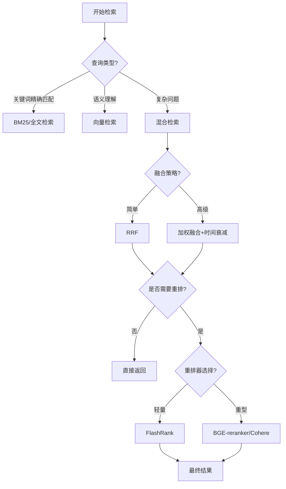

<Callout type="success" title="为什么检索架构是 RAG 的核心">
检索质量直接决定生成质量。好的检索能找到最相关的上下文，而差的检索会让 LLM 陷入"garbage in, garbage out"困境。混合检索、融合策略和重排序是提升检索质量的三大利器。
</Callout>

# 检索架构设计

## 背景与核心问题

### RAG 检索的本质挑战

检索不仅仅是"找相似"，而是要在**召回率（Recall）**与**准确率（Precision）**之间找到平衡：

| 挑战 | 描述 | 常见方案 |
|------|------|---------|
| **语义歧义** | 同一词在不同上下文有不同含义 | 向量检索 + 上下文重排 |
| **关键词缺失** | 用户查询缺少关键术语 | 查询扩展、多查询生成 |
| **粒度不匹配** | Chunk 粒度与查询粒度不一致 | 多粒度索引、窗口扩展 |
| **时效性** | 新信息需要优先展示 | 时间衰减、recency boost |
| **多租户隔离** | 不同用户看到不同数据 | 命名空间、过滤条件 |

### 检索指标权衡

<Callout type="warn" title="召回与准确的权衡">
<ul>
  <li><strong>高召回</strong>：检索更多候选（top_k=100），保证不漏掉相关内容，但会引入噪声</li>
  <li><strong>高准确</strong>：只返回高置信度结果（top_k=5），保证质量但可能漏掉关键信息</li>
  <li><strong>最佳实践</strong>：两阶段检索 — 粗排（高召回）+ 精排/重排（高准确）</li>
</ul>
</Callout>

## 九大项目检索能力全景

| 项目 | 检索策略 | 混合检索 | 重排序 | 多模态检索 | 技术成熟度 |
|------|---------|---------|--------|-----------|-----------|
| **LightRAG** | 双层（向量+图谱） | 4种模式 | ✅ | 需 RAG-Anything | ⭐⭐⭐⭐⭐ |
| **RAG-Anything** | 向量-图谱融合 | 4种模式 | ✅ | ✅ 完整支持 | ⭐⭐⭐⭐⭐ |
| **onyx** | Vespa 混合检索 | ✅ 企业级 | ✅ | 有限 | ⭐⭐⭐⭐⭐（企业） |
| **SurfSense** | 向量+关键词 | RRF | ✅ FlashRank | 有限 | ⭐⭐⭐⭐ |
| **kotaemon** | 向量+全文 | ✅ | ✅ | ✅ 完整 | ⭐⭐⭐⭐ |
| **Self-Corrective-Agentic-RAG** | 向量+BM25 | RRF | ✅ | 有限 | ⭐⭐⭐⭐ |
| **ragflow** | 向量+关键词 | 加权融合 | ✅ | 有限 | ⭐⭐⭐⭐ |
| **UltraRAG** | 向量为主 | MaxSim | ✅ | 有限 | ⭐⭐⭐ |
| **Verba** | 向量+关键词 | ✅ | 计划中 | 有限 | ⭐⭐⭐ |

## 关键决策树



## 核心检索策略深度对比

### 1. LightRAG：四模式双层检索

**架构特点**：向量层 + 知识图谱层的双层索引

#### 四种检索模式

```python title="lightrag/retrieval_modes.py" path=null start=null
# 1. Naive Search - 纯向量检索
async def naive_search(query: str, top_k: int = 10):
    """基础向量相似度搜索"""
    query_embedding = await get_embedding(query)
    results = await vector_db.query(query_embedding, top_k=top_k)
    return results

# 2. Local Search - 局部上下文增强
async def local_search(query: str, top_k: int = 10):
    """
    关注查询相关的局部实体和关系
    适用于：具体问题、实体查询
    """
    # Step 1: 向量检索找到相关实体
    initial_entities = await naive_search(query, top_k=top_k * 2)
    
    # Step 2: 图谱扩展 - 查找相关实体的邻居
    expanded_entities = []
    for entity in initial_entities:
        neighbors = await graph_db.get_neighbors(entity, depth=1)
        expanded_entities.extend(neighbors)
    
    # Step 3: 根据与查询的相关性重排
    ranked_entities = await rank_by_relevance(query, expanded_entities)
    return ranked_entities[:top_k]

# 3. Global Search - 全局视角检索
async def global_search(query: str, top_k: int = 10):
    """
    利用全局知识图谱的社区结构
    适用于：总结性问题、主题查询
    """
    # Step 1: 识别相关的图谱社区
    query_embedding = await get_embedding(query)
    relevant_communities = await graph_db.find_relevant_communities(
        query_embedding, 
        top_k=5
    )
    
    # Step 2: 从社区中提取代表性节点
    representative_entities = []
    for community in relevant_communities:
        representatives = await community.get_representatives()
        representative_entities.extend(representatives)
    
    # Step 3: 融合社区级别和实体级别的相关性
    fused_results = await fuse_community_and_entity_scores(
        query, 
        representative_entities
    )
    return fused_results[:top_k]

# 4. Hybrid Search - 智能组合
async def hybrid_search(query: str, top_k: int = 10):
    """
    根据查询特征自动选择 local 或 global 策略
    或智能组合两者结果
    """
    # 分析查询类型
    query_type = await analyze_query_type(query)
    
    if query_type == "specific":
        # 具体问题偏向 local search
        local_results = await local_search(query, top_k=top_k)
        global_results = await global_search(query, top_k=int(top_k * 0.3))
        weights = [0.7, 0.3]
    else:
        # 总结性问题偏向 global search
        local_results = await local_search(query, top_k=int(top_k * 0.3))
        global_results = await global_search(query, top_k=top_k)
        weights = [0.3, 0.7]
    
    # 加权融合
    fused_results = await weighted_fusion(
        [local_results, global_results], 
        weights=weights
    )
    return fused_results[:top_k]
```

**优势**：
- ✅ 适应不同查询类型（具体 vs 总结）
- ✅ 图谱增强提升上下文理解
- ✅ 灵活的模式切换

**劣势**：
- ❌ 需要维护双层索引（成本高）
- ❌ 图谱构建质量影响检索效果
- ❌ 参数调优复杂

### 2. 混合检索 + RRF 融合（Self-Corrective-Agentic-RAG / SurfSense）

**核心思想**：向量检索抓语义，BM25 抓关键词，RRF 融合取长补短

#### RRF（Reciprocal Rank Fusion）原理

```python title="rrf_fusion.py" path=null start=null
def reciprocal_rank_fusion(
    results_list: List[List[Document]], 
    k: int = 60,  # RRF 常数，通常取 60
    top_k: int = 10
) -> List[Document]:
    """
    RRF 公式：score(d) = Σ 1/(k + rank_i(d))
    
    优势：
    1. 不需要归一化不同检索器的分数
    2. 对离群值不敏感
    3. 简单高效
    
    Args:
        results_list: 多个检索器的结果列表
        k: RRF 常数（越大越平滑）
        top_k: 返回结果数
    """
    doc_scores = defaultdict(float)
    
    # 遍历每个检索器的结果
    for results in results_list:
        for rank, doc in enumerate(results, start=1):
            # RRF 核心公式
            doc_scores[doc.id] += 1.0 / (k + rank)
    
    # 按分数排序
    sorted_docs = sorted(
        doc_scores.items(), 
        key=lambda x: x[1], 
        reverse=True
    )
    
    return [doc_id for doc_id, _ in sorted_docs[:top_k]]

# 实战示例：Self-Corrective-Agentic-RAG
async def hybrid_retrieve(query: str, top_k: int = 10):
    """完整的混合检索流程"""
    # 1. 向量检索（Pinecone）
    query_embedding = await get_embedding(query)
    vector_results = await pinecone_index.query(
        vector=query_embedding,
        top_k=20  # 粗排阶段多召回
    )
    
    # 2. BM25 关键词检索
    bm25_results = bm25.get_top_n(query, documents, n=20)
    
    # 3. RRF 融合
    fused_docs = reciprocal_rank_fusion(
        [vector_results, bm25_results],
        k=60,
        top_k=top_k
    )
    
    return fused_docs
```

**SurfSense 的 PostgreSQL 原生混合检索**：

```python title="surfsense/hybrid_search.py" path=null start=null
async def postgres_hybrid_search(
    query_text: str, 
    query_vector: List[float],
    user_id: int,
    top_k: int = 10
):
    """利用 PostgreSQL 的向量和全文索引"""
    async with engine.begin() as conn:
        # 使用 CTE（Common Table Expression）分别检索
        result = await conn.execute(text("""
        WITH vector_results AS (
            -- pgvector 余弦相似度检索
            SELECT 
                id, 
                content,
                1 - (embedding &lt;=&gt; :query_vector::vector) AS vector_score,
                ROW_NUMBER() OVER (ORDER BY embedding &lt;=&gt; :query_vector::vector) AS vector_rank
            FROM documents
            WHERE user_id = :user_id
            ORDER BY embedding &lt;=&gt; :query_vector::vector
            LIMIT 20
        ),
        fulltext_results AS (
            -- PostgreSQL 全文检索
            SELECT 
                id,
                content,
                ts_rank(to_tsvector('english', content), 
                        plainto_tsquery('english', :query_text)) AS text_score,
                ROW_NUMBER() OVER (
                    ORDER BY ts_rank(to_tsvector('english', content), 
                                    plainto_tsquery('english', :query_text)) DESC
                ) AS text_rank
            FROM documents
            WHERE user_id = :user_id
            AND to_tsvector('english', content) @@ plainto_tsquery('english', :query_text)
            LIMIT 20
        )
        -- RRF 融合（k=60）
        SELECT 
            COALESCE(v.id, f.id) AS id,
            COALESCE(v.content, f.content) AS content,
            (COALESCE(1.0 / (60 + v.vector_rank), 0) + 
             COALESCE(1.0 / (60 + f.text_rank), 0)) AS rrf_score
        FROM vector_results v
        FULL OUTER JOIN fulltext_results f ON v.id = f.id
        WHERE v.id IS NOT NULL OR f.id IS NOT NULL
        ORDER BY rrf_score DESC
        LIMIT :top_k
        """), {
            "query_vector": query_vector,
            "query_text": query_text,
            "user_id": user_id,
            "top_k": top_k
        })
        return result.fetchall()
```

**优势**：
- ✅ RRF 不需要归一化分数
- ✅ 结合语义和精确匹配
- ✅ 实现简单，效果稳定

**劣势**：
- ❌ 需要维护两套索引
- ❌ 查询延迟增加（两次检索）
- ❌ RRF 常数 k 需要调优

### 3. onyx：企业级 Vespa 混合检索

**架构特点**：Vespa 的多字段混合排序 + 时间衰减 + 多租户隔离

```python title="onyx/vespa_retrieval.py" path=null start=null
async def enterprise_hybrid_retrieval(
    query: str,
    user_id: int,
    workspace_id: int,
    hybrid_alpha: float = 0.5,  # 向量权重（0=纯关键词，1=纯向量）
    time_decay_multiplier: float = 1.0,
    top_k: int = 10
):
    """
    Vespa YQL 查询语言实现的多维度混合检索
    """
    # 1. 准备查询向量
    query_embedding = await get_embedding(query)
    
    # 2. 构建 Vespa YQL（类似 SQL 的查询语言）
    yql = f"""
    SELECT * FROM documents WHERE
        (
            -- 向量相似度（内容）
            ({{targetHits: {top_k * 2}}}nearestNeighbor(content_embedding, query_embedding))
            OR
            -- 向量相似度（标题）
            ({{targetHits: {top_k * 2}}}nearestNeighbor(title_embedding, query_embedding))
            OR
            -- BM25 关键词（弱语法，允许部分匹配）
            ({{grammar: "weakAnd"}}userInput(@query))
            OR
            -- 内容摘要关键词
            ({{defaultIndex: "content_summary"}}userInput(@query))
        )
        -- 多租户过滤
        AND user_id = {user_id}
        AND workspace_id = {workspace_id}
        -- 访问控制（ACL）
        AND document_id IN ({accessible_doc_ids})
    """
    
    # 3. 配置 Ranking Profile（排序策略）
    ranking_profile = {
        "profile": "hybrid_with_time_decay",
        "parameters": {
            # 向量和关键词的权重平衡
            "alpha": hybrid_alpha,
            
            # 时间衰减函数（指数衰减）
            "time_decay": f"exp(-{time_decay_multiplier} * max(0, now() - attribute(created_at)) / 86400)",
            
            # 标题加权（标题匹配权重更高）
            "title_boost": 2.0
        }
    }
    
    # 4. 执行查询
    response = await vespa_client.query(
        yql=yql,
        query_embedding=query_embedding,
        query_text=query,
        ranking=ranking_profile,
        hits=top_k
    )
    
    return response.hits

# Vespa Ranking Expression 示例（在 Vespa Schema 中定义）
"""
rank-profile hybrid_with_time_decay {
    # 第一阶段：粗排（快速过滤）
    first-phase {
        expression: 
            # 向量相似度（内容）
            query(alpha) * closeness(field, content_embedding) +
            # 向量相似度（标题）
            query(alpha) * query(title_boost) * closeness(field, title_embedding) +
            # BM25 分数
            (1 - query(alpha)) * bm25(content) +
            # 时间衰减
            query(time_decay)
    }
    
    # 第二阶段：精排（详细计算）
    second-phase {
        expression: 
            firstPhase + 
            # 可以加入更复杂的特征，如用户行为、点击率等
            0.1 * attribute(popularity_score)
        
        rerank-count: 100  # 精排前 100 个结果
    }
}
"""
```

**企业级特性**：
- ✅ 多字段向量检索（内容+标题）
- ✅ 时间衰减（新文档优先）
- ✅ 多租户隔离（安全）
- ✅ 两阶段排序（粗排+精排）
- ✅ ACL 访问控制

**性能优化**：
- HNSW 索引：P99 延迟 &lt; 50ms
- 分布式部署：水平扩展至 1000+ QPS
- 缓存策略：热门查询缓存

### 4. 重排序（Reranking）优化

**为什么需要重排序？**

粗排阶段（向量检索/BM25）速度快但不够精确，重排序用更复杂的模型（Cross-Encoder）对候选结果重新打分。

#### FlashRank（SurfSense）- 轻量级重排

```python title="surfsense/reranking.py" path=null start=null
from flashrank import Ranker, RerankRequest

async def rerank_with_flashrank(
    query: str, 
    documents: List[Document],
    top_k: int = 10
):
    """
    FlashRank 特点：
    1. 速度快（~10ms for 20 docs）
    2. 内存占用小（~100MB）
    3. 无需 GPU
    4. 支持多语言
    """
    # 初始化 ranker（可复用）
    ranker = Ranker(model_name="ms-marco-MiniLM-L-12-v2")
    
    # 准备重排请求
    rerank_request = RerankRequest(
        query=query,
        passages=[{"text": doc.content, "meta": {"id": doc.id}} 
                  for doc in documents]
    )
    
    # 执行重排
    results = ranker.rerank(rerank_request)
    
    # 返回 top-k
    return [
        {"id": r["meta"]["id"], "score": r["score"]}
        for r in results[:top_k]
    ]
```

#### BGE-reranker（LightRAG/onyx）- 重型重排

```python title="reranker_comparison.py" path=null start=null
from transformers import AutoModelForSequenceClassification, AutoTokenizer
import torch

class BGEReranker:
    """
    BGE-reranker 特点：
    1. 精度高（NDCG@10 提升 5-10%）
    2. 需要 GPU（推理时间 ~100ms for 20 docs）
    3. 支持中英文
    """
    def __init__(self, model_name="BAAI/bge-reranker-base"):
        self.tokenizer = AutoTokenizer.from_pretrained(model_name)
        self.model = AutoModelForSequenceClassification.from_pretrained(model_name)
        self.model.eval()
        
        # 如果有 GPU 则使用
        if torch.cuda.is_available():
            self.model = self.model.cuda()
    
    @torch.no_grad()
    def rerank(
        self, 
        query: str, 
        documents: List[str],
        top_k: int = 10
    ) -> List[tuple]:
        """返回 (index, score) 列表"""
        # 构造 query-document pairs
        pairs = [[query, doc] for doc in documents]
        
        # Tokenize（批量处理）
        inputs = self.tokenizer(
            pairs,
            padding=True,
            truncation=True,
            return_tensors='pt',
            max_length=512
        )
        
        if torch.cuda.is_available():
            inputs = {k: v.cuda() for k, v in inputs.items()}
        
        # 推理
        scores = self.model(**inputs, return_dict=True).logits.view(-1,).float()
        scores = scores.cpu().numpy()
        
        # 排序
        sorted_indices = np.argsort(scores)[::-1][:top_k]
        return [(idx, scores[idx]) for idx in sorted_indices]

# 性能对比
"""
                      | FlashRank | BGE-reranker-base | Cohere Rerank
速度（20 docs）       | ~10ms     | ~100ms (GPU)      | ~200ms (API)
内存占用             | ~100MB    | ~1GB              | N/A
NDCG@10 提升         | +3%       | +8%               | +12%
多语言支持           | ✅        | ✅                 | ✅
成本                 | 免费      | GPU 成本          | $1/1000 queries
"""
```

## 高级检索技巧

### 1. 查询扩展（Query Expansion）

```python title="query_expansion.py" path=null start=null
async def multi_query_expansion(query: str, num_variations: int = 3):
    """
    生成多个查询变体提升召回
    
    方法1：LLM 生成变体
    """
    prompt = f"""Given the query: "{query}"
    Generate {num_variations} alternative queries that capture different aspects:
    1. Paraphrase with synonyms
    2. Add contextual details
    3. Rephrase as a question
    
    Output format:
    1. [query variation 1]
    2. [query variation 2]
    3. [query variation 3]
    """
    
    variations = await llm.generate(prompt)
    return [query] + variations

async def query_with_expansion(query: str, top_k: int = 10):
    """使用查询扩展提升召回"""
    # 生成查询变体
    queries = await multi_query_expansion(query, num_variations=2)
    
    # 并行检索所有变体
    all_results = await asyncio.gather(*[
        vector_search(q, top_k=top_k * 2) 
        for q in queries
    ])
    
    # 去重并融合（RRF）
    fused_results = reciprocal_rank_fusion(all_results, top_k=top_k)
    return fused_results
```

### 2. 窗口扩展（Contextual Retrieval）

```python title="context_window.py" path=null start=null
async def retrieve_with_context_window(
    query: str, 
    top_k: int = 5,
    window_size: int = 1  # 前后各扩展 N 个 chunk
):
    """
    检索后扩展上下文窗口
    
    适用场景：
    - Chunk 边界切断了关键信息
    - 需要更多上下文理解
    """
    # 1. 标准检索
    retrieved_chunks = await vector_search(query, top_k=top_k)
    
    # 2. 为每个 chunk 扩展前后窗口
    expanded_chunks = []
    for chunk in retrieved_chunks:
        # 获取同一文档的相邻 chunks
        prev_chunks = await get_adjacent_chunks(
            chunk.document_id, 
            chunk.chunk_index, 
            offset=-window_size
        )
        next_chunks = await get_adjacent_chunks(
            chunk.document_id, 
            chunk.chunk_index, 
            offset=window_size
        )
        
        # 合并上下文
        expanded_content = (
            "\\n".join([c.content for c in prev_chunks]) +
            "\\n" + chunk.content + "\\n" +
            "\\n".join([c.content for c in next_chunks])
        )
        
        expanded_chunks.append({
            "original_chunk": chunk,
            "expanded_content": expanded_content
        })
    
    return expanded_chunks
```

### 3. 时间感知检索

```python title="time_aware_retrieval.py" path=null start=null
def apply_time_decay(
    documents: List[Document], 
    decay_rate: float = 0.1,
    current_time: datetime = None
):
    """
    应用时间衰减：新文档得分更高
    
    公式：final_score = similarity_score * exp(-decay_rate * age_in_days)
    """
    if current_time is None:
        current_time = datetime.now()
    
    for doc in documents:
        age_days = (current_time - doc.created_at).days
        time_decay_factor = math.exp(-decay_rate * age_days)
        
        # 调整分数
        doc.score = doc.similarity_score * time_decay_factor
    
    # 重新排序
    documents.sort(key=lambda x: x.score, reverse=True)
    return documents
```

## 最佳实践清单

<Cards>
  <Card title="粗排 + 精排两阶段" href="#two-stage">
    <p><strong>为什么</strong>：平衡速度与质量</p>
    <p><strong>怎么做</strong>：粗排召回 top-50，精排/重排选 top-10</p>
    <p><strong>工具</strong>：向量检索（粗排）+ BGE-reranker（精排）</p>
  </Card>
  
  <Card title="混合检索是标配" href="#hybrid">
    <p><strong>为什么</strong>：覆盖语义和精确匹配</p>
    <p><strong>怎么做</strong>：向量 + BM25/全文，RRF 融合</p>
    <p><strong>参数</strong>：RRF k=60，top_k 粗排设为精排的 2-5 倍</p>
  </Card>
  
  <Card title="查询优化" href="#query-opt">
    <p><strong>方法1</strong>：查询扩展（同义词、多变体）</p>
    <p><strong>方法2</strong>：查询改写（LLM 优化查询）</p>
    <p><strong>方法3</strong>：HyDE（生成假设答案后检索）</p>
  </Card>
  
  <Card title="监控与调优" href="#monitoring">
    <p><strong>指标</strong>：召回率、NDCG@10、延迟 P99</p>
    <p><strong>A/B 测试</strong>：不同融合权重、重排器对比</p>
    <p><strong>离线评估</strong>：标注测试集，定期回归测试</p>
  </Card>
</Cards>

## 常见问题与解决

<Cards>
  <Card title="检索结果不相关" href="#irrelevant">
    <p><strong>排查</strong>：检查 embedding 模型是否与领域匹配</p>
    <p><strong>解决</strong>：换用领域特化模型，或微调 embedding</p>
  </Card>
  
  <Card title="关键词漏召" href="#keyword-miss">
    <p><strong>排查</strong>：纯向量检索会漏掉精确关键词</p>
    <p><strong>解决</strong>：启用混合检索（向量 + BM25）</p>
  </Card>
  
  <Card title="检索延迟高" href="#latency">
    <p><strong>排查</strong>：是否在粗排阶段召回过多（&gt;100）</p>
    <p><strong>解决</strong>：减少粗排 top_k，优化索引（HNSW），使用轻量级重排器</p>
  </Card>
  
  <Card title="新文档不出现" href="#freshness">
    <p><strong>排查</strong>：旧文档分数过高</p>
    <p><strong>解决</strong>：应用时间衰减（recency boost）</p>
  </Card>
</Cards>

## 延伸阅读

- [HyDE 假设性文档嵌入](/docs/advanced-rag-deep-dive/hyde-hypothetical-document-embeddings) - 查询优化技术
- [如何提高 RAG 性能](/docs/advanced-rag-deep-dive/how-to-improve-rag-performance) - 包含检索调优
- [PostgreSQL 混合搜索](/docs/advanced-rag-deep-dive/postgres-hybrid-search) - 数据库层混合检索

## 参考文献

- RRF: Cormack et al., Reciprocal Rank Fusion
- FlashRank - Lightweight Cross-Encoder reranker
- BAAI BGE-reranker - Multilingual reranking model
- Vespa Docs - YQL, ranking profiles, hybrid retrieval
- BM25/Okapi TF-IDF - Classic IR references

**下一步**：进入 [Embedding 技术选型](./02-Embedding技术选型) 了解如何选择和优化 embedding 模型。
