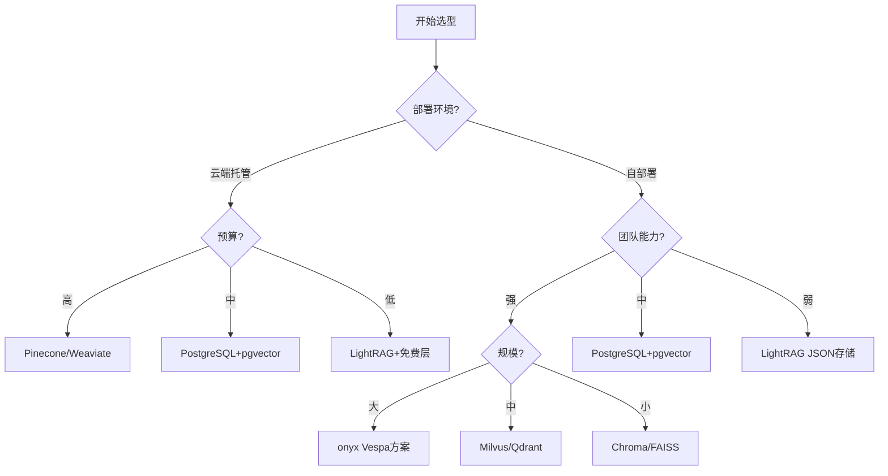

<Callout type="success" title="为什么存储架构至关重要">
存储层是 RAG 系统的基石，直接决定检索性能、扩展能力和运维复杂度。合理的存储架构能在保证性能的同时降低成本，而错误的选型可能导致系统难以扩展。
</Callout>

# 存储方案对比

## 背景与核心问题

### RAG 系统的存储需求

RAG 系统通常需要管理四类数据：

1. **向量数据**：文档 chunks 的向量嵌入（用于语义检索）
2. **图谱数据**：实体和关系（用于知识图谱检索）
3. **文档数据**：原始文档和元数据（用于溯源和展示）
4. **KV 数据**：配置、缓存、会话状态等

### 技术挑战

| 挑战 | 描述 | 常见方案 |
|------|------|---------|
| **可扩展性** | 数据量增长时如何保持性能 | 分布式向量库、水平扩展 |
| **低延迟** | 如何保证毫秒级查询响应 | ANN 算法、缓存、索引优化 |
| **一致性** | 跨存储数据同步 | 事务、最终一致性、CDC |
| **多租户** | 数据隔离与资源控制 | namespace/workspace、RBAC |
| **成本控制** | 存储与计算成本优化 | 冷热分离、压缩、资源池化 |

## 存储技术全景

### 九大项目存储能力对比

| 项目 | 向量存储 | 图谱存储 | 文档存储 | KV 存储 | 技术成熟度 |
|------|---------|---------|---------|---------|-----------|
| **LightRAG** | 8 种实现 | 5 种实现 | 多种 | 多种 | ⭐⭐⭐⭐⭐ |
| **RAG-Anything** | 继承 LightRAG | 继承 LightRAG | 继承 | 继承 | ⭐⭐⭐⭐⭐ |
| **onyx** | Vespa/PostgreSQL | Multiple | PostgreSQL | Redis | ⭐⭐⭐⭐⭐（企业级） |
| **SurfSense** | PostgreSQL+pgvector | - | PostgreSQL | PostgreSQL | ⭐⭐⭐⭐ |
| **kotaemon** | Chroma/Lance/Milvus | Multiple | Multiple | - | ⭐⭐⭐⭐ |
| **Verba** | Weaviate | - | Multiple | Multiple | ⭐⭐⭐ |
| **UltraRAG** | FAISS/LanceDB | - | 文件系统 | 文件系统 | ⭐⭐⭐ |
| **ragflow** | Elastic/OpenSearch | - | Multiple | Redis | ⭐⭐⭐⭐ |
| **Self-Corrective-Agentic-RAG** | Pinecone | - | 本地文件 | - | ⭐⭐ |

<Callout type="warn" title="关键发现">
- **最全面**：LightRAG 提供 8 种向量存储、5 种图谱存储实现
- **最佳企业方案**：onyx 的 Vespa + PostgreSQL 架构最成熟
- **最简单**：Self-Corrective-Agentic-RAG 的 Pinecone 方案最易上手
- **最统一**：SurfSense 的 PostgreSQL 全家桶简化了架构
</Callout>

## 关键决策树



## 跨项目实现深度对比

### 1. LightRAG：最全面的存储支持

**架构特点**：Provider-agnostic 模式，统一接口适配多种后端

#### 向量存储实现（8种）

```python title="lightrag/kg/vector_storage.py" path=null start=null
# 统一的抽象基类
class BaseVectorStorage(ABC):
    @abstractmethod
    async def upsert(self, data: dict[str, dict]) -> None:
        """插入或更新向量"""
        pass
    
    @abstractmethod
    async def query(self, query_vector: list[float], top_k: int = 10) -> list[dict]:
        """相似度查询"""
        pass
    
    @abstractmethod
    async def delete(self, keys: list[str]) -> None:
        """删除向量"""
        pass

# PostgreSQL 向量存储示例
class PGVectorStorage(BaseVectorStorage):
    def __init__(self, namespace: str, embedding_dim: int, **kwargs):
        self.namespace = namespace
        self.embedding_dim = embedding_dim
        self.table_name = f"{namespace}_vector"
        self._initialize_table()
    
    async def upsert(self, data: dict[str, dict]) -> None:
        """批量插入优化"""
        batch_size = 100
        items = list(data.items())
        for i in range(0, len(items), batch_size):
            batch = items[i:i + batch_size]
            await self._upsert_batch(batch)
    
    async def query(self, query_vector: list[float], top_k: int = 10) -> list[dict]:
        """使用 pgvector 的余弦相似度"""
        sql = f"""
        SELECT id, embedding <=> %s AS distance, metadata
        FROM {self.table_name}
        ORDER BY distance
        LIMIT %s
        """
        # 执行查询...
```

**支持的向量存储**：
1. **NanoVectorDB** - 内存向量库（开发/原型）
2. **Milvus** - 生产级分布式向量库
3. **PGVector** - PostgreSQL 向量扩展
4. **FAISS** - Facebook 高性能相似度搜索
5. **Qdrant** - 带高级过滤的向量库
6. **MongoDB** - 文档+向量混合
7. **Chroma** - 简单易用（已弃用）
8. **Redis** - 缓存+向量

**优势**：
- ✅ 接口统一，切换成本低
- ✅ Workspace/namespace 隔离
- ✅ 批量操作优化
- ✅ 易扩展新后端

**劣势**：
- ❌ 维护成本高（8种实现）
- ❌ 不同后端性能差异大
- ❌ 配置复杂

#### 图谱存储实现（5种）

```python title="lightrag/kg/graph_storage.py" path=null start=null
# Neo4j 图谱存储示例
class Neo4JStorage(BaseGraphStorage):
    def __init__(self, namespace: str, global_config: dict):
        self.driver = GraphDatabase.driver(
            uri=global_config["neo4j_uri"],
            auth=(global_config["neo4j_user"], global_config["neo4j_password"])
        )
        self.namespace = namespace
        self._create_indexes()
    
    def _create_indexes(self):
        """创建必要的索引优化查询"""
        with self.driver.session() as session:
            # 实体索引
            session.run(f"""
            CREATE INDEX IF NOT EXISTS entity_name_{self.namespace}
            FOR (n:Entity_{self.namespace})
            ON (n.name)
            """)
            # 全文搜索索引（支持 CJK）
            session.run(f"""
            CREATE FULLTEXT INDEX entity_fulltext_{self.namespace}
            IF NOT EXISTS
            FOR (n:Entity_{self.namespace})
            ON EACH [n.name, n.description]
            OPTIONS {{analyzer: 'cjk'}}
            """)
    
    async def add_entity(self, entity_name: str, entity_type: str, description: str):
        """添加实体节点"""
        with self.driver.session() as session:
            session.run(f"""
            MERGE (n:Entity_{self.namespace} {{name: $name}})
            SET n.type = $type, n.description = $description
            """, name=entity_name, type=entity_type, description=description)
```

**支持的图谱存储**：
1. **NetworkX** - Python 内存图（默认）
2. **Neo4j** - 专业图数据库
3. **PostgreSQL AGE** - PG 的图扩展
4. **MongoDB** - 文档图混合
5. **Memgraph** - 内存图数据库

### 2. onyx：企业级 Vespa + PostgreSQL 方案

**架构特点**：企业级双存储架构

```python title="onyx/storage_architecture.py" path=null start=null
# Vespa 用于向量检索和排序
class VespaVectorStore:
    def __init__(self, vespa_host: str, schema_name: str):
        self.vespa_app = VespaApp(url=vespa_host)
        self.schema = schema_name
    
    async def index_documents(self, documents: List[Document]):
        """批量索引到 Vespa"""
        feeds = []
        for doc in documents:
            feeds.append({
                "id": doc.id,
                "fields": {
                    "embedding": doc.embedding,
                    "content": doc.content,
                    "metadata": doc.metadata,
                    "chunk_id": doc.chunk_id,
                }
            })
        
        # Vespa 支持并行写入
        await self.vespa_app.feed_iterable(feeds, schema=self.schema)
    
    async def search(self, query_vector: List[float], filters: dict, top_k: int = 10):
        """混合查询：向量 + 过滤"""
        yql = f"""
        SELECT * FROM {self.schema}
        WHERE {{targetHits: {top_k}}}nearestNeighbor(embedding, query_vector)
        AND {self._build_filters(filters)}
        ORDER BY closeness DESC
        """
        response = await self.vespa_app.query(yql=yql, query_vector=query_vector)
        return response.hits

# PostgreSQL 用于元数据、权限、审计
class PostgreSQLMetaStore:
    def __init__(self, connection_string: str):
        self.engine = create_async_engine(connection_string)
    
    async def get_user_documents(self, user_id: int, workspace_id: int):
        """多租户数据隔离"""
        async with self.engine.begin() as conn:
            result = await conn.execute(
                select(Document)
                .where(Document.user_id == user_id)
                .where(Document.workspace_id == workspace_id)
                .where(Document.is_deleted == False)
            )
            return result.scalars().all()
```

**技术优势**：
- ✅ **Vespa**：分布式、低延迟、混合查询能力强
- ✅ **PostgreSQL**：ACID、多租户、审计完善
- ✅ **Redis**：热数据缓存、会话管理
- ✅ 企业级监控与运维工具链

**适用场景**：
- 大规模企业部署（>1M 文档）
- 严格多租户隔离
- 合规审计要求
- 高并发检索（>1000 QPS）

**成本考量**：
- ❌ 基础设施成本高（3-4 个组件）
- ❌ 运维复杂度高
- ❌ 团队学习曲线陡

### 3. SurfSense：PostgreSQL 统一存储

**架构特点**：All-in-one PostgreSQL + pgvector

```python title="surfsense/storage.py" path=null start=null
class PostgreSQLUnifiedStore:
    """统一的 PostgreSQL 存储"""
    
    def __init__(self, connection_string: str):
        self.engine = create_engine(connection_string)
        self._init_extensions()
        self._create_tables()
    
    def _init_extensions(self):
        """初始化必要的扩展"""
        with self.engine.connect() as conn:
            # pgvector 用于向量检索
            conn.execute(text("CREATE EXTENSION IF NOT EXISTS vector"))
            # pg_trgm 用于全文模糊搜索
            conn.execute(text("CREATE EXTENSION IF NOT EXISTS pg_trgm"))
            # btree_gin 用于组合索引
            conn.execute(text("CREATE EXTENSION IF NOT EXISTS btree_gin"))
            conn.commit()
    
    def _create_tables(self):
        """创建表结构"""
        with self.engine.connect() as conn:
            # 文档表（含向量）
            conn.execute(text("""
            CREATE TABLE IF NOT EXISTS documents (
                id UUID PRIMARY KEY,
                user_id INTEGER NOT NULL,
                content TEXT NOT NULL,
                embedding vector(768),  -- pgvector 类型
                metadata JSONB,
                created_at TIMESTAMP DEFAULT NOW(),
                -- 混合索引
                CONSTRAINT fk_user FOREIGN KEY (user_id) REFERENCES users(id)
            );
            
            -- HNSW 索引用于向量检索
            CREATE INDEX IF NOT EXISTS idx_documents_embedding_hnsw
            ON documents USING hnsw (embedding vector_cosine_ops);
            
            -- GIN 索引用于全文搜索
            CREATE INDEX IF NOT EXISTS idx_documents_content_gin
            ON documents USING gin(to_tsvector('english', content));
            
            -- B-tree 索引用于过滤
            CREATE INDEX IF NOT EXISTS idx_documents_user_id
            ON documents(user_id);
            """))
            conn.commit()
    
    async def hybrid_search(
        self, 
        query_vector: List[float], 
        query_text: str,
        user_id: int,
        top_k: int = 10
    ):
        """混合检索：向量 + 全文 + 过滤"""
        async with self.engine.begin() as conn:
            # RRF（Reciprocal Rank Fusion）融合向量和全文结果
            result = await conn.execute(text("""
            WITH vector_results AS (
                SELECT id, 1 - (embedding <=> :query_vector::vector) AS vector_score
                FROM documents
                WHERE user_id = :user_id
                ORDER BY embedding <=> :query_vector::vector
                LIMIT :top_k * 2
            ),
            fulltext_results AS (
                SELECT id, ts_rank(to_tsvector('english', content), 
                                   plainto_tsquery('english', :query_text)) AS text_score
                FROM documents
                WHERE user_id = :user_id
                AND to_tsvector('english', content) @@ plainto_tsquery('english', :query_text)
                LIMIT :top_k * 2
            )
            SELECT d.*, 
                   COALESCE(v.vector_score, 0) * 0.6 + COALESCE(f.text_score, 0) * 0.4 AS combined_score
            FROM documents d
            LEFT JOIN vector_results v ON d.id = v.id
            LEFT JOIN fulltext_results f ON d.id = f.id
            WHERE d.user_id = :user_id
            AND (v.id IS NOT NULL OR f.id IS NOT NULL)
            ORDER BY combined_score DESC
            LIMIT :top_k
            """), {
                "query_vector": query_vector,
                "query_text": query_text,
                "user_id": user_id,
                "top_k": top_k
            })
            return result.fetchall()
```

**技术优势**：
- ✅ 架构极简（1个数据库）
- ✅ ACID 事务保证
- ✅ 混合检索（向量+全文）原生支持
- ✅ 运维成本低

**性能特点**：
- HNSW 索引：100ms 内检索 100 万向量
- 支持 10k+ QPS（合理配置）
- 水平扩展：读副本 + 分片

**劣势**：
- ❌ 单点故障风险（需 HA 配置）
- ❌ 大规模数据（>10M）性能下降
- ❌ 向量维度限制（建议 ≤2000）

### 4. Self-Corrective-Agentic-RAG：Pinecone 托管方案

**架构特点**：全托管，零运维

```python title="agentic_rag/pinecone_store.py" path=null start=null
import pinecone

class PineconeVectorStore:
    """最简单的向量存储实现"""
    
    def __init__(self, api_key: str, environment: str, index_name: str):
        pinecone.init(api_key=api_key, environment=environment)
        
        # 检查索引是否存在
        if index_name not in pinecone.list_indexes():
            pinecone.create_index(
                name=index_name,
                dimension=1024,  # BAAI/bge-m3
                metric="cosine",
                pod_type="p1.x1"  # 入门级 pod
            )
        
        self.index = pinecone.Index(index_name)
    
    async def upsert(self, vectors: List[np.ndarray], metadata: List[dict]):
        """批量插入"""
        data = [
            (str(uuid.uuid4()), vec.tolist(), meta)
            for vec, meta in zip(vectors, metadata)
        ]
        # Pinecone 自动处理批量和重试
        self.index.upsert(vectors=data)
    
    async def query(self, query_vector: np.ndarray, top_k: int = 10, filter: dict = None):
        """查询 + 元数据过滤"""
        response = self.index.query(
            vector=query_vector.tolist(),
            top_k=top_k,
            include_metadata=True,
            filter=filter  # 例如: {"source": {"$eq": "docs"}}
        )
        return response.matches
```

**优势**：
- ✅ 零运维（全托管）
- ✅ 自动扩展
- ✅ 低延迟（全球 CDN）
- ✅ 易上手（5 分钟接入）

**劣势**：
- ❌ 供应商锁定
- ❌ 成本较高（$70+/月起）
- ❌ 数据主权问题
- ❌ 离线部署不可用

**成本示例**（2024 年）：
- 免费层：1M 向量，100k 查询/月
- p1.x1：$70/月（10M 向量）
- p2.x1：$400/月（100M 向量）

### 5. 混合架构最佳实践

#### 方案A：LightRAG 渐进式架构

```python title="progressive_architecture.py" path=null start=null
# 开发阶段
config_dev = {
    "vector_storage": "NanoVectorDB",  # 内存
    "graph_storage": "NetworkX",       # 内存
    "kv_storage": "JsonKVStorage",     # 本地文件
}

# 测试阶段
config_test = {
    "vector_storage": "ChromaDB",      # 持久化
    "graph_storage": "NetworkX",
    "kv_storage": "JsonKVStorage",
}

# 生产阶段（小规模）
config_prod_small = {
    "vector_storage": "PGVector",      # PostgreSQL
    "graph_storage": "PGGraphStorage", # PostgreSQL
    "kv_storage": "PGKVStorage",       # PostgreSQL
}

# 生产阶段（大规模）
config_prod_large = {
    "vector_storage": "Milvus",        # 分布式向量库
    "graph_storage": "Neo4j",          # 专业图数据库
    "kv_storage": "Redis",             # 高性能 KV
}
```

## 存储选型 Checklist

<Cards>
  <Card title="开发原型" href="#dev-prototype">
    <ul>
      <li><strong>向量</strong>：NanoVectorDB / Chroma</li>
      <li><strong>图谱</strong>：NetworkX（可选）</li>
      <li><strong>文档</strong>：本地文件</li>
      <li><strong>成本</strong>：$0</li>
      <li><strong>时间</strong>：&lt; 1 天</li>
    </ul>
  </Card>
  
  <Card title="中小规模生产" href="#small-prod">
    <ul>
      <li><strong>向量</strong>：PostgreSQL + pgvector</li>
      <li><strong>图谱</strong>：PostgreSQL AGE / Neo4j Community</li>
      <li><strong>文档</strong>：PostgreSQL</li>
      <li><strong>成本</strong>：$50-200/月</li>
      <li><strong>团队</strong>：1-2 人运维</li>
    </ul>
  </Card>
  
  <Card title="大规模企业" href="#enterprise">
    <ul>
      <li><strong>向量</strong>：Milvus / Qdrant / Vespa</li>
      <li><strong>图谱</strong>：Neo4j Enterprise</li>
      <li><strong>文档</strong>：PostgreSQL / S3</li>
      <li><strong>缓存</strong>：Redis Cluster</li>
      <li><strong>成本</strong>：$1000+/月</li>
      <li><strong>团队</strong>：专职 SRE</li>
    </ul>
  </Card>
  
  <Card title="全托管快速上线" href="#managed">
    <ul>
      <li><strong>向量</strong>：Pinecone / Weaviate Cloud</li>
      <li><strong>图谱</strong>：可选</li>
      <li><strong>文档</strong>：云存储（S3/OSS）</li>
      <li><strong>成本</strong>：$70-500/月</li>
      <li><strong>优势</strong>：零运维，快速上线</li>
    </ul>
  </Card>
</Cards>

## 性能优化要点

### 1. 索引策略

```sql title="index_optimization.sql" path=null start=null
-- pgvector HNSW 索引（推荐）
CREATE INDEX idx_embedding_hnsw 
ON documents 
USING hnsw (embedding vector_cosine_ops)
WITH (m = 16, ef_construction = 64);

-- IVFFlat 索引（大数据集）
CREATE INDEX idx_embedding_ivfflat 
ON documents 
USING ivfflat (embedding vector_cosine_ops)
WITH (lists = 100);

-- 组合索引（向量 + 过滤）
CREATE INDEX idx_embedding_metadata 
ON documents 
USING hnsw (embedding vector_cosine_ops)
INCLUDE (user_id, created_at);
```

### 2. 批量操作

```python title="batch_operations.py" path=null start=null
async def batch_upsert_optimized(store, documents, batch_size=100):
    """批量插入优化"""
    for i in range(0, len(documents), batch_size):
        batch = documents[i:i+batch_size]
        
        # 并行生成 embedding
        embeddings = await asyncio.gather(*[
            get_embedding(doc.content) for doc in batch
        ])
        
        # 批量插入
        await store.upsert_batch(batch, embeddings)
        
        # 避免压垮数据库
        await asyncio.sleep(0.1)
```

### 3. 查询优化

```python title="query_optimization.py" path=null start=null
# 使用连接池
from sqlalchemy.pool import QueuePool

engine = create_async_engine(
    connection_string,
    poolclass=QueuePool,
    pool_size=20,
    max_overflow=10,
    pool_pre_ping=True  # 检测断连
)

# 查询优化
async def optimized_search(query_vector, user_id, top_k=10):
    # 1. 先用轻量级过滤缩小范围
    candidate_ids = await get_candidate_ids(user_id, limit=top_k * 10)
    
    # 2. 只在候选集中做向量检索
    results = await vector_search(
        query_vector, 
        filter_ids=candidate_ids, 
        top_k=top_k
    )
    
    return results
```

## 延伸阅读

- [Vector Search Explained](/docs/advanced-rag-deep-dive/vector-search-explained) - 向量检索原理
- [Graph RAG](/docs/advanced-rag-deep-dive/graph-rag-bilingual) - 知识图谱 RAG
- [如何提高 RAG 性能](/docs/advanced-rag-deep-dive/how-to-improve-rag-performance) - 包含存储优化

## 参考文献

本文基于以下研究材料整理：
- RAGSolutions/storage_analysis.md - 存储节点详细分析
- RAGSolutions/file_system_pipeline_analysis.md - 文件系统分析
- RAGSolutions/knowledge_graph_pipeline_analysis.md - 图谱实现分析

**下一步**：进入 [检索架构设计](./03-检索架构设计) 了解如何高效检索这些存储的数据。
