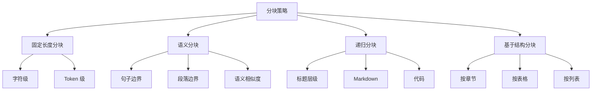

<Callout type="success" title="为什么分块质量决定 RAG 效果">
分块是 RAG 系统的"粒度控制"环节：块太大导致信息过载（检索准确但生成质量差），块太小导致上下文丢失（生成断章取义）。高质量的分块需要平衡语义完整性、检索颗粒度和生成上下文，是优化 RAG 性能的关键杠杆。
</Callout>

# 分块策略与算法

## 背景与核心挑战

### 为什么需要分块？

直接对整个文档进行 embedding 存在以下问题：
1. **超出模型限制**：文档通常超过 embedding 模型的 token 限制（512-8192 tokens）
2. **检索粒度过粗**：用户查询通常针对特定段落，而非整个文档
3. **生成上下文过长**：LLM 生成时无法关注过长的上下文

### 分块的核心权衡

| 维度 | 块太小 | 块太大 | 最佳实践 |
|------|-------|--------|---------|
| **语义完整性** | 断章取义 | 信息过载 | 保持完整语义单元 |
| **检索精度** | 高（精确匹配） | 低（噪音多） | 中等块 + 重排序 |
| **生成质量** | 缺乏上下文 | 干扰信息多 | 适中（200-800 tokens） |
| **存储成本** | 高（重复多） | 低 | 与 overlap 平衡 |

### 分块策略分类



## 九大项目分块方案全景

| 项目 | 主要策略 | Overlap 支持 | 动态大小 | 特殊处理 | 技术成熟度 |
|------|---------|-------------|---------|---------|-----------|
| **LightRAG** | 语义分块 + 图结构 | ✅ | ✅ | 实体关系 | ⭐⭐⭐⭐⭐ |
| **ragflow** | 智能分块（自研） | ✅ | ✅ | 表格/公式 | ⭐⭐⭐⭐⭐ |
| **onyx** | 递归 + 语义 | ✅ | ✅ | 标题保留 | ⭐⭐⭐⭐⭐ |
| **kotaemon** | LlamaIndex 分块器 | ✅ | ✅ | 多种策略 | ⭐⭐⭐⭐ |
| **Verba** | 递归字符分块 | ✅ | ✅ | Markdown | ⭐⭐⭐⭐ |
| **RAG-Anything** | 多模态分块 | ✅ | ✅ | 图像/视频 | ⭐⭐⭐⭐⭐ |
| **SurfSense** | 网页语义分块 | ✅ | ✅ | HTML 结构 | ⭐⭐⭐⭐ |
| **Self-Corrective-Agentic-RAG** | 固定长度 | ✅ | 无 | 基础 | ⭐⭐⭐ |
| **UltraRAG** | 固定长度 | ✅ | 无 | 基础 | ⭐⭐ |

<Callout type="warn" title="关键洞察">
<ul>
  <li><strong>最创新</strong>：LightRAG 的图结构分块（实体 + 关系作为额外索引）</li>
  <li><strong>最智能</strong>：ragflow 的自适应分块（根据内容类型动态调整）</li>
  <li><strong>最实用</strong>：onyx 的递归分块（保留文档结构）</li>
  <li><strong>趋势</strong>：从固定长度向语义感知 + 结构保留演进</li>
</ul>
</Callout>

## 核心实现深度对比

### 1. 固定长度分块（Baseline）

**设计理念**：简单高效，按固定字符数或 token 数分块

```python title="fixed_size_chunking.py" path=null start=null
class FixedSizeChunker:
    """
    固定长度分块器
    
    优势：
    - 简单高效（无需复杂计算）
    - 可预测（每个 chunk 大小一致）
    - 适合快速原型验证
    
    劣势：
    - 可能切断语义单元（句子、段落）
    - 无法感知文档结构
    """
    
    def __init__(
        self,
        chunk_size: int = 500,  # 字符数
        chunk_overlap: int = 50,  # 重叠字符数
        length_function: callable = len,  # 长度计算函数（字符/token）
        separator: str = "\n\n"  # 分隔符（优先在此处切分）
    ):
        self.chunk_size = chunk_size
        self.chunk_overlap = chunk_overlap
        self.length_function = length_function
        self.separator = separator
    
    def split_text(self, text: str) -> list[str]:
        """
        固定长度分块
        
        算法：
        1. 按分隔符切分文本
        2. 合并片段直到达到 chunk_size
        3. 添加 overlap（与下一个 chunk 重叠）
        """
        # 1. 按分隔符切分
        splits = text.split(self.separator)
        
        # 2. 合并为 chunks
        chunks = []
        current_chunk = []
        current_length = 0
        
        for split in splits:
            split_length = self.length_function(split)
            
            # 如果当前片段本身就超过 chunk_size
            if split_length > self.chunk_size:
                # 先保存当前 chunk
                if current_chunk:
                    chunks.append(self.separator.join(current_chunk))
                    current_chunk = []
                    current_length = 0
                
                # 强制切分长片段
                chunks.extend(self._split_long_text(split))
                continue
            
            # 如果加上这个片段会超过 chunk_size
            if current_length + split_length > self.chunk_size:
                # 保存当前 chunk
                if current_chunk:
                    chunks.append(self.separator.join(current_chunk))
                
                # 添加 overlap（重用部分上一个 chunk 的内容）
                overlap_text = self._get_overlap_text(current_chunk)
                current_chunk = [overlap_text] if overlap_text else []
                current_length = self.length_function(overlap_text) if overlap_text else 0
            
            # 添加当前片段
            current_chunk.append(split)
            current_length += split_length
        
        # 保存最后一个 chunk
        if current_chunk:
            chunks.append(self.separator.join(current_chunk))
        
        return chunks
    
    def _split_long_text(self, text: str) -> list[str]:
        """强制切分超长文本"""
        chunks = []
        for i in range(0, len(text), self.chunk_size - self.chunk_overlap):
            chunk = text[i:i + self.chunk_size]
            chunks.append(chunk)
        return chunks
    
    def _get_overlap_text(self, chunks: list[str]) -> str:
        """获取 overlap 文本（上一个 chunk 的末尾）"""
        if not chunks:
            return ""
        
        # 取最后几个片段作为 overlap
        overlap_text = ""
        for chunk in reversed(chunks):
            if self.length_function(overlap_text + chunk) <= self.chunk_overlap:
                overlap_text = chunk + self.separator + overlap_text
            else:
                break
        
        return overlap_text.strip()

# 使用示例
chunker = FixedSizeChunker(
    chunk_size=500,
    chunk_overlap=50,
    separator="\n\n"
)

text = """
长文本内容...
包含多个段落...
"""

chunks = chunker.split_text(text)
for i, chunk in enumerate(chunks, 1):
    print(f"Chunk {i} ({len(chunk)} chars):")
    print(chunk)
    print("---")
```

**优化版：Token-aware 分块**

```python title="token_aware_chunking.py" path=null start=null
import tiktoken

class TokenAwareChunker(FixedSizeChunker):
    """
    Token 感知分块器
    
    改进：用 token 数而非字符数计算长度
    重要性：embedding 模型和 LLM 都有 token 限制
    """
    
    def __init__(
        self,
        chunk_size: int = 500,  # token 数
        chunk_overlap: int = 50,
        model_name: str = "gpt-3.5-turbo"
    ):
        # 加载 tokenizer
        self.tokenizer = tiktoken.encoding_for_model(model_name)
        
        # 使用 token 计数函数
        super().__init__(
            chunk_size=chunk_size,
            chunk_overlap=chunk_overlap,
            length_function=self._count_tokens,
            separator="\n\n"
        )
    
    def _count_tokens(self, text: str) -> int:
        """计算 token 数"""
        return len(self.tokenizer.encode(text))

# 使用示例
token_chunker = TokenAwareChunker(
    chunk_size=500,  # 500 tokens
    chunk_overlap=50,
    model_name="gpt-3.5-turbo"
)

chunks = token_chunker.split_text(text)
```

### 2. 递归分块（结构保留）

**设计理念**：按文档结构（段落 → 句子 → 字符）递归切分

```python title="recursive_chunking.py" path=null start=null
class RecursiveCharacterChunker:
    """
    递归字符分块器（LangChain 方案）
    
    策略：
    1. 优先按段落切分（\n\n）
    2. 段落过大时按句子切分（\n, .）
    3. 句子过大时按字符强制切分
    
    优势：
    - 尽量保留语义单元（段落/句子）
    - 适应多种文档格式
    - 效果 > 固定长度分块
    """
    
    def __init__(
        self,
        chunk_size: int = 500,
        chunk_overlap: int = 50,
        separators: list[str] = None
    ):
        self.chunk_size = chunk_size
        self.chunk_overlap = chunk_overlap
        
        # 分隔符优先级（从大到小）
        self.separators = separators or [
            "\n\n",  # 段落
            "\n",    # 换行
            ". ",    # 句子（英文）
            "。",    # 句子（中文）
            " ",     # 单词
            ""       # 字符（强制切分）
        ]
    
    def split_text(self, text: str) -> list[str]:
        """递归分块"""
        return self._split_recursive(text, self.separators)
    
    def _split_recursive(
        self,
        text: str,
        separators: list[str]
    ) -> list[str]:
        """
        递归切分算法
        
        流程：
        1. 尝试用当前分隔符切分
        2. 如果切分后的块仍然过大，递归用下一级分隔符
        3. 直到所有块都小于 chunk_size
        """
        final_chunks = []
        
        # 选择当前分隔符
        separator = separators[0] if separators else ""
        remaining_separators = separators[1:] if len(separators) > 1 else []
        
        # 按当前分隔符切分
        if separator:
            splits = text.split(separator)
        else:
            splits = list(text)  # 字符级切分
        
        # 合并小块
        current_chunk = []
        current_length = 0
        
        for split in splits:
            split_length = len(split)
            
            # 如果当前片段本身就过大，递归切分
            if split_length > self.chunk_size:
                # 先保存当前 chunk
                if current_chunk:
                    final_chunks.append(self._merge_chunks(current_chunk, separator))
                    current_chunk = []
                    current_length = 0
                
                # 递归切分
                if remaining_separators:
                    sub_chunks = self._split_recursive(split, remaining_separators)
                    final_chunks.extend(sub_chunks)
                else:
                    # 强制切分
                    final_chunks.extend(self._force_split(split))
                continue
            
            # 如果加上这个片段会超过 chunk_size
            if current_length + split_length + len(separator) > self.chunk_size:
                # 保存当前 chunk
                if current_chunk:
                    final_chunks.append(self._merge_chunks(current_chunk, separator))
                
                # 添加 overlap
                overlap_chunks = self._get_overlap_chunks(current_chunk, separator)
                current_chunk = overlap_chunks
                current_length = sum(len(c) for c in current_chunk) + \
                                len(separator) * (len(current_chunk) - 1)
            
            # 添加当前片段
            current_chunk.append(split)
            current_length += split_length + (len(separator) if current_chunk else 0)
        
        # 保存最后一个 chunk
        if current_chunk:
            final_chunks.append(self._merge_chunks(current_chunk, separator))
        
        return final_chunks
    
    def _merge_chunks(self, chunks: list[str], separator: str) -> str:
        """合并片段"""
        return separator.join(chunks)
    
    def _get_overlap_chunks(self, chunks: list[str], separator: str) -> list[str]:
        """获取 overlap 片段"""
        overlap_chunks = []
        overlap_length = 0
        
        for chunk in reversed(chunks):
            chunk_length = len(chunk) + len(separator)
            if overlap_length + chunk_length <= self.chunk_overlap:
                overlap_chunks.insert(0, chunk)
                overlap_length += chunk_length
            else:
                break
        
        return overlap_chunks
    
    def _force_split(self, text: str) -> list[str]:
        """强制按字符切分"""
        return [
            text[i:i + self.chunk_size]
            for i in range(0, len(text), self.chunk_size - self.chunk_overlap)
        ]

# 使用示例
recursive_chunker = RecursiveCharacterChunker(
    chunk_size=500,
    chunk_overlap=50
)

text = """
# 标题

这是第一段内容。包含多个句子。第一句。第二句。

这是第二段内容。也包含多个句子。
"""

chunks = recursive_chunker.split_text(text)
```

**特化版：Markdown 递归分块**

```python title="markdown_chunking.py" path=null start=null
class MarkdownChunker(RecursiveCharacterChunker):
    """
    Markdown 专用分块器
    
    改进：
    1. 按标题层级分块（# → ## → ###）
    2. 保留标题作为上下文
    3. 处理代码块、表格
    """
    
    def __init__(self, chunk_size: int = 500, chunk_overlap: int = 50):
        super().__init__(
            chunk_size=chunk_size,
            chunk_overlap=chunk_overlap,
            separators=[
                "\n## ",    # H2 标题
                "\n### ",   # H3 标题
                "\n#### ",  # H4 标题
                "\n\n",     # 段落
                "\n",       # 换行
                ". ",       # 句子
                " ",        # 单词
                ""          # 字符
            ]
        )
    
    def split_text(self, text: str) -> list[dict]:
        """
        Markdown 分块（保留标题信息）
        
        Returns:
            [
                {
                    "content": str,
                    "heading": str,
                    "level": int
                },
                ...
            ]
        """
        # 提取标题层级
        import re
        
        # 识别标题
        heading_pattern = r'^(#{1,6})\s+(.+)$'
        current_heading = {"text": "", "level": 0}
        
        chunks = []
        current_text = []
        
        for line in text.split('\n'):
            match = re.match(heading_pattern, line)
            
            if match:
                # 保存当前 chunk
                if current_text:
                    text_content = '\n'.join(current_text)
                    for chunk in super().split_text(text_content):
                        chunks.append({
                            "content": chunk,
                            "heading": current_heading["text"],
                            "level": current_heading["level"]
                        })
                    current_text = []
                
                # 更新当前标题
                level = len(match.group(1))
                heading_text = match.group(2)
                current_heading = {"text": heading_text, "level": level}
                
                # 标题本身也作为一个 chunk
                chunks.append({
                    "content": line,
                    "heading": heading_text,
                    "level": level
                })
            else:
                current_text.append(line)
        
        # 保存最后一个 chunk
        if current_text:
            text_content = '\n'.join(current_text)
            for chunk in super().split_text(text_content):
                chunks.append({
                    "content": chunk,
                    "heading": current_heading["text"],
                    "level": current_heading["level"]
                })
        
        return chunks

# 使用示例
md_chunker = MarkdownChunker(chunk_size=500, chunk_overlap=50)

markdown_text = """
# 主标题

一些介绍内容。

## 第一节

第一节的内容。包含多个段落。

### 子节

子节的详细内容。

## 第二节

第二节的内容。
"""

chunks = md_chunker.split_text(markdown_text)
for chunk in chunks:
    print(f"Level {chunk['level']}: {chunk['heading']}")
    print(f"Content: {chunk['content'][:50]}...")
    print("---")
```

### 3. 语义分块（最先进）

**设计理念**：基于语义相似度切分，保持语义连贯性

```python title="semantic_chunking.py" path=null start=null
import numpy as np
from sklearn.metrics.pairwise import cosine_similarity

class SemanticChunker:
    """
    语义分块器
    
    策略：
    1. 将文本切分为句子
    2. 计算相邻句子的语义相似度
    3. 在相似度低的地方切分（语义边界）
    
    优势：
    - 保持语义完整性（每个 chunk 讨论一个主题）
    - 自适应块大小（根据内容动态调整）
    - 检索效果最好
    
    劣势：
    - 计算开销大（需要 embedding 所有句子）
    - 块大小不可预测
    """
    
    def __init__(
        self,
        embedding_model,
        buffer_size: int = 1,  # 合并相邻句子的窗口大小
        breakpoint_threshold: float = 0.5  # 语义边界阈值
    ):
        self.embedding_model = embedding_model
        self.buffer_size = buffer_size
        self.breakpoint_threshold = breakpoint_threshold
    
    def split_text(self, text: str) -> list[str]:
        """
        语义分块
        
        算法：
        1. 分句
        2. 计算每个句子的 embedding
        3. 计算相邻句子组的相似度
        4. 在相似度骤降处切分
        """
        # 1. 分句
        sentences = self._split_sentences(text)
        
        if len(sentences) <= 1:
            return [text]
        
        # 2. 生成 embeddings
        embeddings = self.embedding_model.embed(sentences)
        
        # 3. 计算相邻句子组的相似度
        similarities = self._calculate_similarity_scores(embeddings)
        
        # 4. 识别语义边界（相似度骤降）
        breakpoints = self._identify_breakpoints(similarities)
        
        # 5. 按边界切分
        chunks = self._split_by_breakpoints(sentences, breakpoints)
        
        return chunks
    
    def _split_sentences(self, text: str) -> list[str]:
        """
        分句（支持中英文）
        """
        import re
        
        # 简单分句（生产环境可用 spaCy 或 nltk）
        # 英文：按 .!? 切分
        # 中文：按 。！？ 切分
        sentence_delimiters = r'[.!?。！？]+'
        
        sentences = re.split(sentence_delimiters, text)
        sentences = [s.strip() for s in sentences if s.strip()]
        
        return sentences
    
    def _calculate_similarity_scores(
        self,
        embeddings: np.ndarray
    ) -> list[float]:
        """
        计算相邻句子组的语义相似度
        
        策略：用 buffer_size 控制比较的句子数
        - buffer_size=1: 比较单句 vs 单句
        - buffer_size=2: 比较 [s1, s2] vs [s3, s4]
        """
        similarities = []
        
        for i in range(len(embeddings) - self.buffer_size):
            # 组1：当前句子及其前 buffer_size-1 个句子
            group1 = embeddings[i:i + self.buffer_size]
            group1_combined = np.mean(group1, axis=0)
            
            # 组2：下一个句子及其后 buffer_size-1 个句子
            group2 = embeddings[i + self.buffer_size:i + 2 * self.buffer_size]
            if len(group2) < self.buffer_size:
                break
            group2_combined = np.mean(group2, axis=0)
            
            # 计算余弦相似度
            similarity = cosine_similarity(
                [group1_combined],
                [group2_combined]
            )[0][0]
            
            similarities.append(similarity)
        
        return similarities
    
    def _identify_breakpoints(
        self,
        similarities: list[float]
    ) -> list[int]:
        """
        识别语义边界
        
        策略：相似度低于阈值的位置作为切分点
        """
        breakpoints = []
        
        for i, similarity in enumerate(similarities):
            if similarity < self.breakpoint_threshold:
                # 切分点在第 i+1 个句子之前
                breakpoints.append(i + self.buffer_size)
        
        return breakpoints
    
    def _split_by_breakpoints(
        self,
        sentences: list[str],
        breakpoints: list[int]
    ) -> list[str]:
        """按边界切分句子"""
        chunks = []
        
        start = 0
        for breakpoint in breakpoints:
            chunk_sentences = sentences[start:breakpoint]
            chunks.append(" ".join(chunk_sentences))
            start = breakpoint
        
        # 最后一个 chunk
        if start < len(sentences):
            chunk_sentences = sentences[start:]
            chunks.append(" ".join(chunk_sentences))
        
        return chunks

# 使用示例
from sentence_transformers import SentenceTransformer

embedding_model = SentenceTransformer("all-MiniLM-L6-v2")

semantic_chunker = SemanticChunker(
    embedding_model=embedding_model,
    buffer_size=1,
    breakpoint_threshold=0.5
)

text = """
机器学习是人工智能的一个子领域。它专注于让计算机从数据中学习。
深度学习是机器学习的一个分支。它使用多层神经网络来处理复杂模式。
自然语言处理是另一个重要领域。它帮助计算机理解人类语言。
计算机视觉让机器能够"看见"图像。它广泛应用于自动驾驶和医疗诊断。
"""

chunks = semantic_chunker.split_text(text)
for i, chunk in enumerate(chunks, 1):
    print(f"Chunk {i}:")
    print(chunk)
    print("---")
```

**优化版：混合语义 + 大小限制**

```python title="hybrid_semantic_chunking.py" path=null start=null
class HybridSemanticChunker(SemanticChunker):
    """
    混合语义分块器
    
    改进：
    1. 语义分块（保证语义完整性）
    2. 大小限制（避免块过大或过小）
    3. 最佳实践：语义边界 + 固定长度兜底
    """
    
    def __init__(
        self,
        embedding_model,
        min_chunk_size: int = 100,
        max_chunk_size: int = 1000,
        buffer_size: int = 1,
        breakpoint_threshold: float = 0.5
    ):
        super().__init__(embedding_model, buffer_size, breakpoint_threshold)
        self.min_chunk_size = min_chunk_size
        self.max_chunk_size = max_chunk_size
    
    def split_text(self, text: str) -> list[str]:
        """混合分块"""
        # 1. 语义分块
        semantic_chunks = super().split_text(text)
        
        # 2. 后处理：合并过小的块，切分过大的块
        final_chunks = []
        buffer = []
        buffer_length = 0
        
        for chunk in semantic_chunks:
            chunk_length = len(chunk)
            
            # 块过大：强制切分
            if chunk_length > self.max_chunk_size:
                # 先保存 buffer
                if buffer:
                    final_chunks.append(" ".join(buffer))
                    buffer = []
                    buffer_length = 0
                
                # 切分大块
                sub_chunks = self._split_large_chunk(chunk)
                final_chunks.extend(sub_chunks)
                continue
            
            # 块过小：合并到 buffer
            if buffer_length + chunk_length < self.min_chunk_size:
                buffer.append(chunk)
                buffer_length += chunk_length
                continue
            
            # 块大小合适
            if buffer:
                final_chunks.append(" ".join(buffer))
                buffer = []
                buffer_length = 0
            
            final_chunks.append(chunk)
        
        # 保存剩余 buffer
        if buffer:
            final_chunks.append(" ".join(buffer))
        
        return final_chunks
    
    def _split_large_chunk(self, chunk: str) -> list[str]:
        """切分过大的块（使用固定长度分块器）"""
        fixed_chunker = FixedSizeChunker(
            chunk_size=self.max_chunk_size,
            chunk_overlap=50
        )
        return fixed_chunker.split_text(chunk)

# 使用示例
hybrid_chunker = HybridSemanticChunker(
    embedding_model=embedding_model,
    min_chunk_size=100,
    max_chunk_size=1000,
    buffer_size=1,
    breakpoint_threshold=0.5
)

chunks = hybrid_chunker.split_text(text)
```

## 高级技巧

### 1. 上下文增强（Parent-Child 策略）

```python title="context_enrichment.py" path=null start=null
class ContextEnrichedChunker:
    """
    上下文增强分块器
    
    策略：
    - Child Chunk：用于检索（小块，精确匹配）
    - Parent Chunk：用于生成（大块，完整上下文）
    
    优势：
    - 检索准确（小块匹配更精确）
    - 生成质量高（大块提供完整上下文）
    """
    
    def __init__(
        self,
        child_chunk_size: int = 200,
        parent_chunk_size: int = 800,
        overlap: int = 50
    ):
        self.child_chunk_size = child_chunk_size
        self.parent_chunk_size = parent_chunk_size
        self.overlap = overlap
        
        self.child_chunker = FixedSizeChunker(child_chunk_size, overlap)
        self.parent_chunker = FixedSizeChunker(parent_chunk_size, overlap)
    
    def split_text(self, text: str) -> list[dict]:
        """
        分层分块
        
        Returns:
            [
                {
                    "child": str,
                    "parent": str,
                    "siblings": list[str]
                },
                ...
            ]
        """
        # 1. 生成 parent chunks
        parent_chunks = self.parent_chunker.split_text(text)
        
        # 2. 为每个 parent chunk 生成 child chunks
        enriched_chunks = []
        
        for parent_chunk in parent_chunks:
            child_chunks = self.child_chunker.split_text(parent_chunk)
            
            for child_chunk in child_chunks:
                enriched_chunks.append({
                    "child": child_chunk,  # 用于检索
                    "parent": parent_chunk,  # 用于生成
                    "siblings": child_chunks  # 同一 parent 的其他 children
                })
        
        return enriched_chunks

# 使用示例
context_chunker = ContextEnrichedChunker(
    child_chunk_size=200,
    parent_chunk_size=800
)

chunks = context_chunker.split_text(text)

# 检索时：用 child chunk 匹配
# 生成时：用 parent chunk 作为上下文
```

### 2. 动态分块（LightRAG 方案）

```python title="dynamic_chunking.py" path=null start=null
class DynamicChunker:
    """
    动态分块器（LightRAG 风格）
    
    策略：
    1. 按内容类型动态调整块大小
    2. 提取实体和关系作为额外索引
    3. 构建文档级图结构
    """
    
    def __init__(self, embedding_model, llm_client):
        self.embedding_model = embedding_model
        self.llm = llm_client
    
    async def split_and_enrich(self, text: str) -> dict:
        """
        动态分块 + 实体提取
        
        Returns:
            {
                "chunks": list[str],
                "entities": list[dict],
                "relations": list[dict],
                "graph": dict
            }
        """
        # 1. 语义分块
        semantic_chunker = SemanticChunker(self.embedding_model)
        chunks = semantic_chunker.split_text(text)
        
        # 2. 从每个 chunk 提取实体和关系
        entities = []
        relations = []
        
        for chunk in chunks:
            chunk_entities, chunk_relations = await self._extract_kg(chunk)
            entities.extend(chunk_entities)
            relations.extend(chunk_relations)
        
        # 3. 构建知识图谱
        graph = self._build_graph(entities, relations)
        
        return {
            "chunks": chunks,
            "entities": entities,
            "relations": relations,
            "graph": graph
        }
    
    async def _extract_kg(self, text: str) -> tuple[list, list]:
        """提取知识图谱（实体 + 关系）"""
        prompt = f"""Extract entities and relations from the following text.

Text: {text}

Output JSON format:
{{
  "entities": [
    {{"name": "entity1", "type": "Person"}},
    {{"name": "entity2", "type": "Organization"}}
  ],
  "relations": [
    {{"source": "entity1", "relation": "works_at", "target": "entity2"}}
  ]
}}

JSON:"""
        
        response = await self.llm.chat.completions.create(
            model="gpt-4",
            messages=[{"role": "user", "content": prompt}],
            temperature=0
        )
        
        import json
        result = json.loads(response.choices[0].message.content)
        
        return result["entities"], result["relations"]
    
    def _build_graph(self, entities: list[dict], relations: list[dict]) -> dict:
        """构建知识图谱"""
        # 简化实现：用 networkx
        import networkx as nx
        
        G = nx.Graph()
        
        # 添加节点
        for entity in entities:
            G.add_node(entity["name"], type=entity["type"])
        
        # 添加边
        for relation in relations:
            G.add_edge(
                relation["source"],
                relation["target"],
                relation=relation["relation"]
            )
        
        return {
            "nodes": list(G.nodes(data=True)),
            "edges": list(G.edges(data=True))
        }
```

## 分块质量评估

### 评估指标

| 指标 | 计算方法 | 目标值 |
|------|---------|-------|
| **语义完整性** | 人工评估 chunk 是否完整 | > 90% |
| **块大小分布** | 标准差 / 平均值 | < 0.3 |
| **检索准确率** | 正确 chunk 在 top-k 中的比例 | > 95% (k=5) |
| **生成质量** | BLEU/ROUGE 分数 | > 基线 5% |

### 常见问题与解决方案

<Cards>
  <Card title="块切断句子" href="#sentence">
    <p><strong>原因</strong>：固定长度分块不尊重语义边界</p>
    <p><strong>解决</strong>：使用递归分块或语义分块</p>
  </Card>
  
  <Card title="块大小不一致" href="#size">
    <p><strong>原因</strong>：语义分块可能产生过大/过小的块</p>
    <p><strong>解决</strong>：使用混合策略（语义 + 大小限制）</p>
  </Card>
  
  <Card title="丢失跨块上下文" href="#context">
    <p><strong>原因</strong>：overlap 不足或未使用 parent-child</p>
    <p><strong>解决</strong>：增加 overlap 或使用上下文增强策略</p>
  </Card>
  
  <Card title="代码/表格分块错误" href="#special">
    <p><strong>原因</strong>：特殊内容需要特殊处理</p>
    <p><strong>解决</strong>：使用专用分块器（Markdown/Code）</p>
  </Card>
</Cards>

## 最佳实践

### 分块策略选择指南

```python title="strategy_selector.py" path=null start=null
def select_chunking_strategy(
    document_type: str,
    requirements: dict
) -> Chunker:
    """
    根据文档类型和需求选择分块策略
    
    Args:
        document_type: "article" / "code" / "markdown" / "chat" / "table"
        requirements: {
            "accuracy": "high" / "medium" / "low",
            "speed": "fast" / "medium" / "slow",
            "preserve_structure": bool
        }
    """
    # 策略1：代码文档 → 代码专用分块器
    if document_type == "code":
        return CodeChunker()
    
    # 策略2：Markdown → Markdown 专用
    if document_type == "markdown":
        return MarkdownChunker()
    
    # 策略3：高准确率 + 不在乎速度 → 语义分块
    if requirements['accuracy'] == 'high' and requirements['speed'] != 'fast':
        return HybridSemanticChunker(embedding_model)
    
    # 策略4：需要保留结构 → 递归分块
    if requirements['preserve_structure']:
        return RecursiveCharacterChunker()
    
    # 策略5：默认 → 固定长度（最快）
    return TokenAwareChunker()
```

## 延伸阅读

- [向量索引优化](/docs/rag-project-analysis/03-data-processing-indexing/03-向量索引优化) - 分块后的向量存储优化
- [如何提高 RAG 性能](/docs/advanced-rag-deep-dive/how-to-improve-rag-performance) - 包含分块优化章节

## 参考文献

- LangChain 文档 - 递归分块算法
- LlamaIndex 文档 - 语义/窗口分块实现
- Chonkie - 通用分块库
- Academic/Industry blogs on chunking best practices

**下一步**：进入 [向量索引优化](./03-向量索引优化) 了解如何高效存储和检索向量。
