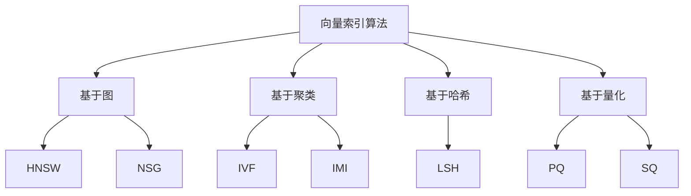

<Callout type="success" title="为什么向量索引是 RAG 的性能瓶颈">
在百万甚至亿级文档的 RAG 系统中，暴力检索（brute force）需要几秒甚至几十秒，完全无法满足实时查询需求。高效的向量索引（如 HNSW、IVF）可以将检索时间降低到毫秒级，同时保持 95%+ 的召回率。选择和优化向量索引是构建大规模 RAG 系统的关键。
</Callout>

# 向量索引优化

## 背景与核心挑战

### 向量检索的难点

传统数据库的索引（B树、哈希）无法直接用于向量检索，因为：
1. **高维诅咒**：向量通常是 768-3072 维，欧式距离在高维空间失效
2. **近似最近邻**：精确最近邻太慢（O(n)），需要用近似算法权衡速度与准确率
3. **大规模数据**：百万级向量需要 GB 级内存，亿级需要分布式方案

### 检索性能的三个维度

| 维度 | 指标 | 优化目标 | 权衡 |
|------|------|---------|------|
| **速度** | QPS、P95 延迟 | 毫秒级响应 | ↔ 准确率 |
| **准确率** | Recall@k | > 95% | ↔ 速度、内存 |
| **内存/成本** | 内存占用、硬件成本 | 最小化 | ↔ 速度、准确率 |

### 主流向量索引算法



## 九大项目向量存储方案全景

| 项目 | 向量数据库 | 索引类型 | 分布式支持 | 量化支持 | 技术成熟度 |
|------|-----------|---------|-----------|---------|-----------|
| **onyx** | Qdrant / Weaviate / Pinecone | HNSW | ✅ | ✅ | ⭐⭐⭐⭐⭐（企业） |
| **ragflow** | Elasticsearch / Milvus | HNSW / IVF | ✅ | ✅ | ⭐⭐⭐⭐⭐ |
| **kotaemon** | Qdrant / ChromaDB | HNSW | ✅ | ✅ | ⭐⭐⭐⭐ |
| **Verba** | Weaviate | HNSW | ✅ | ✅ | ⭐⭐⭐⭐ |
| **LightRAG** | 自定义（NetworkX + NumPy） | 暴力检索 | 无 | 无 | ⭐⭐⭐ |
| **RAG-Anything** | ChromaDB / FAISS | HNSW / IVF | 有限 | ✅ | ⭐⭐⭐⭐ |
| **SurfSense** | ChromaDB | HNSW | 无 | 无 | ⭐⭐⭐ |
| **Self-Corrective-Agentic-RAG** | FAISS | IVF | 无 | ✅ | ⭐⭐⭐ |
| **UltraRAG** | ChromaDB | HNSW | 无 | 无 | ⭐⭐ |

<Callout type="warn" title="关键洞察">
<ul>
  <li><strong>最灵活</strong>：onyx 支持多种向量数据库（Qdrant/Weaviate/Pinecone）</li>
  <li><strong>最高性能</strong>：ragflow 的 Elasticsearch + HNSW（亿级文档）</li>
  <li><strong>最轻量</strong>：ChromaDB（单机百万级，嵌入式）</li>
  <li><strong>趋势</strong>：从嵌入式向云原生分布式演进</li>
</ul>
</Callout>

## 核心算法深度对比

### 1. HNSW（分层导航小世界图）

**设计理念**：构建多层图，上层稀疏（快速定位区域），下层密集（精确检索）

```python title="hnsw_implementation.py" path=null start=null
import numpy as np
import heapq
from collections import defaultdict

class HNSWIndex:
    """
    HNSW 索引实现（简化版）
    
    核心思想：
    1. 构建多层图（0-M 层）
    2. 上层：长距离跳跃（快速定位）
    3. 下层：短距离连接（精确搜索）
    
    参数：
    - M: 每个节点的最大连接数（16-48）
    - ef_construction: 构建时的搜索宽度（100-200）
    - ef_search: 查询时的搜索宽度（50-500）
    
    性能：
    - 构建时间：O(n log n)
    - 查询时间：O(log n)
    - 内存：O(n * M * layers)
    """
    
    def __init__(
        self,
        dim: int,
        M: int = 16,  # 每层最大连接数
        ef_construction: int = 200,  # 构建时搜索宽度
        max_layers: int = None  # 最大层数
    ):
        self.dim = dim
        self.M = M
        self.M0 = M * 2  # 第0层连接数更多
        self.ef_construction = ef_construction
        self.max_layers = max_layers or int(np.log2(10000))  # 自动计算
        
        # 数据存储
        self.data = []  # 所有向量
        self.graph = defaultdict(lambda: defaultdict(set))  # {layer: {node: {neighbors}}}
        self.entry_point = None
        
        # 层级分配概率（指数分布）
        self.ml = 1.0 / np.log(2.0)
    
    def _get_random_layer(self) -> int:
        """随机分配节点层级（指数分布）"""
        return min(
            int(-np.log(np.random.uniform()) * self.ml),
            self.max_layers - 1
        )
    
    def add(self, vector: np.ndarray) -> int:
        """
        添加向量到索引
        
        算法：
        1. 随机分配层级
        2. 从顶层开始搜索最近邻
        3. 每层插入并建立连接
        """
        node_id = len(self.data)
        self.data.append(vector)
        
        # 1. 分配层级
        node_layer = self._get_random_layer()
        
        # 2. 如果是第一个节点，设为入口点
        if self.entry_point is None:
            self.entry_point = node_id
            for layer in range(node_layer + 1):
                self.graph[layer][node_id] = set()
            return node_id
        
        # 3. 从顶层开始搜索
        nearest = [self.entry_point]
        
        # 从顶层到目标层：贪心搜索
        for layer in range(self.max_layers - 1, node_layer, -1):
            nearest = self._search_layer(
                vector,
                nearest,
                ef=1,  # 只保留1个最近邻
                layer=layer
            )
        
        # 4. 从目标层到第0层：插入并建立连接
        for layer in range(node_layer, -1, -1):
            # 搜索候选邻居
            candidates = self._search_layer(
                vector,
                nearest,
                ef=self.ef_construction,
                layer=layer
            )
            
            # 选择M个最近邻
            M = self.M0 if layer == 0 else self.M
            neighbors = self._select_neighbors(vector, candidates, M)
            
            # 建立双向连接
            self.graph[layer][node_id] = set(neighbors)
            for neighbor in neighbors:
                self.graph[layer][neighbor].add(node_id)
                
                # 如果邻居的连接数超过M，剪枝
                if len(self.graph[layer][neighbor]) > M:
                    self._prune_connections(neighbor, layer, M)
            
            nearest = candidates
        
        # 5. 更新入口点（如果新节点层级更高）
        if node_layer > self._get_node_layer(self.entry_point):
            self.entry_point = node_id
        
        return node_id
    
    def search(
        self,
        query: np.ndarray,
        k: int = 10,
        ef: int = None
    ) -> list[tuple[int, float]]:
        """
        搜索 k 个最近邻
        
        Args:
            query: 查询向量
            k: 返回结果数
            ef: 搜索宽度（越大越准确但越慢）
        
        Returns:
            [(node_id, distance), ...]
        """
        if ef is None:
            ef = max(k, 50)
        
        if self.entry_point is None:
            return []
        
        # 1. 从顶层到第1层：贪心搜索
        nearest = [self.entry_point]
        for layer in range(self.max_layers - 1, 0, -1):
            nearest = self._search_layer(query, nearest, ef=1, layer=layer)
        
        # 2. 第0层：精确搜索
        candidates = self._search_layer(query, nearest, ef=ef, layer=0)
        
        # 3. 返回 top-k
        results = []
        for node_id in candidates[:k]:
            distance = self._distance(query, self.data[node_id])
            results.append((node_id, distance))
        
        return sorted(results, key=lambda x: x[1])[:k]
    
    def _search_layer(
        self,
        query: np.ndarray,
        entry_points: list[int],
        ef: int,
        layer: int
    ) -> list[int]:
        """
        在指定层搜索最近邻
        
        算法：贪心最佳优先搜索（Greedy Best-First Search）
        """
        visited = set()
        candidates = []  # 最小堆（按距离）
        results = []  # 最大堆（按距离）
        
        # 初始化
        for ep in entry_points:
            dist = self._distance(query, self.data[ep])
            heapq.heappush(candidates, (dist, ep))
            heapq.heappush(results, (-dist, ep))
            visited.add(ep)
        
        # 贪心搜索
        while candidates:
            current_dist, current = heapq.heappop(candidates)
            
            # 如果当前距离比结果中的最远距离还大，停止
            if current_dist > -results[0][0]:
                break
            
            # 扩展邻居
            for neighbor in self.graph[layer].get(current, []):
                if neighbor in visited:
                    continue
                
                visited.add(neighbor)
                dist = self._distance(query, self.data[neighbor])
                
                # 如果比当前最差结果更好，或结果数不足ef
                if dist < -results[0][0] or len(results) < ef:
                    heapq.heappush(candidates, (dist, neighbor))
                    heapq.heappush(results, (-dist, neighbor))
                    
                    # 保持结果数 <= ef
                    if len(results) > ef:
                        heapq.heappop(results)
        
        # 返回结果（从近到远）
        return [node_id for _, node_id in sorted(results, reverse=True)]
    
    def _select_neighbors(
        self,
        vector: np.ndarray,
        candidates: list[int],
        M: int
    ) -> list[int]:
        """选择M个最佳邻居（启发式剪枝）"""
        # 简单实现：选择距离最近的M个
        distances = [(self._distance(vector, self.data[c]), c) for c in candidates]
        distances.sort()
        return [node_id for _, node_id in distances[:M]]
    
    def _prune_connections(self, node_id: int, layer: int, M: int):
        """剪枝：保留M个最佳连接"""
        neighbors = list(self.graph[layer][node_id])
        if len(neighbors) <= M:
            return
        
        # 选择最佳M个
        node_vector = self.data[node_id]
        best_neighbors = self._select_neighbors(node_vector, neighbors, M)
        
        # 移除多余连接
        for neighbor in neighbors:
            if neighbor not in best_neighbors:
                self.graph[layer][node_id].discard(neighbor)
                self.graph[layer][neighbor].discard(node_id)
    
    def _get_node_layer(self, node_id: int) -> int:
        """获取节点的最高层级"""
        for layer in range(self.max_layers - 1, -1, -1):
            if node_id in self.graph[layer]:
                return layer
        return 0
    
    def _distance(self, v1: np.ndarray, v2: np.ndarray) -> float:
        """计算距离（余弦距离 = 1 - 余弦相似度）"""
        cos_sim = np.dot(v1, v2) / (np.linalg.norm(v1) * np.linalg.norm(v2))
        return 1.0 - cos_sim

# 使用示例
import numpy as np

# 创建 HNSW 索引
index = HNSWIndex(
    dim=768,
    M=16,
    ef_construction=200
)

# 添加向量
vectors = np.random.randn(10000, 768)
for i, vec in enumerate(vectors):
    vec = vec / np.linalg.norm(vec)  # 归一化
    index.add(vec)
    
    if (i + 1) % 1000 == 0:
        print(f"Indexed {i + 1} vectors")

# 搜索
query = np.random.randn(768)
query = query / np.linalg.norm(query)

results = index.search(query, k=10, ef=100)
print(f"Top-10 results: {results}")
```

**HNSW 参数调优**：

| 参数 | 推荐值 | 影响 | 调优建议 |
|------|-------|------|---------|
| **M** | 16-48 | 内存 ↑ 准确率 ↑ | 从16开始，准确率不足时增加 |
| **ef_construction** | 100-400 | 构建时间 ↑ 准确率 ↑ | 生产环境用200+ |
| **ef_search** | 50-500 | 查询时间 ↑ 准确率 ↑ | 根据延迟要求调整 |

### 2. IVF（倒排文件索引）

**设计理念**：先聚类，查询时只搜索最相关的几个聚类

```python title="ivf_implementation.py" path=null start=null
from sklearn.cluster import KMeans
import numpy as np

class IVFIndex:
    """
    IVF (Inverted File) 索引
    
    核心思想：
    1. K-Means 聚类将向量空间分成 n_clusters 个区域
    2. 每个聚类维护一个倒排列表（向量ID）
    3. 查询时：找到最近的 nprobe 个聚类中心，只搜索这些聚类
    
    参数：
    - n_clusters: 聚类数（sqrt(n) ~ n/100）
    - nprobe: 查询时搜索的聚类数（1-100）
    
    性能：
    - 构建时间：O(n * k * iter)
    - 查询时间：O(nprobe * n/k)
    - 内存：O(n + k * dim)
    """
    
    def __init__(
        self,
        dim: int,
        n_clusters: int = 100,
        nprobe: int = 10
    ):
        self.dim = dim
        self.n_clusters = n_clusters
        self.nprobe = nprobe
        
        # 存储
        self.centroids = None  # 聚类中心
        self.inverted_lists = [[] for _ in range(n_clusters)]  # 倒排列表
        self.data = []  # 所有向量
        self.trained = False
    
    def train(self, training_vectors: np.ndarray):
        """
        训练索引（K-Means 聚类）
        
        Args:
            training_vectors: (n_samples, dim)
        """
        print(f"Training IVF with {len(training_vectors)} vectors...")
        
        # K-Means 聚类
        kmeans = KMeans(
            n_clusters=self.n_clusters,
            random_state=42,
            n_init=10
        )
        kmeans.fit(training_vectors)
        
        self.centroids = kmeans.cluster_centers_
        self.trained = True
        
        print(f"Training complete. {self.n_clusters} clusters created.")
    
    def add(self, vectors: np.ndarray) -> list[int]:
        """
        添加向量到索引
        
        Args:
            vectors: (n_samples, dim)
        
        Returns:
            向量 ID 列表
        """
        if not self.trained:
            raise ValueError("Index must be trained before adding vectors")
        
        vector_ids = []
        
        for vector in vectors:
            vector_id = len(self.data)
            self.data.append(vector)
            
            # 找到最近的聚类中心
            cluster_id = self._find_nearest_cluster(vector)
            
            # 添加到倒排列表
            self.inverted_lists[cluster_id].append(vector_id)
            
            vector_ids.append(vector_id)
        
        return vector_ids
    
    def search(
        self,
        query: np.ndarray,
        k: int = 10,
        nprobe: int = None
    ) -> list[tuple[int, float]]:
        """
        搜索 k 个最近邻
        
        Args:
            query: 查询向量
            k: 返回结果数
            nprobe: 搜索的聚类数（越大越准确但越慢）
        
        Returns:
            [(vector_id, distance), ...]
        """
        if not self.trained:
            raise ValueError("Index must be trained before searching")
        
        if nprobe is None:
            nprobe = self.nprobe
        
        # 1. 找到最近的 nprobe 个聚类
        cluster_distances = []
        for cluster_id, centroid in enumerate(self.centroids):
            dist = self._distance(query, centroid)
            cluster_distances.append((dist, cluster_id))
        
        cluster_distances.sort()
        nearest_clusters = [cid for _, cid in cluster_distances[:nprobe]]
        
        # 2. 在这些聚类中搜索
        candidates = []
        for cluster_id in nearest_clusters:
            for vector_id in self.inverted_lists[cluster_id]:
                vector = self.data[vector_id]
                dist = self._distance(query, vector)
                candidates.append((dist, vector_id))
        
        # 3. 返回 top-k
        candidates.sort()
        return [(vid, dist) for dist, vid in candidates[:k]]
    
    def _find_nearest_cluster(self, vector: np.ndarray) -> int:
        """找到最近的聚类中心"""
        min_dist = float('inf')
        nearest_cluster = 0
        
        for cluster_id, centroid in enumerate(self.centroids):
            dist = self._distance(vector, centroid)
            if dist < min_dist:
                min_dist = dist
                nearest_cluster = cluster_id
        
        return nearest_cluster
    
    def _distance(self, v1: np.ndarray, v2: np.ndarray) -> float:
        """L2 距离"""
        return np.linalg.norm(v1 - v2)

# 使用示例

# 创建 IVF 索引
index = IVFIndex(dim=768, n_clusters=100, nprobe=10)

# 训练（用部分数据聚类）
training_vectors = np.random.randn(10000, 768)
index.train(training_vectors)

# 添加向量
vectors = np.random.randn(100000, 768)
index.add(vectors)

# 搜索
query = np.random.randn(768)
results = index.search(query, k=10, nprobe=20)
```

**IVF 参数调优**：

| 参数 | 推荐值 | 影响 | 调优建议 |
|------|-------|------|---------|
| **n_clusters** | sqrt(n) | 内存 ↑ 准确率 ↑ | n=1M 用 1000, n=10M 用 4000 |
| **nprobe** | 10-100 | 查询时间 ↑ 准确率 ↑ | 从10开始，不满意时加倍 |

### 3. 量化优化（PQ + SQ）

**设计理念**：压缩向量表示，减少内存和加速距离计算

```python title="quantization.py" path=null start=null
class ProductQuantization:
    """
    乘积量化（Product Quantization）
    
    核心思想：
    1. 将 d 维向量拆分为 m 个子向量（每个 d/m 维）
    2. 对每个子空间独立做 K-Means 聚类（k个中心）
    3. 用聚类ID表示子向量（log2(k) bits）
    
    压缩比：d*32 bits → m*log2(k) bits
    示例：768*32 = 24576 bits → 96*8 = 768 bits（压缩32倍）
    
    性能：
    - 内存：减少 32x
    - 速度：距离计算加速 10-20x
    - 准确率：略降（95-98%）
    """
    
    def __init__(
        self,
        dim: int,
        n_subvectors: int = 96,  # 子向量数
        n_clusters: int = 256  # 每个子空间的聚类数（2^8）
    ):
        self.dim = dim
        self.n_subvectors = n_subvectors
        self.n_clusters = n_clusters
        self.subvector_dim = dim // n_subvectors
        
        assert dim % n_subvectors == 0, "dim must be divisible by n_subvectors"
        
        # 每个子空间的码本（codebook）
        self.codebooks = []  # [(n_clusters, subvector_dim), ...]
        self.trained = False
    
    def train(self, training_vectors: np.ndarray):
        """
        训练量化器
        
        Args:
            training_vectors: (n_samples, dim)
        """
        print(f"Training PQ with {len(training_vectors)} vectors...")
        
        # 对每个子空间训练码本
        for i in range(self.n_subvectors):
            start_dim = i * self.subvector_dim
            end_dim = (i + 1) * self.subvector_dim
            
            # 提取子向量
            subvectors = training_vectors[:, start_dim:end_dim]
            
            # K-Means 聚类
            kmeans = KMeans(n_clusters=self.n_clusters, random_state=42)
            kmeans.fit(subvectors)
            
            # 保存码本
            self.codebooks.append(kmeans.cluster_centers_)
            
            if (i + 1) % 10 == 0:
                print(f"Trained {i + 1}/{self.n_subvectors} subspaces")
        
        self.trained = True
        print("Training complete.")
    
    def encode(self, vectors: np.ndarray) -> np.ndarray:
        """
        量化向量
        
        Args:
            vectors: (n_samples, dim)
        
        Returns:
            codes: (n_samples, n_subvectors) 每个值是聚类ID
        """
        if not self.trained:
            raise ValueError("Quantizer must be trained before encoding")
        
        codes = np.zeros((len(vectors), self.n_subvectors), dtype=np.uint8)
        
        for i in range(self.n_subvectors):
            start_dim = i * self.subvector_dim
            end_dim = (i + 1) * self.subvector_dim
            
            subvectors = vectors[:, start_dim:end_dim]
            
            # 找到最近的聚类中心
            for j, subvec in enumerate(subvectors):
                distances = np.linalg.norm(
                    self.codebooks[i] - subvec,
                    axis=1
                )
                codes[j, i] = np.argmin(distances)
        
        return codes
    
    def decode(self, codes: np.ndarray) -> np.ndarray:
        """
        解码向量（近似重建）
        
        Args:
            codes: (n_samples, n_subvectors)
        
        Returns:
            vectors: (n_samples, dim)
        """
        vectors = np.zeros((len(codes), self.dim))
        
        for i in range(self.n_subvectors):
            start_dim = i * self.subvector_dim
            end_dim = (i + 1) * self.subvector_dim
            
            # 从码本中取出对应的子向量
            vectors[:, start_dim:end_dim] = self.codebooks[i][codes[:, i]]
        
        return vectors
    
    def compute_distance_table(self, query: np.ndarray) -> np.ndarray:
        """
        预计算查询向量与所有码本的距离
        
        这是 PQ 加速的关键：
        - 距离计算从 O(d) 降为 O(m)（查表）
        
        Returns:
            distance_table: (n_subvectors, n_clusters)
        """
        distance_table = np.zeros((self.n_subvectors, self.n_clusters))
        
        for i in range(self.n_subvectors):
            start_dim = i * self.subvector_dim
            end_dim = (i + 1) * self.subvector_dim
            
            query_subvec = query[start_dim:end_dim]
            
            # 计算与所有码字的距离
            for j in range(self.n_clusters):
                distance_table[i, j] = np.linalg.norm(
                    query_subvec - self.codebooks[i][j]
                )
        
        return distance_table
    
    def asymmetric_distance(
        self,
        query: np.ndarray,
        codes: np.ndarray,
        distance_table: np.ndarray = None
    ) -> np.ndarray:
        """
        非对称距离计算（查询向量 vs 量化向量）
        
        Args:
            query: (dim,)
            codes: (n_samples, n_subvectors)
            distance_table: 预计算的距离表
        
        Returns:
            distances: (n_samples,)
        """
        if distance_table is None:
            distance_table = self.compute_distance_table(query)
        
        # 查表求和
        distances = np.zeros(len(codes))
        for i in range(self.n_subvectors):
            distances += distance_table[i, codes[:, i]]
        
        return distances

# 使用示例

# 创建 PQ 量化器
pq = ProductQuantization(dim=768, n_subvectors=96, n_clusters=256)

# 训练
training_vectors = np.random.randn(10000, 768)
pq.train(training_vectors)

# 量化向量
vectors = np.random.randn(100000, 768)
codes = pq.encode(vectors)

print(f"原始大小: {vectors.nbytes / 1024 / 1024:.2f} MB")
print(f"量化后大小: {codes.nbytes / 1024 / 1024:.2f} MB")
print(f"压缩比: {vectors.nbytes / codes.nbytes:.1f}x")

# 搜索（使用量化距离）
query = np.random.randn(768)
distance_table = pq.compute_distance_table(query)
distances = pq.asymmetric_distance(query, codes, distance_table)

# 找到 top-k
top_k_indices = np.argsort(distances)[:10]
print(f"Top-10 results: {top_k_indices}")
```

## 向量数据库实战

### Qdrant（推荐方案）

```python title="qdrant_usage.py" path=null start=null
from qdrant_client import QdrantClient
from qdrant_client.models import Distance, VectorParams, PointStruct

class QdrantVectorStore:
    """
    Qdrant 向量数据库封装
    
    特性：
    - 高性能 HNSW 索引
    - 丰富的过滤条件
    - 分布式支持
    - 量化支持
    """
    
    def __init__(
        self,
        host: str = "localhost",
        port: int = 6333,
        collection_name: str = "documents"
    ):
        self.client = QdrantClient(host=host, port=port)
        self.collection_name = collection_name
    
    def create_collection(
        self,
        vector_dim: int,
        distance: str = "Cosine",  # Cosine / Euclidean / Dot
        hnsw_config: dict = None
    ):
        """
        创建集合
        
        Args:
            vector_dim: 向量维度
            distance: 距离度量
            hnsw_config: HNSW 参数配置
        """
        from qdrant_client.models import HnswConfigDiff
        
        # 默认 HNSW 配置
        if hnsw_config is None:
            hnsw_config = {
                "m": 16,
                "ef_construct": 200,
                "full_scan_threshold": 10000
            }
        
        self.client.create_collection(
            collection_name=self.collection_name,
            vectors_config=VectorParams(
                size=vector_dim,
                distance=getattr(Distance, distance.upper())
            ),
            hnsw_config=HnswConfigDiff(**hnsw_config)
        )
        
        print(f"Collection '{self.collection_name}' created")
    
    def add_vectors(
        self,
        vectors: list[np.ndarray],
        payloads: list[dict] = None,
        ids: list[str] = None
    ):
        """
        添加向量
        
        Args:
            vectors: 向量列表
            payloads: 元数据列表（可选）
            ids: 向量ID列表（可选）
        """
        if ids is None:
            ids = [str(i) for i in range(len(vectors))]
        
        if payloads is None:
            payloads = [{}] * len(vectors)
        
        points = [
            PointStruct(
                id=id_,
                vector=vector.tolist(),
                payload=payload
            )
            for id_, vector, payload in zip(ids, vectors, payloads)
        ]
        
        self.client.upsert(
            collection_name=self.collection_name,
            points=points
        )
        
        print(f"Added {len(vectors)} vectors")
    
    def search(
        self,
        query_vector: np.ndarray,
        top_k: int = 10,
        filter_conditions: dict = None,
        score_threshold: float = None
    ) -> list[dict]:
        """
        搜索向量
        
        Args:
            query_vector: 查询向量
            top_k: 返回结果数
            filter_conditions: 过滤条件（元数据）
            score_threshold: 分数阈值
        
        Returns:
            [{"id": str, "score": float, "payload": dict}, ...]
        """
        from qdrant_client.models import Filter, FieldCondition, MatchValue
        
        # 构建过滤器
        search_filter = None
        if filter_conditions:
            conditions = []
            for key, value in filter_conditions.items():
                conditions.append(
                    FieldCondition(key=key, match=MatchValue(value=value))
                )
            search_filter = Filter(must=conditions)
        
        # 搜索
        results = self.client.search(
            collection_name=self.collection_name,
            query_vector=query_vector.tolist(),
            limit=top_k,
            query_filter=search_filter,
            score_threshold=score_threshold
        )
        
        return [
            {
                "id": result.id,
                "score": result.score,
                "payload": result.payload
            }
            for result in results
        ]
    
    def enable_quantization(self):
        """启用量化（减少内存）"""
        from qdrant_client.models import ScalarQuantization, ScalarType
        
        self.client.update_collection(
            collection_name=self.collection_name,
            quantization_config=ScalarQuantization(
                scalar=ScalarType.INT8,
                quantile=0.99,
                always_ram=True
            )
        )
        
        print("Quantization enabled")

# 使用示例

# 创建 Qdrant 存储
store = QdrantVectorStore(collection_name="my_rag_docs")

# 创建集合
store.create_collection(
    vector_dim=768,
    distance="Cosine",
    hnsw_config={"m": 16, "ef_construct": 200}
)

# 添加向量（带元数据）
vectors = [np.random.randn(768) for _ in range(1000)]
payloads = [
    {"text": f"Document {i}", "category": "tech"}
    for i in range(1000)
]

store.add_vectors(vectors, payloads)

# 搜索（带过滤）
query = np.random.randn(768)
results = store.search(
    query_vector=query,
    top_k=10,
    filter_conditions={"category": "tech"},
    score_threshold=0.7
)

for result in results:
    print(f"ID: {result['id']}, Score: {result['score']:.3f}")
    print(f"Text: {result['payload']['text']}")
```

## 性能优化清单

<Cards>
  <Card title="索引选择" href="#index">
    <ul>
      <li>百万级：HNSW（Qdrant, ChromaDB）</li>
      <li>千万级：IVF-PQ（FAISS）</li>
      <li>亿级：分布式HNSW（Milvus, Weaviate）</li>
    </ul>
  </Card>
  
  <Card title="参数调优" href="#tuning">
    <ul>
      <li>HNSW M: 16（快）→ 48（准）</li>
      <li>ef_search: 50（快）→ 200（准）</li>
      <li>IVF nprobe: 10（快）→ 100（准）</li>
    </ul>
  </Card>
  
  <Card title="内存优化" href="#memory">
    <ul>
      <li>启用量化（8倍压缩）</li>
      <li>使用 PQ（32倍压缩）</li>
      <li>分片存储（超大规模）</li>
    </ul>
  </Card>
  
  <Card title="查询优化" href="#query">
    <ul>
      <li>批量查询（减少网络开销）</li>
      <li>使用过滤条件（减少候选集）</li>
      <li>预热索引（避免冷启动）</li>
    </ul>
  </Card>
</Cards>

## 延伸阅读

- [元数据管理策略](./04-元数据管理策略) - 如何高效管理向量的元数据
- [如何提高 RAG 性能](/docs/advanced-rag-deep-dive/how-to-improve-rag-performance) - 包含索引优化章节

## 参考文献

- HNSW: Malkov & Yashunin (2018) - Efficient and robust approximate nearest neighbor search
- Qdrant 官方文档 - HNSW 与量化配置
- FAISS 论文/文档 - IVF/IVFPQ/Scalar Quantization
- Milvus/Weaviate Docs - 分布式向量检索与分片

**下一步**：进入 [元数据管理策略](./04-元数据管理策略) 了解如何管理文档元数据。
