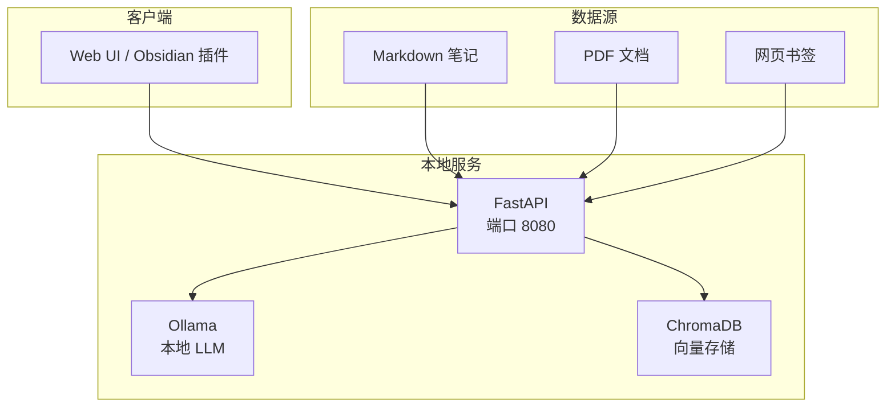

<Callout type="info" title="个人知识管理的痛点">
每天产生大量笔记、收藏、文档，但搜索时只能靠关键词？个人知识库 RAG 让你的笔记"会说话"：自然语言提问、智能关联、隐私本地化。本文从 quivr/MemFree 等个人项目提炼最佳实践，提供从 0 到 1 的完整方案。
</Callout>

# 个人知识管理 RAG

## 个人场景核心需求

### 典型应用场景

| 场景 | 核心需求 | 工具生态 | 数据规模 |
|------|---------|---------|---------|
| **个人笔记检索** | Markdown、自然语言查询 | Obsidian/Logseq/Notion | 1K-10K 笔记 |
| **学习笔记助手** | 知识关联、概念解释 | Roam/Heptabase | 500-5K 笔记 |
| **书签/收藏管理** | 网页内容提取、去重 | Raindrop/Pocket | 1K-50K 链接 |
| **PDF 研究库** | 论文阅读、引用追踪 | Zotero/Calibre | 100-5K PDF |
| **微信读书笔记** | 划线/批注整合 | 微信读书 API | 100-2K 本书 |

### 个人级 vs 企业级差异

| 维度 | 个人级 | 企业级 |
|------|-------|-------|
| **部署** | 本地/单机 | 分布式集群 |
| **成本** | 尽可能免费/低成本 | 按需付费，关注 ROI |
| **隐私** | 绝对本地化 | 合规框架 |
| **性能** | 秒级响应即可 | 毫秒级 + 高并发 |
| **集成** | 个人工具链 | 企业 SSO/AD |
| **维护** | 一键部署、零运维 | 专业 DevOps 团队 |

## 项目映射与选型理由

<Callout type="info" title="个人优先顺序">
本地优先、零运维、隐私隔离：优先 LightRAG；需要更完善 UI/组织管理可看 kotaemon；需要解析 PDF/表格较多，再接 ragflow；若需混合检索效果提升，参考 SurfSense 简化版。
</Callout>

- LightRAG（推荐优先）
  - 为何适配：单用户/小团队最友好，安装简、参数清晰，能快速形成高质量 baseline。
  - 关键能力：Token 感知切分、重叠、检索策略切换、存储后端灵活。
  - 不适用：强权限/多租户（需要额外中间件）。
  - 深入阅读：[LightRAG 深度解析](/docs/rag-project-analysis/04-key-projects-analysis/lightrag)
  - 快速落地：
    1) 针对 Markdown/笔记设定按标题分块；2) 试 200-400 token + 10-15% overlap；3) 混合检索作为兜底。

- kotaemon（候选）
  - 为何适配：需要管理多知识库、可视化与简单工作流的个人/小团队。
  - 不适用：端到端强检索质量要求（需自行调参/增强）。

- ragflow（解析前置）
  - 为何适配：大量 PDF/扫描件/表格资料的个人研究库。
  - 深入阅读：[ragflow 深度解析](/docs/rag-project-analysis/04-key-projects-analysis/ragflow)

- SurfSense（可选增强）
  - 为何适配：在单机数据库内实现向量+BM25 融合，提升长尾召回，成本低。
  - 深入阅读：[SurfSense 深度解析](/docs/rag-project-analysis/04-key-projects-analysis/surfsense)

> 不建议个人直接使用 onyx：运维复杂度与合规模块过重，除非将来要迁移到企业环境。

<Cards>
  <Card title="LightRAG 深度解析" href="/docs/rag-project-analysis/04-key-projects-analysis/lightrag"/>
  <Card title="ragflow 深度解析" href="/docs/rag-project-analysis/04-key-projects-analysis/ragflow"/>
  <Card title="SurfSense 深度解析" href="/docs/rag-project-analysis/04-key-projects-analysis/surfsense"/>
</Cards>

### 其他相关项目（占位）
- Verba：轻量组合与易集成，适合把检索/重排/生成拼装进现有小应用
- RAG-Anything：更强多模态解析，适合图像/表格/公式多的个人研究库
- Self-Corrective-Agentic-RAG：自纠正链路，适合模糊提问与主动澄清
- UltraRAG：实验加速与复现实验脚手架，适合做比较与参数探索

## 轻量级架构设计

### quivr 个人版架构



### 技术栈选型（本地优先）

| 组件 | 推荐方案 | 理由 |
|------|---------|------|
| **LLM** | Ollama (Llama 3.1 8B) | 本地免费、8-16GB 显存可运行 |
| **Embedding** | nomic-embed-text (137M) | 本地免费、性能接近 OpenAI |
| **向量库** | ChromaDB / LanceDB | SQLite-like、零配置 |
| **文档解析** | pypdf / markitdown | 轻量、纯 Python |
| **Web 框架** | FastAPI / Streamlit | 简单快速 |

## 核心功能实现

### 1. Markdown 笔记索引

```python title="markdown_indexer.py" path=null start=null
import os
from pathlib import Path
from typing import List, Dict
import frontmatter
from datetime import datetime

class MarkdownIndexer:
    """Markdown 笔记索引器（支持 Obsidian/Logseq）"""
    
    def __init__(self, notes_dir: str, vector_store):
        self.notes_dir = Path(notes_dir)
        self.vector_store = vector_store
    
    def index_all_notes(self):
        """索引所有笔记"""
        markdown_files = list(self.notes_dir.rglob("*.md"))
        
        for file_path in markdown_files:
            # 跳过隐藏文件和模板
            if file_path.name.startswith(".") or "_templates" in str(file_path):
                continue
            
            self.index_note(file_path)
    
    def index_note(self, file_path: Path):
        """索引单个笔记"""
        with open(file_path, "r", encoding="utf-8") as f:
            post = frontmatter.load(f)
        
        # 提取元数据
        metadata = {
            "file_path": str(file_path),
            "file_name": file_path.name,
            "title": post.get("title", file_path.stem),
            "tags": post.get("tags", []),
            "created": post.get("created", self._get_file_ctime(file_path)),
            "modified": self._get_file_mtime(file_path),
            "type": "markdown"
        }
        
        # 处理 Obsidian 特有语法
        content = post.content
        content = self._process_obsidian_syntax(content)
        
        # 分块策略：按标题层级
        chunks = self._chunk_by_headers(content, metadata)
        
        # 向量化并存储
        for chunk in chunks:
            self.vector_store.add(
                text=chunk["text"],
                metadata=chunk["metadata"]
            )
    
    def _process_obsidian_syntax(self, content: str) -> str:
        """处理 Obsidian 特有语法"""
        import re
        
        # 1. 双向链接 [[笔记名称]] -> 笔记名称
        content = re.sub(r"\[\[([^\]]+)\]\]", r"\1", content)
        
        # 2. 标签 #tag -> tag
        content = re.sub(r"#(\w+)", r"\1", content)
        
        # 3. 高亮 ==text== -> text
        content = re.sub(r"==([^=]+)==", r"\1", content)
        
        # 4. 删除 Dataview 查询块
        content = re.sub(r"```dataview[\s\S]*?```", "", content)
        
        return content
    
    def _chunk_by_headers(self, content: str, base_metadata: Dict) -> List[Dict]:
        """按 Markdown 标题分块"""
        chunks = []
        lines = content.split("\n")
        
        current_chunk = []
        current_header = None
        
        for line in lines:
            if line.startswith("#"):
                # 遇到新标题，保存上一个 chunk
                if current_chunk:
                    chunks.append({
                        "text": "\n".join(current_chunk),
                        "metadata": {
                            **base_metadata,
                            "section": current_header
                        }
                    })
                
                current_header = line.lstrip("#").strip()
                current_chunk = [line]
            else:
                current_chunk.append(line)
        
        # 保存最后一个 chunk
        if current_chunk:
            chunks.append({
                "text": "\n".join(current_chunk),
                "metadata": {
                    **base_metadata,
                    "section": current_header
                }
            })
        
        return chunks
    
    def _get_file_ctime(self, path: Path) -> str:
        """获取文件创建时间"""
        return datetime.fromtimestamp(path.stat().st_ctime).isoformat()
    
    def _get_file_mtime(self, path: Path) -> str:
        """获取文件修改时间"""
        return datetime.fromtimestamp(path.stat().st_mtime).isoformat()

# 使用示例
indexer = MarkdownIndexer(
    notes_dir="/Users/me/Documents/Obsidian Vault",
    vector_store=chroma_client
)
indexer.index_all_notes()
```

### 2. 智能查询增强

```python title="personal_query.py" path=null start=null
from typing import List, Optional
import re

class PersonalKnowledgeQuery:
    """个人知识库查询增强"""
    
    def __init__(self, vector_store, llm):
        self.vector_store = vector_store
        self.llm = llm
    
    async def query(
        self,
        question: str,
        filters: Optional[dict] = None,
        use_rerank: bool = True
    ) -> dict:
        """
        智能查询
        
        特性：
        1. 时间感知（"最近的笔记"）
        2. 标签过滤（"关于机器学习的笔记"）
        3. 关联笔记推荐
        """
        # 1. 提取查询意图
        intent = self._extract_intent(question)
        
        # 2. 构建过滤器
        search_filters = self._build_filters(intent, filters)
        
        # 3. 向量检索
        results = self.vector_store.search(
            query=question,
            n_results=20,
            filter=search_filters
        )
        
        # 4. 重排序（可选）
        if use_rerank:
            results = self._rerank(question, results)
        
        # 5. 生成答案
        answer = await self._generate_answer(
            question=question,
            context=results[:5],
            intent=intent
        )
        
        # 6. 推荐关联笔记
        related_notes = self._get_related_notes(results)
        
        return {
            "answer": answer,
            "sources": results[:5],
            "related_notes": related_notes,
            "intent": intent
        }
    
    def _extract_intent(self, question: str) -> dict:
        """提取查询意图"""
        intent = {
            "time_range": None,
            "tags": [],
            "note_type": None,
            "sort_by": "relevance"
        }
        
        # 时间范围检测
        if re.search(r"(最近|近期|今天|这周|本月)", question):
            intent["time_range"] = "recent"
        elif re.search(r"(去年|早期|以前|旧)", question):
            intent["time_range"] = "old"
        
        # 标签提取
        tags = re.findall(r"关于(\w+)", question)
        if tags:
            intent["tags"] = tags
        
        # 笔记类型
        if "待办" in question or "TODO" in question:
            intent["note_type"] = "todo"
        elif "会议" in question:
            intent["note_type"] = "meeting"
        
        return intent
    
    def _build_filters(self, intent: dict, user_filters: Optional[dict]) -> dict:
        """构建查询过滤器"""
        filters = user_filters or {}
        
        # 时间过滤
        if intent["time_range"] == "recent":
            from datetime import datetime, timedelta
            cutoff = (datetime.now() - timedelta(days=30)).isoformat()
            filters["modified"] = {"$gte": cutoff}
        
        # 标签过滤
        if intent["tags"]:
            filters["tags"] = {"$in": intent["tags"]}
        
        # 类型过滤
        if intent["note_type"]:
            filters["note_type"] = intent["note_type"]
        
        return filters
    
    def _rerank(self, query: str, results: List[dict]) -> List[dict]:
        """
        重排序策略（本地轻量）
        
        考虑因素：
        1. 语义相关性（已由向量检索提供）
        2. 笔记新鲜度（最近修改加分）
        3. 笔记完整性（字数、结构）
        """
        from datetime import datetime
        
        for result in results:
            score = result["score"]  # 初始相似度分数
            
            # 新鲜度加分
            modified = datetime.fromisoformat(result["metadata"]["modified"])
            days_old = (datetime.now() - modified).days
            freshness_bonus = max(0, 1 - days_old / 365) * 0.2
            
            # 完整性加分
            text_length = len(result["text"])
            completeness_bonus = min(text_length / 1000, 1) * 0.1
            
            result["final_score"] = score + freshness_bonus + completeness_bonus
        
        # 按最终分数排序
        results.sort(key=lambda x: x["final_score"], reverse=True)
        return results
    
    async def _generate_answer(
        self,
        question: str,
        context: List[dict],
        intent: dict
    ) -> str:
        """生成答案（带个人化 prompt）"""
        
        # 构建上下文
        context_text = "\n\n---\n\n".join([
            f"【{c['metadata']['title']}】\n{c['text']}"
            for c in context
        ])
        
        # 个人化 system prompt
        system_prompt = """你是我的个人知识助手。
        
规则：
1. 用第一人称（"你的笔记"）而不是第三人称
2. 如果笔记不完整，鼓励我补充
3. 主动关联相关笔记
4. 保留笔记原有的表述风格
"""
        
        user_prompt = f"""基于我的笔记回答问题。

我的问题：{question}

相关笔记：
{context_text}

请用简洁、友好的方式回答，并告诉我这些信息来自哪条笔记。"""
        
        answer = await self.llm.generate(
            system_prompt=system_prompt,
            user_prompt=user_prompt
        )
        
        return answer
    
    def _get_related_notes(self, results: List[dict]) -> List[str]:
        """提取关联笔记链接"""
        related = set()
        
        for result in results:
            # 提取笔记中的双向链接
            text = result["text"]
            links = re.findall(r"\[\[([^\]]+)\]\]", text)
            related.update(links)
        
        return list(related)[:5]  # 最多返回 5 个

# 使用示例
query_engine = PersonalKnowledgeQuery(chroma_client, ollama_llm)

result = await query_engine.query(
    question="我最近学习的机器学习概念有哪些？",
    use_rerank=True
)

print(result["answer"])
print("相关笔记：", result["related_notes"])
```

### 3. 隐私保护最佳实践

```python title="privacy_protection.py" path=null start=null
import hashlib
from pathlib import Path
from typing import List

class PrivacyProtector:
    """隐私保护工具"""
    
    def __init__(self):
        self.sensitive_patterns = [
            r"\d{11}",  # 手机号
            r"\d{15,18}",  # 身份证号
            r"\b[A-Za-z0-9._%+-]+@[A-Za-z0-9.-]+\.[A-Z|a-z]{2,}\b",  # 邮箱
            r"\d{16,19}",  # 银行卡号
        ]
    
    def anonymize_text(self, text: str) -> str:
        """文本脱敏"""
        import re
        
        for pattern in self.sensitive_patterns:
            text = re.sub(pattern, "[REDACTED]", text)
        
        return text
    
    def hash_identifier(self, identifier: str) -> str:
        """ID 哈希化（用于去重，但不可逆）"""
        return hashlib.sha256(identifier.encode()).hexdigest()
    
    def check_local_only(self):
        """检查是否为本地部署"""
        # 确保向量存储在本地
        assert Path("./chroma_db").exists(), "向量库必须在本地"
        
        # 确保没有外部 API 密钥
        import os
        assert not os.getenv("OPENAI_API_KEY"), "不应使用外部 API"
        
        print("✅ 隐私检查通过：所有数据本地化")

# 使用示例
protector = PrivacyProtector()
protector.check_local_only()

# 脱敏
text = "我的手机号是 13800138000"
safe_text = protector.anonymize_text(text)  # "我的手机号是 [REDACTED]"
```

## 笔记工具集成

### Obsidian 插件

```typescript title="obsidian-plugin.ts" path=null start=null
// Obsidian RAG 插件示例
import { Plugin, Notice, Modal } from 'obsidian';

export default class RAGPlugin extends Plugin {
    async onload() {
        // 添加侧边栏搜索面板
        this.addRibbonIcon('search', 'RAG 搜索', () => {
            new RAGSearchModal(this.app).open();
        });
        
        // 添加命令
        this.addCommand({
            id: 'rag-search',
            name: '智能搜索笔记',
            callback: () => {
                new RAGSearchModal(this.app).open();
            }
        });
        
        // 监听笔记变化，自动重新索引
        this.registerEvent(
            this.app.vault.on('modify', (file) => {
                this.reindexNote(file.path);
            })
        );
    }
    
    async reindexNote(filePath: string) {
        // 调用本地 RAG API
        const content = await this.app.vault.adapter.read(filePath);
        
        await fetch('http://localhost:8080/index', {
            method: 'POST',
            body: JSON.stringify({
                path: filePath,
                content: content
            })
        });
        
        new Notice('笔记已重新索引');
    }
}

class RAGSearchModal extends Modal {
    onOpen() {
        const { contentEl } = this;
        
        contentEl.createEl('h2', { text: '智能搜索' });
        
        const input = contentEl.createEl('input', {
            type: 'text',
            placeholder: '用自然语言提问...'
        });
        
        const resultsDiv = contentEl.createEl('div', { cls: 'rag-results' });
        
        input.addEventListener('keydown', async (e) => {
            if (e.key === 'Enter') {
                const query = input.value;
                const results = await this.search(query);
                this.displayResults(resultsDiv, results);
            }
        });
    }
    
    async search(query: string) {
        const response = await fetch('http://localhost:8080/query', {
            method: 'POST',
            body: JSON.stringify({ query })
        });
        
        return await response.json();
    }
    
    displayResults(container: HTMLElement, results: any) {
        container.empty();
        
        // 显示答案
        container.createEl('div', {
            cls: 'rag-answer',
            text: results.answer
        });
        
        // 显示来源笔记
        const sourcesDiv = container.createEl('div', { cls: 'rag-sources' });
        sourcesDiv.createEl('h3', { text: '来源笔记' });
        
        results.sources.forEach((source: any) => {
            const link = sourcesDiv.createEl('a', {
                text: source.metadata.title,
                href: source.metadata.file_path
            });
            
            link.addEventListener('click', (e) => {
                e.preventDefault();
                this.app.workspace.openLinkText(source.metadata.file_path, '');
            });
        });
    }
}
```

### Logseq 集成

```javascript title="logseq-integration.js" path=null start=null
// Logseq RAG 插件
logseq.ready(() => {
    // 注册斜杠命令
    logseq.Editor.registerSlashCommand('RAG 搜索', async () => {
        const query = await logseq.UI.showInputDialog({
            title: '智能搜索',
            placeholder: '用自然语言提问...'
        });
        
        if (query) {
            const results = await fetch('http://localhost:8080/query', {
                method: 'POST',
                body: JSON.stringify({ query })
            }).then(r => r.json());
            
            // 插入结果到当前块
            await logseq.Editor.insertAtEditingCursor(
                `**AI 回答：** ${results.answer}\n\n**来源：**\n${
                    results.sources.map(s => `- [[${s.metadata.title}]]`).join('\n')
                }`
            );
        }
    });
    
    // 自动索引新增/修改的块
    logseq.DB.onChanged(async ({ blocks }) => {
        for (const block of blocks) {
            await fetch('http://localhost:8080/index-block', {
                method: 'POST',
                body: JSON.stringify({
                    uuid: block.uuid,
                    content: block.content,
                    page: block.page.name
                })
            });
        }
    });
});
```

## 一键部署方案

### Docker Compose（全本地）

```yaml title="docker-compose.yml" path=null start=null
version: '3.8'

services:
  # 本地 LLM（Ollama）
  ollama:
    image: ollama/ollama:latest
    ports:
      - "11434:11434"
    volumes:
      - ollama_data:/root/.ollama
    deploy:
      resources:
        reservations:
          devices:
            - driver: nvidia
              count: 1
              capabilities: [gpu]
  
  # RAG API 服务
  rag_api:
    build: .
    ports:
      - "8080:8080"
    environment:
      - OLLAMA_URL=http://ollama:11434
      - CHROMA_PATH=/data/chroma
      - NOTES_DIR=/notes
    volumes:
      - ./chroma_db:/data/chroma
      - ~/Documents/Obsidian:/notes:ro  # 只读挂载笔记
    depends_on:
      - ollama
  
  # Web UI
  web_ui:
    image: nginx:alpine
    ports:
      - "3000:80"
    volumes:
      - ./web:/usr/share/nginx/html:ro
    depends_on:
      - rag_api

volumes:
  ollama_data:
```

### 启动脚本

```bash title="start.sh" path=null start=null
#!/bin/bash

echo "🚀 启动个人知识库 RAG..."

# 1. 拉取 Ollama 模型
docker exec ollama ollama pull llama3.1:8b
docker exec ollama ollama pull nomic-embed-text

# 2. 初始化向量库
echo "📚 索引笔记..."
curl -X POST http://localhost:8080/index-all

# 3. 打开浏览器
open http://localhost:3000

echo "✅ 启动完成！"
echo "   - Web UI: http://localhost:3000"
echo "   - API: http://localhost:8080/docs"
```

## 性能优化（低资源）

### 资源受限环境优化

```python title="low_resource_optimization.py" path=null start=null
# 1. 量化模型（减少显存）
class QuantizedLLM:
    """量化 LLM（4-bit）"""
    
    def __init__(self):
        from transformers import AutoModelForCausalLM, BitsAndBytesConfig
        
        quantization_config = BitsAndBytesConfig(
            load_in_4bit=True,
            bnb_4bit_compute_dtype=torch.float16
        )
        
        self.model = AutoModelForCausalLM.from_pretrained(
            "meta-llama/Llama-3.1-8B",
            quantization_config=quantization_config,
            device_map="auto"
        )
        
        # 8B 模型 -> 4GB 显存（vs 16GB 原始）

# 2. 向量缓存（减少重复计算）
class CachedEmbedding:
    """带缓存的 Embedding"""
    
    def __init__(self, model, cache_path="./embedding_cache.db"):
        self.model = model
        self.cache = {}
        self.cache_path = cache_path
        self._load_cache()
    
    def embed(self, text: str):
        # 计算文本哈希
        text_hash = hashlib.md5(text.encode()).hexdigest()
        
        if text_hash in self.cache:
            return self.cache[text_hash]
        
        # 计算 embedding
        embedding = self.model.encode(text)
        
        # 缓存
        self.cache[text_hash] = embedding
        self._save_cache()
        
        return embedding

# 3. 增量索引（只处理变化的文件）
class IncrementalIndexer:
    """增量索引器"""
    
    def __init__(self, notes_dir: str):
        self.notes_dir = Path(notes_dir)
        self.index_state = self._load_state()
    
    def sync(self):
        """同步索引（只处理新增/修改）"""
        current_state = self._scan_files()
        
        for file_path, mtime in current_state.items():
            if file_path not in self.index_state or self.index_state[file_path] < mtime:
                print(f"索引: {file_path}")
                self.index_file(file_path)
                self.index_state[file_path] = mtime
        
        # 删除已移除的文件
        for file_path in list(self.index_state.keys()):
            if file_path not in current_state:
                print(f"移除: {file_path}")
                self.remove_from_index(file_path)
                del self.index_state[file_path]
        
        self._save_state()
    
    def _scan_files(self) -> dict:
        """扫描文件系统"""
        state = {}
        for file_path in self.notes_dir.rglob("*.md"):
            state[str(file_path)] = file_path.stat().st_mtime
        return state
```

## 实战案例

### 案例1：学术论文管理（配合 Zotero）

```python title="paper_management.py" path=null start=null
class PaperRAG:
    """学术论文 RAG（配合 Zotero）"""
    
    def __init__(self):
        self.zotero_lib = "/Users/me/Zotero/storage"
        self.vector_store = ChromaClient()
    
    def index_zotero_library(self):
        """索引 Zotero 文献库"""
        from pyzotero import zotero
        
        zot = zotero.Zotero(library_id, library_type, api_key)
        items = zot.top(limit=1000)
        
        for item in items:
            if item['data']['itemType'] == 'journalArticle':
                # 提取元数据
                metadata = {
                    "title": item['data']['title'],
                    "authors": ", ".join([c['firstName'] + ' ' + c['lastName'] 
                                        for c in item['data']['creators']]),
                    "year": item['data']['date'][:4],
                    "journal": item['data'].get('publicationTitle', ''),
                    "doi": item['data'].get('DOI', ''),
                    "tags": [t['tag'] for t in item['data']['tags']]
                }
                
                # 提取 PDF 内容
                pdf_path = self._find_pdf(item['key'])
                if pdf_path:
                    text = self._extract_pdf_text(pdf_path)
                    
                    # 分章节索引
                    sections = self._split_paper_sections(text)
                    for section_name, section_text in sections.items():
                        self.vector_store.add(
                            text=section_text,
                            metadata={
                                **metadata,
                                "section": section_name
                            }
                        )
    
    def _split_paper_sections(self, text: str) -> dict:
        """分割论文章节"""
        sections = {}
        
        # 常见章节标题
        section_patterns = [
            "Abstract", "Introduction", "Related Work",
            "Method", "Experiment", "Results", "Conclusion"
        ]
        
        # 简单的章节分割（实际需要更复杂的逻辑）
        for section in section_patterns:
            if section in text:
                start = text.index(section)
                end = len(text)
                for next_section in section_patterns:
                    if next_section in text[start+len(section):]:
                        end = start + len(section) + text[start+len(section):].index(next_section)
                        break
                sections[section] = text[start:end]
        
        return sections
    
    async def query_papers(self, question: str):
        """论文问答"""
        # 检索相关论文
        results = self.vector_store.search(question, n_results=10)
        
        # 生成答案（带引用）
        answer = await self.generate_with_citations(question, results)
        
        return answer
    
    async def generate_with_citations(self, question: str, results: list) -> str:
        """生成带引用的答案"""
        context = "\n\n".join([
            f"[{i+1}] {r['metadata']['authors']} ({r['metadata']['year']}). "
            f"{r['metadata']['title']}.\n{r['text']}"
            for i, r in enumerate(results)
        ])
        
        prompt = f"""基于以下论文回答问题，并用 [数字] 标注引用。

问题：{question}

论文：
{context}

要求：
1. 答案必须基于论文内容
2. 用 [1] [2] 标注引用来源
3. 如果论文信息不足，明确说明
"""
        
        answer = await self.llm.generate(prompt)
        
        # 添加引用列表
        references = "\n".join([
            f"[{i+1}] {r['metadata']['authors']} ({r['metadata']['year']}). "
            f"{r['metadata']['title']}. {r['metadata']['journal']}."
            for i, r in enumerate(results)
        ])
        
        return f"{answer}\n\n**参考文献：**\n{references}"
```

### 案例2：微信读书笔记整合

```python title="weread_integration.py" path=null start=null
class WeReadRAG:
    """微信读书笔记 RAG"""
    
    def __init__(self):
        self.vector_store = ChromaClient()
    
    def sync_weread_notes(self, cookies: str):
        """同步微信读书笔记"""
        import requests
        
        headers = {"Cookie": cookies}
        
        # 获取书架
        resp = requests.get(
            "https://i.weread.qq.com/shelf/sync",
            headers=headers
        )
        books = resp.json()['books']
        
        for book in books:
            book_id = book['bookId']
            
            # 获取笔记
            notes_resp = requests.get(
                f"https://i.weread.qq.com/book/bookmarklist?bookId={book_id}",
                headers=headers
            )
            
            notes = notes_resp.json().get('updated', [])
            
            for note in notes:
                self.vector_store.add(
                    text=note['markText'],
                    metadata={
                        "book_id": book_id,
                        "book_title": book['title'],
                        "author": book['author'],
                        "chapter": note.get('chapterTitle', ''),
                        "create_time": note['createTime'],
                        "type": "highlight"
                    }
                )
                
                # 如果有批注
                if note.get('review'):
                    self.vector_store.add(
                        text=f"{note['markText']}\n\n我的想法：{note['review']['content']}",
                        metadata={
                            **metadata,
                            "type": "annotation"
                        }
                    )
    
    async def query_reading_notes(self, question: str):
        """查询阅读笔记"""
        results = self.vector_store.search(question, n_results=5)
        
        # 按书籍分组
        by_book = {}
        for r in results:
            book_title = r['metadata']['book_title']
            if book_title not in by_book:
                by_book[book_title] = []
            by_book[book_title].append(r)
        
        # 生成答案
        answer = f"关于「{question}」，我在这些书中有相关笔记：\n\n"
        
        for book_title, notes in by_book.items():
            answer += f"**《{book_title}》**\n"
            for note in notes:
                answer += f"- {note['text']}\n"
            answer += "\n"
        
        return answer
```

## 实操清单

- 准备环境：Ollama + 本地向量库（Chroma/LanceDB）
- 解析策略：Markdown 标题分块；去除 Obsidian/Logseq 特有语法；保留链接与标签
- 嵌入与索引：nomic-embed-text 或本地 BGE；增量索引（监听文件变化）
- 检索：向量检索为主，必要时引入简化 BM25 以提升长尾召回
- 重排：本地轻量重排（可选）；或用规则分（新鲜度/完整性）
- 隐私：本地化运行；API 禁止外联；敏感内容脱敏

## 参数网格模板

```yaml title="personal_param_grid.yaml" path=null start=null
chunking:
  size: [200, 300, 400]
  overlap_ratio: [0.1, 0.15]
embedding:
  model: ["nomic-embed-text", "bge-small", "gte-small"]
retrieval:
  top_k: [5, 8]
  use_bm25: [false, true]
  bm25_weight: [0.3, 0.5]
rerank:
  enabled: [false, true]
  top_k: [20, 50]
  model: ["flashrank-bge-small"]
```

## 最佳实践清单

<Cards>
  <Card title="隐私" href="#privacy">
    <ul>
      <li>✅ 所有数据本地存储</li>
      <li>✅ 不使用外部 API</li>
      <li>✅ 敏感信息自动脱敏</li>
      <li>✅ 离线可用</li>
    </ul>
  </Card>
  
  <Card title="性能" href="#performance">
    <ul>
      <li>✅ 模型量化（4-bit）</li>
      <li>✅ Embedding 缓存</li>
      <li>✅ 增量索引</li>
      <li>✅ 8GB 显存可运行</li>
    </ul>
  </Card>
  
  <Card title="易用性" href="#usability">
    <ul>
      <li>✅ 一键启动（Docker）</li>
      <li>✅ Obsidian/Logseq 插件</li>
      <li>✅ 自动监听文件变化</li>
      <li>✅ 友好的 Web UI</li>
    </ul>
  </Card>
  
  <Card title="扩展性" href="#extensibility">
    <ul>
      <li>✅ 支持多种笔记格式</li>
      <li>✅ 可集成 Zotero/微信读书</li>
      <li>✅ 自定义 Embedding 模型</li>
      <li>✅ 插件化架构</li>
    </ul>
  </Card>
</Cards>

## 延伸阅读

- [企业知识库 RAG](/docs/rag-project-analysis/04-application-scenarios/01-企业知识库RAG) - 对比企业场景
- [文档解析](/docs/rag-project-analysis/02-pipeline-deep-dive/06-文档解析) - 支持更多文档格式

## 参考文献

- quivr 官方文档 - 个人知识库最佳实践
- Obsidian RAG Plugin - 社区插件
- MemFree - 开源个人搜索引擎

**下一步**：了解 [代码库问答 RAG](/docs/rag-project-analysis/04-application-scenarios/./03-代码库问答RAG) 的代码检索优化。
