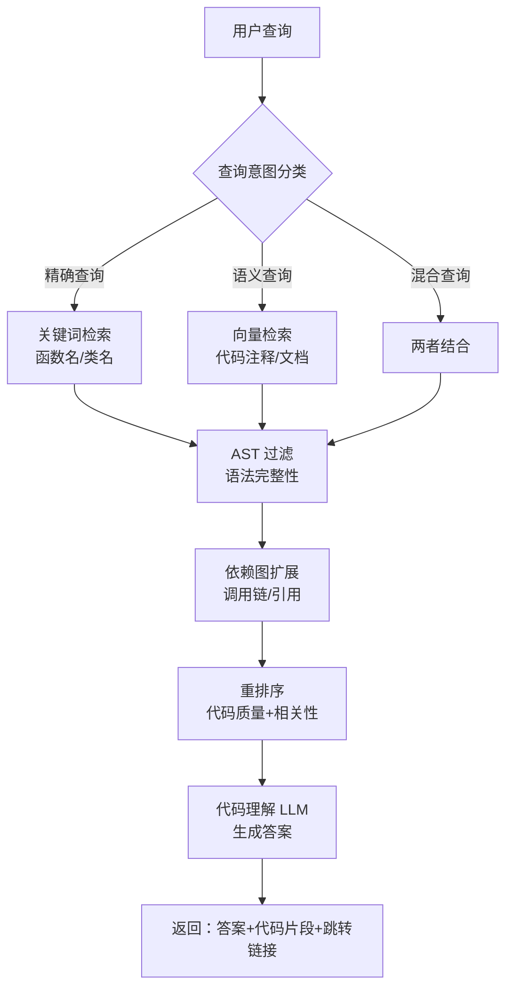

<Callout type="warn" title="代码检索的特殊性">
代码不是普通文本：有严格语法、层级结构、跨文件引用、多种编程语言。简单的文本切分会破坏代码完整性，纯语义检索又容易遗漏精确匹配。本文从 sweep.ai/continue 等代码 AI 项目提炼核心技术，打造专业的代码库 RAG。
</Callout>

# 代码库问答 RAG

## 代码检索核心挑战

### 代码 vs 普通文档

| 维度 | 普通文档 | 代码库 |
|------|---------|-------|
| **结构** | 章节层级 | AST 树形结构 |
| **语义** | 自然语言 | 函数/类/变量名 + 注释 |
| **关联** | 引用、超链接 | import/include/继承/调用 |
| **精确性** | 模糊匹配可接受 | 函数签名必须精确 |
| **语言** | 单一语言 | 多种编程语言混合 |
| **变化** | 相对稳定 | 频繁 commit |

### 典型应用场景

| 场景 | 核心需求 | 示例问题 |
|------|---------|---------|
| **代码理解** | 函数功能、调用链 | "登录功能的实现流程？" |
| **Bug 定位** | 错误处理、异常路径 | "为什么会报 NullPointerException？" |
| **重构辅助** | 影响范围、依赖分析 | "修改这个接口会影响哪些模块？" |
| **新人上手** | 架构概览、代码导航 | "用户服务在哪个目录？" |
| **API 文档** | 自动生成文档 | "如何使用 UserService？" |

## 项目映射与选型理由

<Callout type="warn" title="检索先混合，理解再专业化">
代码场景普遍受益于“关键词+向量”的混合检索与 rerank；在此基础上再引入 AST/依赖图等结构化特征。
</Callout>

- SurfSense（推荐优先）
  - 为何适配：Postgres 内融合 BM25+向量 + RRF，可先保障函数名/类名等精确命中，再以语义补全，CPU 即可达标。
  - 关键能力：SQL 融合透明可调、FlashRank 轻量重排、参数敏感性实验成熟。
  - 不适用：需要跨库大型代码图谱（需额外图数据库）。
  - 深入阅读：[SurfSense 深度解析](/docs/rag-project-analysis/04-key-projects-analysis/surfsense)
  - 快速落地：
    1) 将符号表/标识符建关键词索引；2) 注释/文档文本进向量库；3) 调整 RRF k 与 topN；4) 以函数签名与路径加权。

- LightRAG
  - 为何适配：作为 baseline 与参数网格试验平台；便于对 chunking（函数/类粒度）和检索策略做快速迭代。
  - 深入阅读：[LightRAG 深度解析](/docs/rag-project-analysis/04-key-projects-analysis/lightrag)

- onyx（企业代码知识库）
  - 为何适配：若涉及权限/审计/多租户（例如跨团队代码与内部文档合并查询）。
  - 深入阅读：[onyx 深度解析](/docs/rag-project-analysis/04-key-projects-analysis/onyx)

- 补充：可将 ragflow 用于 PDF 设计文档/图示解析；Self-Corrective-Agentic-RAG 用于“先定位再追问澄清”的纠错链。

<Cards>
  <Card title="SurfSense 深度解析" href="/docs/rag-project-analysis/04-key-projects-analysis/surfsense"/>
  <Card title="LightRAG 深度解析" href="/docs/rag-project-analysis/04-key-projects-analysis/lightrag"/>
  <Card title="onyx 深度解析" href="/docs/rag-project-analysis/04-key-projects-analysis/onyx"/>
</Cards>

### 其他相关项目（占位）
- RAG-Anything：用于解析设计文档中的图表/截图，补充代码上下文
- kotaemon：更完善的知识库/图谱可视化界面，适合开发内网门户
- Verba：灵活拼装检索/重排策略，便于快速试错
- Self-Corrective-Agentic-RAG：先检索再澄清/纠错的链路，用于降低幻觉
- UltraRAG：参数探索与对比实验脚手架

## 架构设计

### 混合检索架构



### 核心组件

```python title="code_rag_components.py" path=null start=null
from dataclasses import dataclass
from typing import List, Dict, Optional
from enum import Enum

class CodeLanguage(Enum):
    """支持的编程语言"""
    PYTHON = "python"
    JAVASCRIPT = "javascript"
    TYPESCRIPT = "typescript"
    JAVA = "java"
    GO = "go"
    RUST = "rust"
    CPP = "cpp"

@dataclass
class CodeChunk:
    """代码块"""
    content: str
    language: CodeLanguage
    file_path: str
    
    # AST 信息
    node_type: str  # function, class, method, etc.
    name: str  # 函数/类名
    signature: str  # 完整签名
    docstring: Optional[str]
    
    # 位置信息
    start_line: int
    end_line: int
    
    # 依赖关系
    imports: List[str]
    calls: List[str]  # 调用的其他函数
    called_by: List[str]  # 被谁调用
    
    # 质量指标
    complexity: int  # 圈复杂度
    test_coverage: float  # 测试覆盖率

class CodeRAGSystem:
    """代码库 RAG 系统"""
    
    def __init__(self):
        self.ast_parser = ASTParser()
        self.keyword_index = KeywordIndex()
        self.vector_store = VectorStore()
        self.dependency_graph = DependencyGraph()
        self.llm = CodeLLM()
    
    async def query(self, question: str, repo_path: str) -> dict:
        """代码库查询"""
        # 1. 意图分类
        intent = self._classify_intent(question)
        
        # 2. 混合检索
        candidates = await self._hybrid_search(
            question=question,
            intent=intent,
            repo_path=repo_path
        )
        
        # 3. 依赖扩展
        expanded = self.dependency_graph.expand(candidates)
        
        # 4. 重排序
        ranked = self._rerank(question, expanded)
        
        # 5. 生成答案
        answer = await self.llm.generate_code_answer(
            question=question,
            code_chunks=ranked[:10]
        )
        
        return answer
```

## 核心技术实现

### 1. AST 解析与索引

```python title="ast_parser.py" path=null start=null
import ast
from typing import List, Dict
from pathlib import Path

class ASTParser:
    """抽象语法树解析器"""
    
    def __init__(self):
        self.parsers = {
            "python": self._parse_python,
            "javascript": self._parse_javascript,
            # 其他语言...
        }
    
    def parse_file(self, file_path: str, language: str) -> List[CodeChunk]:
        """解析单个文件"""
        parser = self.parsers.get(language)
        if not parser:
            raise ValueError(f"Unsupported language: {{{{language}}}}")
        
        with open(file_path, "r", encoding="utf-8") as f:
            content = f.read()
        
        return parser(content, file_path)
    
    def _parse_python(self, content: str, file_path: str) -> List[CodeChunk]:
        """解析 Python 文件"""
        try:
            tree = ast.parse(content)
        except SyntaxError:
            return []
        
        chunks = []
        
        for node in ast.walk(tree):
            # 解析函数
            if isinstance(node, ast.FunctionDef):
                chunk = self._extract_function(node, content, file_path)
                chunks.append(chunk)
            
            # 解析类
            elif isinstance(node, ast.ClassDef):
                chunk = self._extract_class(node, content, file_path)
                chunks.append(chunk)
                
                # 解析类中的方法
                for item in node.body:
                    if isinstance(item, ast.FunctionDef):
                        method_chunk = self._extract_method(
                            item, node.name, content, file_path
                        )
                        chunks.append(method_chunk)
        
        return chunks
    
    def _extract_function(
        self,
        node: ast.FunctionDef,
        content: str,
        file_path: str
    ) -> CodeChunk:
        """提取函数信息"""
        # 获取完整代码
        lines = content.split("\n")
        func_code = "\n".join(lines[node.lineno-1:node.end_lineno])
        
        # 提取 docstring
        docstring = ast.get_docstring(node)
        
        # 提取函数签名
        args = [arg.arg for arg in node.args.args]
        signature = f"def {{{{node.name}}}}({{{{', '.join(args)}}}})
        
        # 提取调用的函数
        calls = []
        for child in ast.walk(node):
            if isinstance(child, ast.Call):
                if isinstance(child.func, ast.Name):
                    calls.append(child.func.id)
                elif isinstance(child.func, ast.Attribute):
                    calls.append(child.func.attr)
        
        # 计算圈复杂度
        complexity = self._calculate_complexity(node)
        
        return CodeChunk(
            content=func_code,
            language=CodeLanguage.PYTHON,
            file_path=file_path,
            node_type="function",
            name=node.name,
            signature=signature,
            docstring=docstring,
            start_line=node.lineno,
            end_line=node.end_lineno,
            imports=[],  # 需要单独提取
            calls=calls,
            called_by=[],  # 需要反向索引
            complexity=complexity,
            test_coverage=0.0
        )
    
    def _calculate_complexity(self, node: ast.AST) -> int:
        """计算圈复杂度（McCabe）"""
        complexity = 1  # 基础复杂度
        
        for child in ast.walk(node):
            # 分支语句
            if isinstance(child, (ast.If, ast.While, ast.For)):
                complexity += 1
            # 逻辑操作符
            elif isinstance(child, ast.BoolOp):
                complexity += len(child.values) - 1
            # 异常处理
            elif isinstance(child, ast.ExceptHandler):
                complexity += 1
        
        return complexity
    
    def _extract_class(
        self,
        node: ast.ClassDef,
        content: str,
        file_path: str
    ) -> CodeChunk:
        """提取类信息"""
        lines = content.split("\n")
        class_code = "\n".join(lines[node.lineno-1:node.end_lineno])
        
        # 提取基类
        bases = [base.id for base in node.bases if isinstance(base, ast.Name)]
        
        # 提取方法列表
        methods = [
            item.name for item in node.body
            if isinstance(item, ast.FunctionDef)
        ]
        
        return CodeChunk(
            content=class_code,
            language=CodeLanguage.PYTHON,
            file_path=file_path,
            node_type="class",
            name=node.name,
            signature=f"class {{{{node.name}}}}({{{{', '.join(bases)}}}})",
            docstring=ast.get_docstring(node),
            start_line=node.lineno,
            end_line=node.end_lineno,
            imports=[],
            calls=methods,  # 类的方法
            called_by=[],
            complexity=0,
            test_coverage=0.0
        )

# 使用示例
parser = ASTParser()
chunks = parser.parse_file("app/main.py", "python")

for chunk in chunks:
    print(f"{{{{chunk.node_type}}}}: {{{{chunk.name}}}}")
    print(f"  Signature: {{{{chunk.signature}}}}")
    print(f"  Lines: {{{{chunk.start_line}}}}-{{{{chunk.end_line}}}}")
    print(f"  Complexity: {{{{chunk.complexity}}}}")
```

### 2. 混合检索（语义 + 关键词）

```python title="hybrid_search.py" path=null start=null
from typing import List
from dataclasses import dataclass

@dataclass
class SearchResult:
    """搜索结果"""
    chunk: CodeChunk
    score: float
    source: str  # "keyword" or "semantic"

class HybridSearchEngine:
    """混合搜索引擎"""
    
    def __init__(self, vector_store, keyword_index):
        self.vector_store = vector_store
        self.keyword_index = keyword_index
    
    async def search(
        self,
        query: str,
        n_results: int = 20,
        semantic_weight: float = 0.5
    ) -> List[SearchResult]:
        """
        混合检索
        
        Args:
            query: 查询文本
            n_results: 返回结果数
            semantic_weight: 语义权重（0-1，剩余为关键词权重）
        """
        # 1. 语义检索
        semantic_results = await self._semantic_search(query, n_results)
        
        # 2. 关键词检索
        keyword_results = await self._keyword_search(query, n_results)
        
        # 3. 融合排序（RRF - Reciprocal Rank Fusion）
        fused_results = self._reciprocal_rank_fusion(
            semantic_results,
            keyword_results,
            semantic_weight
        )
        
        return fused_results[:n_results]
    
    async def _semantic_search(
        self,
        query: str,
        n_results: int
    ) -> List[SearchResult]:
        """语义检索（向量）"""
        # 构建语义查询（包含代码注释和文档字符串）
        search_text = f"{{{{query}}}}"
        
        results = self.vector_store.search(
            query=search_text,
            n_results=n_results,
            filter={"has_docstring": True}  # 优先有文档的代码
        )
        
        return [
            SearchResult(
                chunk=r["chunk"],
                score=r["similarity"],
                source="semantic"
            )
            for r in results
        ]
    
    async def _keyword_search(
        self,
        query: str,
        n_results: int
    ) -> List[SearchResult]:
        """关键词检索（精确匹配）"""
        # 提取查询中的代码标识符
        identifiers = self._extract_identifiers(query)
        
        results = []
        
        for identifier in identifiers:
            # 搜索函数名、类名、变量名
            matches = self.keyword_index.search(
                identifier,
                fields=["name", "signature", "calls"]
            )
            
            for match in matches:
                results.append(SearchResult(
                    chunk=match["chunk"],
                    score=match["score"],
                    source="keyword"
                ))
        
        # 去重并排序
        results = self._deduplicate(results)
        results.sort(key=lambda x: x.score, reverse=True)
        
        return results[:n_results]
    
    def _extract_identifiers(self, query: str) -> List[str]:
        """提取查询中的代码标识符"""
        import re
        
        # 匹配驼峰命名和下划线命名
        identifiers = re.findall(
            r'\b[a-z_][a-z0-9_]*\b|\b[A-Z][a-zA-Z0-9]*\b',
            query
        )
        
        # 过滤常见词
        stopwords = {"the", "a", "is", "are", "how", "what", "where"}
        identifiers = [i for i in identifiers if i.lower() not in stopwords]
        
        return identifiers
    
    def _reciprocal_rank_fusion(
        self,
        semantic_results: List[SearchResult],
        keyword_results: List[SearchResult],
        semantic_weight: float
    ) -> List[SearchResult]:
        """
        倒数排名融合（RRF）
        
        RRF Score = semantic_weight * (1 / (k + rank_semantic))
                  + (1 - semantic_weight) * (1 / (k + rank_keyword))
        
        k 是常数（通常为 60）
        """
        k = 60
        rrf_scores = {}
        
        # 语义检索贡献
        for rank, result in enumerate(semantic_results):
            chunk_id = self._get_chunk_id(result.chunk)
            if chunk_id not in rrf_scores:
                rrf_scores[chunk_id] = {"chunk": result.chunk, "score": 0.0}
            rrf_scores[chunk_id]["score"] += semantic_weight / (k + rank + 1)
        
        # 关键词检索贡献
        keyword_weight = 1 - semantic_weight
        for rank, result in enumerate(keyword_results):
            chunk_id = self._get_chunk_id(result.chunk)
            if chunk_id not in rrf_scores:
                rrf_scores[chunk_id] = {"chunk": result.chunk, "score": 0.0}
            rrf_scores[chunk_id]["score"] += keyword_weight / (k + rank + 1)
        
        # 转换为列表并排序
        fused = [
            SearchResult(
                chunk=data["chunk"],
                score=data["score"],
                source="hybrid"
            )
            for data in rrf_scores.values()
        ]
        
        fused.sort(key=lambda x: x.score, reverse=True)
        return fused
    
    def _get_chunk_id(self, chunk: CodeChunk) -> str:
        """生成 chunk 唯一 ID"""
        return f"{{{{{{{{chunk.file_path}}}}}}}}:{{{{{{{{chunk.start_line}}}}}}}}:{{{{{{{{chunk.name}}}}}}}}"
    
    def _deduplicate(self, results: List[SearchResult]) -> List[SearchResult]:
        """去重"""
        seen = set()
        unique_results = []
        
        for result in results:
            chunk_id = self._get_chunk_id(result.chunk)
            if chunk_id not in seen:
                seen.add(chunk_id)
                unique_results.append(result)
        
        return unique_results
```

### 3. 依赖图构建与扩展

```python title="dependency_graph.py" path=null start=null
import networkx as nx
from typing import List, Set

class DependencyGraph:
    """代码依赖图"""
    
    def __init__(self):
        self.graph = nx.DiGraph()  # 有向图
    
    def build_from_chunks(self, chunks: List[CodeChunk]):
        """从代码块构建依赖图"""
        # 1. 添加节点
        for chunk in chunks:
            node_id = f"{{{{{{{{chunk.file_path}}}}}}}}:{{{{{{{{chunk.name}}}}}}}}"
            self.graph.add_node(
                node_id,
                chunk=chunk,
                type=chunk.node_type,
                name=chunk.name
            )
        
        # 2. 添加边（调用关系）
        for chunk in chunks:
            caller_id = f"{{{{{{{{chunk.file_path}}}}}}}}:{{{{{{{{chunk.name}}}}}}}}"
            
            for callee in chunk.calls:
                # 查找被调用的函数/方法
                callee_nodes = [
                    n for n in self.graph.nodes()
                    if self.graph.nodes[n]["name"] == callee
                ]
                
                for callee_id in callee_nodes:
                    self.graph.add_edge(caller_id, callee_id, type="calls")
    
    def expand_context(
        self,
        chunks: List[CodeChunk],
        max_depth: int = 2
    ) -> List[CodeChunk]:
        """
        扩展上下文
        
        给定初始检索结果，扩展其调用链和依赖
        """
        expanded_chunks = set(chunks)
        
        for chunk in chunks:
            node_id = f"{{{{{{{{chunk.file_path}}}}}}}}:{{{{{{{{chunk.name}}}}}}}}"
            
            if node_id not in self.graph:
                continue
            
            # 1. 上游依赖（被谁调用）
            predecessors = nx.ancestors(self.graph, node_id)
            for pred_id in list(predecessors)[:5]:  # 限制数量
                pred_chunk = self.graph.nodes[pred_id]["chunk"]
                expanded_chunks.add(pred_chunk)
            
            # 2. 下游依赖（调用了谁）
            successors = nx.descendants(self.graph, node_id)
            for succ_id in list(successors)[:5]:
                succ_chunk = self.graph.nodes[succ_id]["chunk"]
                expanded_chunks.add(succ_chunk)
            
            # 3. 同文件的相关函数
            same_file_chunks = [
                c for c in chunks
                if c.file_path == chunk.file_path and c != chunk
            ]
            expanded_chunks.update(same_file_chunks[:3])
        
        return list(expanded_chunks)
    
    def get_call_chain(
        self,
        start_function: str,
        end_function: str
    ) -> List[List[str]]:
        """获取两个函数之间的调用链"""
        start_nodes = [
            n for n in self.graph.nodes()
            if self.graph.nodes[n]["name"] == start_function
        ]
        end_nodes = [
            n for n in self.graph.nodes()
            if self.graph.nodes[n]["name"] == end_function
        ]
        
        all_paths = []
        for start in start_nodes:
            for end in end_nodes:
                try:
                    paths = nx.all_simple_paths(
                        self.graph, start, end, cutoff=5
                    )
                    all_paths.extend(paths)
                except nx.NetworkXNoPath:
                    continue
        
        return all_paths
    
    def visualize(self, output_path: str = "dependency_graph.png"):
        """可视化依赖图"""
        import matplotlib.pyplot as plt
        
        pos = nx.spring_layout(self.graph)
        
        plt.figure(figsize=(20, 20))
        nx.draw(
            self.graph,
            pos,
            with_labels=True,
            node_color="lightblue",
            node_size=500,
            font_size=8,
            arrows=True
        )
        
        plt.savefig(output_path)
        print(f"依赖图已保存到 {{{{output_path}}}}")
```

### 4. 代码理解 LLM

```python title="code_llm.py" path=null start=null
class CodeLLM:
    """代码理解 LLM"""
    
    def __init__(self, model_name: str = "gpt-4"):
        self.model_name = model_name
        self.system_prompt = self._build_system_prompt()
    
    def _build_system_prompt(self) -> str:
        """构建代码理解的 system prompt"""
        return """你是一个专业的代码助手，擅长阅读和理解代码。

你的职责：
1. 基于给定的代码片段回答用户问题
2. 解释代码的功能、逻辑、设计模式
3. 指出潜在的 bug 或优化点
4. 提供代码示例和最佳实践

回答要求：
- 用清晰、简洁的语言
- 引用具体的函数名、文件路径
- 提供代码行号定位
- 如果信息不足，明确说明
- 推荐相关的代码片段"""
    
    async def generate_code_answer(
        self,
        question: str,
        code_chunks: List[CodeChunk],
        include_references: bool = True
    ) -> dict:
        """生成代码问答答案"""
        
        # 构建上下文
        context = self._format_code_context(code_chunks)
        
        user_prompt = f"""问题：{{{{question}}}}

相关代码：
{{{{context}}}}

请基于以上代码回答问题。"""
        
        # 调用 LLM
        answer = await self._call_llm(user_prompt)
        
        # 添加代码引用
        if include_references:
            references = self._build_references(code_chunks)
            answer += f"\n\n## 代码引用\n{{{{references}}}}"
        
        return {
            "answer": answer,
            "code_chunks": code_chunks,
            "question": question
        }
    
    def _format_code_context(self, chunks: List[CodeChunk]) -> str:
        """格式化代码上下文"""
        context_parts = []
        
        for i, chunk in enumerate(chunks):
            part = f"""
### [{{{{i+1}}}}] {{{{chunk.file_path}}}}:{{{{chunk.start_line}}}}
|
**{{{{chunk.node_type.capitalize()}}}}: {{{{chunk.name}}}}**
|
{{{{{{{{chunk.language.value}}}}}}}}
{{{{chunk.content}}}}

|
Signature: `{{{{chunk.signature}}}}`
Complexity: {{{{chunk.complexity}}}}
"""
            if chunk.docstring:
                part += f"Documentation: {{{{chunk.docstring}}}}\n"
            
            if chunk.calls:
                part += f"Calls: {{{{', '.join(chunk.calls[:5])}}}}\n"
            
            context_parts.append(part)
        
        return "\n".join(context_parts)
    
    def _build_references(self, chunks: List[CodeChunk]) -> str:
        """构建代码引用"""
        references = []
        
        for chunk in chunks:
            ref = f"- `{{{{chunk.name}}}}` in `{{{{chunk.file_path}}}}` (lines {{{{chunk.start_line}}}}-{{{{chunk.end_line}}}})"  
            references.append(ref)
        
        return "\n".join(references)
    
    async def explain_function(self, chunk: CodeChunk) -> str:
        """解释单个函数"""
        prompt = f"""请详细解释以下函数：
|
文件：{{{{chunk.file_path}}}}
函数：{{{{chunk.name}}}}
|
{{{{{{{{chunk.language.value}}}}}}}}
{{{{chunk.content}}}}

请说明：
1. 函数的功能
2. 参数和返回值
3. 主要逻辑步骤
4. 可能的边界情况
5. 优化建议（如果有）"""
        
        return await self._call_llm(prompt)
    
    async def find_bug(self, chunk: CodeChunk, error_message: str) -> str:
        """定位 bug"""
        prompt = f"""代码运行时出现以下错误：
|
错误信息：
{{{{error_message}}}}
|
相关代码：
{{{{{{{{chunk.language.value}}}}}}}}
{{{{chunk.content}}}}

请分析：
1. 错误的根本原因
2. 可能的触发条件
3. 修复建议
4. 如何预防类似问题"""
        
        return await self._call_llm(prompt)
    
    async def _call_llm(self, prompt: str) -> str:
        """调用 LLM（统一接口）"""
        # 实际实现取决于使用的 LLM
        # OpenAI / Anthropic / Local Ollama
        ...
```

## 实操清单

- 代码解析：按语言建立 AST 解析与代码块抽取（函数/类/方法）
- 索引策略：标识符/签名/路径走关键词索引；注释/文档走向量索引
- 混合检索：RRF 融合；函数签名/路径加权；限制同文件冗余
- 依赖扩展：同文件/调用链上下游扩展 1-2 跳
- 重排：轻量重排 + 质量特征（复杂度、覆盖率、lint 分）
- 答案生成：包含代码片段、路径、行号与引用

## 参数网格模板

```yaml title="code_param_grid.yaml" path=null start=null
hybrid:
  rrf_k: [10, 30, 60]
  semantic_weight: [0.3, 0.5, 0.7]
chunking:
  granularity: ["function", "class", "file_section"]
  include_docstring: [true, false]
retrieval:
  top_k: [10, 20]
boost:
  signature_match: [1.5, 2.0]
  path_hint: [1.1, 1.3]
rerank:
  enabled: [true, false]
  model: ["flashrank-bge-large"]
quality:
  complexity_cap: [15, 20]
  coverage_floor: [0.0, 0.3]
```

## 实战案例

### 案例1：GitHub 仓库索引与问答

```python title="github_repo_rag.py" path=null start=null
import os
from git import Repo

class GitHubRepoRAG:
    """GitHub 仓库 RAG"""
    
    def __init__(self):
        self.ast_parser = ASTParser()
        self.search_engine = HybridSearchEngine(vector_store, keyword_index)
        self.dep_graph = DependencyGraph()
        self.llm = CodeLLM()
    
    async def index_repository(self, repo_url: str, local_path: str):
        """索引 GitHub 仓库"""
        # 1. Clone 仓库
        if not os.path.exists(local_path):
            print(f"Cloning {{{{repo_url}}}}...")
            Repo.clone_from(repo_url, local_path)
        
        # 2. 遍历代码文件
        all_chunks = []
        
        for root, dirs, files in os.walk(local_path):
            # 跳过常见的非代码目录
            dirs[:] = [d for d in dirs if d not in ['.git', 'node_modules', '__pycache__', 'venv']]
            
            for file in files:
                file_path = os.path.join(root, file)
                language = self._detect_language(file_path)
                
                if language:
                    chunks = self.ast_parser.parse_file(file_path, language)
                    all_chunks.extend(chunks)
        
        # 3. 构建依赖图
        self.dep_graph.build_from_chunks(all_chunks)
        
        # 4. 向量化存储
        for chunk in all_chunks:
            # 构建索引文本（代码 + 注释 + 文件路径）
            index_text = f"{{{{{{{{chunk.name}}}}}}}} {{{{{{{{chunk.signature}}}}}}}}\n{{{{{{{{chunk.docstring or ''}}}}}}}}\n{{{{{{{{chunk.content}}}}}}}}"
            
            self.vector_store.add(
                text=index_text,
                metadata={
                    "file_path": chunk.file_path,
                    "name": chunk.name,
                    "node_type": chunk.node_type,
                    "start_line": chunk.start_line
                },
                id=f"{{{{{{{{chunk.file_path}}}}}}}}:{{{{{{{{chunk.start_line}}}}}}}}"
            )
        
        print(f"✅ 索引完成：{{{{{{{{len(all_chunks)}}}}}}}} 个代码块")
    
    async def query(self, question: str) -> dict:
        """查询代码库"""
        # 1. 混合检索
        results = await self.search_engine.search(question, n_results=10)
        
        # 2. 依赖扩展
        chunks = [r.chunk for r in results]
        expanded_chunks = self.dep_graph.expand_context(chunks, max_depth=2)
        
        # 3. 重排序（代码质量）
        ranked_chunks = self._rerank_by_quality(expanded_chunks)
        
        # 4. 生成答案
        answer = await self.llm.generate_code_answer(
            question=question,
            code_chunks=ranked_chunks[:5]
        )
        
        return answer
    
    def _detect_language(self, file_path: str) -> Optional[str]:
        """检测编程语言"""
        ext_map = {
            ".py": "python",
            ".js": "javascript",
            ".ts": "typescript",
            ".java": "java",
            ".go": "go",
            ".rs": "rust",
            ".cpp": "cpp",
            ".c": "cpp"
        }
        
        ext = os.path.splitext(file_path)[1]
        return ext_map.get(ext)
    
    def _rerank_by_quality(self, chunks: List[CodeChunk]) -> List[CodeChunk]:
        """按代码质量重排序"""
        def quality_score(chunk: CodeChunk) -> float:
            score = 0.0
            
            # 有文档字符串加分
            if chunk.docstring:
                score += 2.0
            
            # 圈复杂度低加分
            if chunk.complexity < 10:
                score += 1.0
            elif chunk.complexity > 20:
                score -= 1.0
            
            # 有测试覆盖加分
            if chunk.test_coverage > 0.8:
                score += 1.5
            
            return score
        
        chunks_with_scores = [
            (chunk, quality_score(chunk))
            for chunk in chunks
        ]
        
        chunks_with_scores.sort(key=lambda x: x[1], reverse=True)
        
        return [chunk for chunk, _ in chunks_with_scores]

# 使用示例
rag = GitHubRepoRAG()

# 索引仓库
await rag.index_repository(
    repo_url="https://github.com/langchain-ai/langchain",
    local_path="./repos/langchain"
)

# 查询
result = await rag.query("How does the VectorStore interface work?")
print(result["answer"])
```

### 案例2：API 文档自动生成

```python title="api_doc_generator.py" path=null start=null
class APIDocGenerator:
    """API 文档自动生成"""
    
    def __init__(self, code_rag: GitHubRepoRAG):
        self.code_rag = code_rag
    
    async def generate_api_docs(self, module_path: str) -> str:
        """生成模块 API 文档"""
        # 1. 提取模块中的所有公开函数/类
        chunks = self._extract_public_api(module_path)
        
        # 2. 为每个 API 生成文档
        docs = []
        
        for chunk in chunks:
            # 使用 LLM 生成文档
            doc = await self.code_rag.llm.explain_function(chunk)
            
            # 提取使用示例
            examples = self._find_usage_examples(chunk)
            
            # 组装文档
            code_fence = "```"
            api_doc = f"""
## `{{{{chunk.name}}}}`

**Signature:** `{{{{chunk.signature}}}}`

**Location:** `{{{{chunk.file_path}}}}:{{{{chunk.start_line}}}}`

### Description

{{{{doc}}}}

### Usage Examples

{{{{code_fence}}}}{{{{chunk.language.value}}}}
{{{{examples}}}}
{{{{code_fence}}}}

### Parameters

{{{{self._extract_parameters(chunk)}}}}

### Returns

{{{{self._extract_return_type(chunk)}}}}
"""
            docs.append(api_doc)
        
        # 3. 生成目录
        toc = self._generate_toc(chunks)
        
        # 4. 组合完整文档
        full_doc = f"""# API Documentation

## Table of Contents

{{{{toc}}}}

{{''.join(docs)}}
"""
        
        return full_doc
    
    def _extract_public_api(self, module_path: str) -> List[CodeChunk]:
        """提取公开 API"""
        all_chunks = self.code_rag.ast_parser.parse_file(module_path, "python")
        
        # 过滤私有函数/类（以 _ 开头）
        public_chunks = [
            chunk for chunk in all_chunks
            if not chunk.name.startswith("_")
        ]
        
        return public_chunks
    
    def _find_usage_examples(self, chunk: CodeChunk) -> str:
        """查找使用示例（从测试文件）"""
        # 查找对应的测试文件
        test_file = chunk.file_path.replace("/src/", "/tests/").replace(".py", "_test.py")
        
        if os.path.exists(test_file):
            with open(test_file, "r") as f:
                content = f.read()
                
                # 查找包含该函数名的测试
                lines = content.split("\n")
                for i, line in enumerate(lines):
                    if chunk.name in line:
                        # 提取周围 10 行作为示例
                        start = max(0, i - 5)
                        end = min(len(lines), i + 5)
                        return "\n".join(lines[start:end])
        
        return "# No example available"
```

## 多语言支持

### 语言特性适配

```python title="language_adapters.py" path=null start=null
class LanguageAdapter:
    """编程语言适配器"""
    
    @staticmethod
    def get_adapter(language: str):
        adapters = {
            "python": PythonAdapter(),
            "javascript": JavaScriptAdapter(),
            "typescript": TypeScriptAdapter(),
            "java": JavaAdapter(),
            "go": GoAdapter()
        }
        return adapters.get(language)

class PythonAdapter:
    """Python 适配器"""
    
    def extract_imports(self, content: str) -> List[str]:
        """提取 import 语句"""
        import re
        imports = re.findall(r'^import\s+(\S+)', content, re.MULTILINE)
        imports += re.findall(r'^from\s+(\S+)\s+import', content, re.MULTILINE)
        return imports
    
    def is_test_file(self, file_path: str) -> bool:
        """判断是否为测试文件"""
        return "test_" in file_path or "_test.py" in file_path

class JavaScriptAdapter:
    """JavaScript/TypeScript 适配器"""
    
    def extract_imports(self, content: str) -> List[str]:
        """提取 import 语句"""
        import re
        # import x from 'module'
        imports = re.findall(r"import.*from\s+['\"](.+)['\"]", content)
        # require('module')
        imports += re.findall(r"require\(['\"](.+)['\"]\)", content)
        return imports
    
    def is_test_file(self, file_path: str) -> bool:
        return ".test." in file_path or ".spec." in file_path
```

## 最佳实践

<Cards>
  <Card title="索引策略" href="#indexing">
    <ul>
      <li>✅ 按 AST 节点分块（函数/类级别）</li>
      <li>✅ 保留代码完整性（不破坏语法）</li>
      <li>✅ 提取 docstring 和注释</li>
      <li>✅ 增量索引（Git diff）</li>
    </ul>
  </Card>
  
  <Card title="检索优化" href="#retrieval">
    <ul>
      <li>✅ 混合检索（语义 + 关键词）</li>
      <li>✅ 依赖图扩展（上下文补全）</li>
      <li>✅ 代码质量排序</li>
      <li>✅ 去重（避免重复代码）</li>
    </ul>
  </Card>
  
  <Card title="多语言" href="#multi-language">
    <ul>
      <li>✅ 语言特性适配器</li>
      <li>✅ 统一的 AST 抽象</li>
      <li>✅ 跨语言调用追踪</li>
      <li>✅ 语言特定的 LLM prompt</li>
    </ul>
  </Card>
  
  <Card title="性能" href="#performance">
    <ul>
      <li>✅ 异步索引（后台任务）</li>
      <li>✅ 缓存 AST 解析结果</li>
      <li>✅ 分片处理大仓库</li>
      <li>✅ 限制依赖扩展深度</li>
    </ul>
  </Card>
</Cards>

## 延伸阅读

- [企业知识库 RAG](/docs/rag-project-analysis/04-application-scenarios/01-企业知识库RAG) - 权限控制
- [分块算法](/docs/rag-project-analysis/02-pipeline-deep-dive/07-分块算法) - 代码分块策略

## 参考文献

- sweep.ai - AI 代码编辑器
- continue.dev - VS Code AI 插件
- GitHub Copilot - 代码补全

**下一步**：了解 [多模态 RAG](./04-多模态RAG) 的图像与表格处理。
