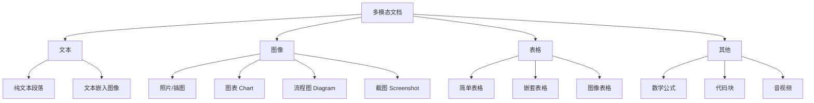

<Callout type="success" title="多模态 RAG 的价值">
真实世界的文档充满图表、表格、公式、截图。纯文本 RAG 会丢失这些视觉信息。多模态 RAG 让 AI 能"看懂"图像、理解表格、解析公式，实现真正的全文档理解。本文从 ColPali/Nougat 等前沿项目提炼技术，打造视觉增强的 RAG 系统。
</Callout>

# 多模态 RAG

## 多模态场景核心需求

### 典型应用场景

| 场景 | 核心挑战 | 数据类型 | 示例 |
|------|---------|---------|------|
| **财报分析** | 图表+表格提取 | PDF (图表密集) | "Q2 营收趋势？" |
| **学术论文** | 公式+图示理解 | PDF (LaTeX) | "这个模型的架构是什么？" |
| **技术手册** | 流程图+示意图 | PDF/Word | "系统部署流程图？" |
| **电商产品** | 商品图+描述 | 图片+文本 | "红色连衣裙推荐" |
| **医疗影像** | X光片+报告 | DICOM+文本 | "肺部阴影位置？" |

### 多模态数据分类



## 项目映射与选型理由

<Callout type="success" title="先解析，后检索">
多模态的关键是“可靠解析”：先用专门的解析/编码获得高质量块，再进入检索与生成链路。
</Callout>

- ragflow（推荐优先）
  - 为何适配：面向 PDF/扫描/表格/公式的结构化解析流水线，具备布局检测、表格结构重建、阅读顺序恢复，支持与 ColPali 融合。
  - 深入阅读：[ragflow 深度解析](/docs/rag-project-analysis/04-key-projects-analysis/ragflow)
  - 快速落地：
    1) 配置版面/表格/公式模块；2) 导出文本+结构（Markdown/JSON/图像片段）；3) 选择 ColPali/Clip 等多模态向量；4) 入库检索。

- RAG-Anything（候选）
  - 为何适配：更强的多模态解析/抽取能力与“模态感知检索”。

- LightRAG（基座）
  - 为何适配：将 ragflow 输出作为文本通道 baseline；用于快速比较生成质量与成本。
  - 深入阅读：[LightRAG 深度解析](/docs/rag-project-analysis/04-key-projects-analysis/lightrag)

- onyx（企业需要权限/审计时）
  - 为何适配：作为企业侧 API 与权限外壳，接入多模态检索。
  - 深入阅读：[onyx 深度解析](/docs/rag-project-analysis/04-key-projects-analysis/onyx)

<Cards>
  <Card title="ragflow 深度解析" href="/docs/rag-project-analysis/04-key-projects-analysis/ragflow"/>
  <Card title="LightRAG 深度解析" href="/docs/rag-project-analysis/04-key-projects-analysis/lightrag"/>
  <Card title="onyx 深度解析" href="/docs/rag-project-analysis/04-key-projects-analysis/onyx"/>
</Cards>

## 实操清单

- 解析流水线：配置布局检测/表格结构化/公式识别；输出文本+结构+图像切片
- 嵌入策略：文本与图像/表格分别编码并加权融合（alpha）
- 索引：为不同模态建立分库或多向量字段；保留位置信息（页码/bbox）
- 检索：跨模态检索（文本→图像/表格）；必要时 OCR 兜底
- 重排：优先图表/表格的结构相似度，文本相似度为辅
- 可视化：渲染引用的图片区域/表格 markdown，提升可解释性

## 参数网格模板

```yaml title="multimodal_param_grid.yaml" path=null start=null
parser:
  dpi: [200, 300]
  layout_threshold: [0.5, 0.7, 0.8]
  table_engine: ["table-structure-net", "camelot"]
embedding:
  text_model: ["clip-text-base", "bge-small"]
  image_model: ["clip-vit-large", "colpali"]
  table_text_weight: [0.3, 0.5]
  text_image_alpha: [0.4, 0.6, 0.7]
retrieval:
  cross_modal_top_k: [5, 10]
rerank:
  enabled: [true, false]
  prefer_chart: [true, false]
```

## 技术路线对比
（占位）
- SurfSense：在数据库内做文本检索融合，作为多模态文本通道的“稳态”补充
- kotaemon：多知识库管理与可视化，适合承载多模态素材库
- Verba：灵活拼装，便于把多模态检索管线接入现有系统
- Self-Corrective-Agentic-RAG：对复杂文档先做澄清/纠错，再检索
- UltraRAG：多模态实验的对比与脚手架

## 技术路线对比

### 方案1：OCR + 文本 RAG

```python title="ocr_approach.py" path=null start=null
# 传统方案：OCR 提取文本后进行文本 RAG
from pdf2image import convert_from_path
import pytesseract

def ocr_pdf(pdf_path: str) -> str:
    """OCR 提取 PDF 文本"""
    images = convert_from_path(pdf_path)
    text = ""
    for image in images:
        text += pytesseract.image_to_string(image, lang='eng+chi_sim')
    return text

# 优点：简单、通用
# 缺点：
# 1. 丢失布局信息（图表位置、表格结构）
# 2. OCR 错误率高（手写、低质量图像）
# 3. 无法理解图像语义（只提取图像中的文字）
```

### 方案2：Vision-Language Models

```python title="vlm_approach.py" path=null start=null
# 现代方案：多模态 Embedding 模型
from colpali_engine import ColPali

model = ColPali.from_pretrained("vidore/colpali")

# 直接对图像生成 embedding
image_embedding = model.encode_image(pdf_page_image)
query_embedding = model.encode_text("What is the revenue?")

# 优点：
# 1. 保留视觉信息（布局、颜色、图表类型）
# 2. 端到端可训练
# 3. 跨模态检索（文本查图像）

# 缺点：
# 1. 模型较大（需要 GPU）
# 2. 推理成本高
```

### 方案对比

| 方案 | 精度 | 速度 | 成本 | 适用场景 |
|------|------|------|------|---------|
| **OCR + 文本 RAG** | 中 | 快 | 低 | 文字密集型文档 |
| **Vision LM (ColPali)** | 高 | 慢 | 高 | 图表密集型文档 |
| **混合方案** | 高 | 中 | 中 | 通用场景 |

## 核心技术实现

### 1. 文档解析与分类

```python title="multimodal_parser.py" path=null start=null
from pdf2image import convert_from_path
from PIL import Image
from typing import List, Dict
from enum import Enum

class ContentType(Enum):
    """内容类型"""
    TEXT = "text"
    IMAGE = "image"
    TABLE = "table"
    CHART = "chart"
    FORMULA = "formula"

class MultimodalChunk:
    """多模态块"""
    def __init__(
        self,
        content: any,  # str for text, Image for image
        content_type: ContentType,
        page_number: int,
        bbox: tuple,  # (x1, y1, x2, y2)
        metadata: dict
    ):
        self.content = content
        self.content_type = content_type
        self.page_number = page_number
        self.bbox = bbox
        self.metadata = metadata

class MultimodalParser:
    """多模态文档解析器"""
    
    def __init__(self):
        self.layout_model = self._load_layout_model()
        self.table_parser = self._load_table_parser()
        self.formula_parser = self._load_formula_parser()
    
    def parse_pdf(self, pdf_path: str) -> List[MultimodalChunk]:
        """解析 PDF 为多模态块"""
        chunks = []
        
        # 1. 转换为图像
        images = convert_from_path(pdf_path, dpi=300)
        
        for page_num, page_image in enumerate(images):
            # 2. 布局分析（检测文本、图像、表格区域）
            layout_results = self.layout_model.detect(page_image)
            
            for region in layout_results:
                # 3. 根据类型解析
                if region['type'] == 'text':
                    chunk = self._parse_text_region(
                        page_image, region, page_num
                    )
                
                elif region['type'] == 'figure':
                    chunk = self._parse_image_region(
                        page_image, region, page_num
                    )
                
                elif region['type'] == 'table':
                    chunk = self._parse_table_region(
                        page_image, region, page_num
                    )
                
                chunks.append(chunk)
        
        return chunks
    
    def _load_layout_model(self):
        """加载布局检测模型（如 LayoutLMv3）"""
        from transformers import LayoutLMv3ForTokenClassification
        return LayoutLMv3ForTokenClassification.from_pretrained(
            "microsoft/layoutlmv3-base"
        )
    
    def _parse_text_region(
        self,
        page_image: Image,
        region: dict,
        page_num: int
    ) -> MultimodalChunk:
        """解析文本区域"""
        # 裁剪区域
        bbox = region['bbox']
        region_image = page_image.crop(bbox)
        
        # OCR 提取文本
        import pytesseract
        text = pytesseract.image_to_string(region_image)
        
        return MultimodalChunk(
            content=text,
            content_type=ContentType.TEXT,
            page_number=page_num,
            bbox=bbox,
            metadata={"confidence": region.get('confidence', 0.0)}
        )
    
    def _parse_image_region(
        self,
        page_image: Image,
        region: dict,
        page_num: int
    ) -> MultimodalChunk:
        """解析图像区域"""
        bbox = region['bbox']
        image = page_image.crop(bbox)
        
        # 图像分类（图表 vs 普通图片）
        chart_type = self._classify_chart(image)
        
        # 如果是图表，提取数据
        if chart_type:
            chart_data = self._extract_chart_data(image, chart_type)
            metadata = {
                "chart_type": chart_type,
                "data": chart_data
            }
        else:
            # 普通图片，生成描述
            caption = self._generate_image_caption(image)
            metadata = {"caption": caption}
        
        return MultimodalChunk(
            content=image,
            content_type=ContentType.IMAGE,
            page_number=page_num,
            bbox=bbox,
            metadata=metadata
        )
    
    def _parse_table_region(
        self,
        page_image: Image,
        region: dict,
        page_num: int
    ) -> MultimodalChunk:
        """解析表格区域"""
        bbox = region['bbox']
        table_image = page_image.crop(bbox)
        
        # 表格结构识别 + OCR
        table_data = self.table_parser.parse(table_image)
        
        # 转换为结构化格式（DataFrame）
        import pandas as pd
        df = pd.DataFrame(table_data)
        
        # 同时保留图像（用于视觉检索）
        return MultimodalChunk(
            content=table_image,
            content_type=ContentType.TABLE,
            page_number=page_num,
            bbox=bbox,
            metadata={
                "dataframe": df.to_dict(),
                "markdown": df.to_markdown()
            }
        )
    
    def _classify_chart(self, image: Image) -> str:
        """图表分类（柱状图/折线图/饼图等）"""
        # 使用图像分类模型
        # 返回 "bar", "line", "pie", "scatter", None
        ...
    
    def _extract_chart_data(self, image: Image, chart_type: str) -> dict:
        """从图表提取数据点"""
        # 使用 ChartOCR 或 DePlot 模型
        ...
    
    def _generate_image_caption(self, image: Image) -> str:
        """生成图像描述"""
        from transformers import BlipProcessor, BlipForConditionalGeneration
        
        processor = BlipProcessor.from_pretrained("Salesforce/blip-image-captioning-base")
        model = BlipForConditionalGeneration.from_pretrained("Salesforce/blip-image-captioning-base")
        
        inputs = processor(image, return_tensors="pt")
        out = model.generate(**inputs)
        caption = processor.decode(out[0], skip_special_tokens=True)
        
        return caption
```

### 2. 多模态 Embedding

```python title="multimodal_embedding.py" path=null start=null
from typing import Union
import torch

class MultimodalEmbedding:
    """多模态 Embedding 模型"""
    
    def __init__(self, model_name: str = "openai/clip-vit-large-patch14"):
        self.text_encoder = self._load_text_encoder(model_name)
        self.image_encoder = self._load_image_encoder(model_name)
        self.table_encoder = self._load_table_encoder()
    
    def encode(
        self,
        content: Union[str, Image],
        content_type: ContentType
    ) -> torch.Tensor:
        """统一编码接口"""
        if content_type == ContentType.TEXT:
            return self.encode_text(content)
        
        elif content_type in [ContentType.IMAGE, ContentType.CHART]:
            return self.encode_image(content)
        
        elif content_type == ContentType.TABLE:
            # 表格：图像 + 文本混合编码
            return self.encode_table(content)
        
        elif content_type == ContentType.FORMULA:
            return self.encode_formula(content)
    
    def encode_text(self, text: str) -> torch.Tensor:
        """文本编码"""
        from transformers import CLIPProcessor
        
        inputs = self.processor(
            text=[text],
            return_tensors="pt",
            padding=True,
            truncation=True
        )
        
        with torch.no_grad():
            text_features = self.text_encoder(**inputs).last_hidden_state
            # 使用 [CLS] token
            embedding = text_features[:, 0, :]
        
        return embedding
    
    def encode_image(self, image: Image) -> torch.Tensor:
        """图像编码"""
        inputs = self.processor(
            images=image,
            return_tensors="pt"
        )
        
        with torch.no_grad():
            image_features = self.image_encoder(**inputs).last_hidden_state
            embedding = image_features.mean(dim=1)  # Global average pooling
        
        return embedding
    
    def encode_table(self, chunk: MultimodalChunk) -> torch.Tensor:
        """表格混合编码"""
        # 方案1：图像 + Markdown 文本
        image_emb = self.encode_image(chunk.content)
        text_emb = self.encode_text(chunk.metadata['markdown'])
        
        # 加权融合
        alpha = 0.6  # 图像权重
        combined_emb = alpha * image_emb + (1 - alpha) * text_emb
        
        return combined_emb
    
    def encode_formula(self, formula_image: Image) -> torch.Tensor:
        """数学公式编码"""
        # 使用专门的公式识别模型（如 Nougat）
        from nougat import NougatModel
        
        nougat = NougatModel.from_pretrained("facebook/nougat-base")
        latex = nougat.predict(formula_image)
        
        # 将 LaTeX 转为文本编码
        return self.encode_text(latex)

# 使用示例
embedder = MultimodalEmbedding()

text_emb = embedder.encode("What is the revenue?", ContentType.TEXT)
image_emb = embedder.encode(chart_image, ContentType.IMAGE)

# 跨模态相似度
similarity = torch.cosine_similarity(text_emb, image_emb)
```

### 3. 多模态检索引擎

```python title="multimodal_retrieval.py" path=null start=null
class MultimodalRetrieval:
    """多模态检索引擎"""
    
    def __init__(self):
        self.embedder = MultimodalEmbedding()
        self.vector_store = VectorStore()
        self.vision_llm = VisionLLM()  # GPT-4V / Claude 3
    
    def index_document(self, pdf_path: str):
        """索引多模态文档"""
        # 1. 解析文档
        parser = MultimodalParser()
        chunks = parser.parse_pdf(pdf_path)
        
        # 2. 为每个块生成 embedding
        for chunk in chunks:
            embedding = self.embedder.encode(
                chunk.content,
                chunk.content_type
            )
            
            # 3. 存储到向量库
            self.vector_store.add(
                embedding=embedding,
                metadata={
                    "content_type": chunk.content_type.value,
                    "page_number": chunk.page_number,
                    "bbox": chunk.bbox,
                    **chunk.metadata
                },
                # 如果是图像，存储 base64
                image=self._image_to_base64(chunk.content) 
                      if chunk.content_type != ContentType.TEXT else None
            )
    
    async def query(
        self,
        query_text: str,
        modality_filter: List[ContentType] = None
    ) -> dict:
        """多模态查询"""
        # 1. 查询编码
        query_emb = self.embedder.encode_text(query_text)
        
        # 2. 向量检索
        results = self.vector_store.search(
            query_emb,
            n_results=20,
            filter={"content_type": {"$in": [m.value for m in modality_filter]}}
                   if modality_filter else None
        )
        
        # 3. 分类处理不同模态
        text_results = [r for r in results if r['metadata']['content_type'] == 'text']
        image_results = [r for r in results if r['metadata']['content_type'] in ['image', 'chart']]
        table_results = [r for r in results if r['metadata']['content_type'] == 'table']
        
        # 4. 使用 Vision LLM 理解图像
        image_insights = []
        for img_result in image_results[:3]:  # 只处理 top-3 图像
            image = self._base64_to_image(img_result['image'])
            insight = await self.vision_llm.analyze_image(
                image=image,
                question=query_text
            )
            image_insights.append({
                "page": img_result['metadata']['page_number'],
                "insight": insight,
                "image": img_result['image']
            })
        
        # 5. 生成综合答案
        answer = await self._generate_multimodal_answer(
            query=query_text,
            text_results=text_results,
            image_insights=image_insights,
            table_results=table_results
        )
        
        return {
            "answer": answer,
            "sources": {
                "text": text_results[:3],
                "images": image_insights,
                "tables": table_results[:2]
            }
        }
    
    async def _generate_multimodal_answer(
        self,
        query: str,
        text_results: list,
        image_insights: list,
        table_results: list
    ) -> str:
        """生成多模态答案"""
        
        # 构建上下文
        context = "## 文本信息\n"
        for r in text_results[:3]:
            context += f"- {r['content']}\n"
        
        context += "\n## 图像分析\n"
        for insight in image_insights:
            context += f"- Page {insight['page']}: {insight['insight']}\n"
        
        context += "\n## 表格数据\n"
        for r in table_results:
            context += f"```\n{r['metadata']['markdown']}\n```\n"
        
        # 调用 LLM
        prompt = f"""基于以下多模态信息回答问题。

问题：{query}

上下文：
{context}

要求：
1. 综合文本、图像、表格信息
2. 明确标注信息来源（页码）
3. 如果涉及图表，描述趋势或关键数据点
"""
        
        answer = await self.vision_llm.generate(prompt)
        return answer

class VisionLLM:
    """Vision Language Model 封装"""
    
    async def analyze_image(self, image: Image, question: str) -> str:
        """分析图像回答问题"""
        # GPT-4V
        import base64
        from io import BytesIO
        
        buffered = BytesIO()
        image.save(buffered, format="PNG")
        img_str = base64.b64encode(buffered.getvalue()).decode()
        
        response = await openai.ChatCompletion.acreate(
            model="gpt-4-vision-preview",
            messages=[
                {
                    "role": "user",
                    "content": [
                        {"type": "text", "text": question},
                        {
                            "type": "image_url",
                            "image_url": f"data:image/png;base64,{img_str}"
                        }
                    ]
                }
            ],
            max_tokens=300
        )
        
        return response.choices[0].message.content
```

## 专项优化

### 表格理解增强

```python title="table_enhancement.py" path=null start=null
class TableUnderstanding:
    """表格理解增强"""
    
    def parse_complex_table(self, table_image: Image) -> dict:
        """复杂表格解析"""
        # 1. 表格结构识别
        structure = self._detect_table_structure(table_image)
        
        # 2. 单元格 OCR
        cells = self._extract_cells(table_image, structure)
        
        # 3. 构建 DataFrame
        import pandas as pd
        df = self._reconstruct_dataframe(cells, structure)
        
        # 4. 语义理解（列类型推断）
        df = self._infer_column_types(df)
        
        return {
            "dataframe": df,
            "markdown": df.to_markdown(),
            "summary": self._generate_table_summary(df)
        }
    
    def _detect_table_structure(self, image: Image) -> dict:
        """检测表格结构（行列分割线）"""
        # 使用 Table Transformer
        from transformers import TableTransformerForObjectDetection
        
        model = TableTransformerForObjectDetection.from_pretrained(
            "microsoft/table-transformer-structure-recognition"
        )
        
        # 检测行列
        ...
    
    def _infer_column_types(self, df: pd.DataFrame) -> pd.DataFrame:
        """推断列类型（数值/日期/类别）"""
        for col in df.columns:
            # 尝试转换为数值
            try:
                df[col] = pd.to_numeric(df[col])
            except:
                # 尝试转换为日期
                try:
                    df[col] = pd.to_datetime(df[col])
                except:
                    # 保持为字符串
                    pass
        
        return df
    
    def _generate_table_summary(self, df: pd.DataFrame) -> str:
        """生成表格摘要"""
        summary = f"表格包含 {len(df)} 行 {len(df.columns)} 列。\n"
        
        # 列名
        summary += f"列名：{', '.join(df.columns)}\n"
        
        # 数值列统计
        numeric_cols = df.select_dtypes(include=['number']).columns
        if len(numeric_cols) > 0:
            summary += "数值列统计：\n"
            for col in numeric_cols:
                summary += f"  - {col}: 均值 {df[col].mean():.2f}, 范围 [{df[col].min()}, {df[col].max()}]\n"
        
        return summary

# 使用示例：支持自然语言查询表格
table_qa = TableQA(table_parser)
answer = table_qa.query(
    table_df=df,
    question="Which product has the highest revenue?"
)
```

### 图表数据提取

```python title="chart_extraction.py" path=null start=null
class ChartDataExtraction:
    """图表数据提取"""
    
    def extract_chart_data(self, chart_image: Image) -> dict:
        """从图表图像提取数据"""
        # 1. 图表类型分类
        chart_type = self._classify_chart_type(chart_image)
        
        # 2. 根据类型提取数据
        if chart_type == "bar":
            data = self._extract_bar_chart(chart_image)
        elif chart_type == "line":
            data = self._extract_line_chart(chart_image)
        elif chart_type == "pie":
            data = self._extract_pie_chart(chart_image)
        else:
            # 使用 Vision LLM 通用提取
            data = self._extract_with_vlm(chart_image)
        
        return {
            "chart_type": chart_type,
            "data": data,
            "insights": self._generate_insights(data, chart_type)
        }
    
    def _extract_bar_chart(self, image: Image) -> list:
        """柱状图数据提取"""
        # 使用 DePlot 模型
        from deplot import DePlotModel
        
        model = DePlotModel.from_pretrained("google/deplot")
        data_table = model.predict(image)
        
        # 返回 [{"label": "Q1", "value": 100}, ...]
        return data_table
    
    def _generate_insights(self, data: list, chart_type: str) -> str:
        """生成图表洞察"""
        if chart_type == "line":
            # 趋势分析
            values = [d['value'] for d in data]
            if values[-1] > values[0]:
                trend = "上升"
            elif values[-1] < values[0]:
                trend = "下降"
            else:
                trend = "平稳"
            
            return f"整体呈{trend}趋势，从 {values[0]} 到 {values[-1]}"
        
        elif chart_type == "bar":
            # 最大/最小值
            max_item = max(data, key=lambda x: x['value'])
            min_item = min(data, key=lambda x: x['value'])
            
            return f"最高值：{max_item['label']} ({max_item['value']})，最低值：{min_item['label']} ({min_item['value']})"
```

## 实战案例

### 案例：财报分析 RAG

```python title="financial_report_rag.py" path=null start=null
class FinancialReportRAG:
    """财报分析 RAG"""
    
    def __init__(self):
        self.retrieval = MultimodalRetrieval()
        self.chart_extractor = ChartDataExtraction()
        self.table_parser = TableUnderstanding()
    
    async def index_financial_report(self, pdf_path: str):
        """索引财报"""
        # 1. 解析 PDF
        parser = MultimodalParser()
        chunks = parser.parse_pdf(pdf_path)
        
        # 2. 增强处理
        for chunk in chunks:
            if chunk.content_type == ContentType.CHART:
                # 提取图表数据
                chart_data = self.chart_extractor.extract_chart_data(chunk.content)
                chunk.metadata.update(chart_data)
            
            elif chunk.content_type == ContentType.TABLE:
                # 解析表格
                table_data = self.table_parser.parse_complex_table(chunk.content)
                chunk.metadata.update(table_data)
        
        # 3. 索引
        for chunk in chunks:
            self.retrieval.index_chunk(chunk)
    
    async def query(self, question: str) -> dict:
        """查询财报"""
        # 1. 多模态检索
        result = await self.retrieval.query(question)
        
        # 2. 如果涉及图表，提取具体数值
        if result['sources']['images']:
            for img_insight in result['sources']['images']:
                if 'data' in img_insight:
                    # 将数据点加入答案
                    result['answer'] += f"\n\n数据点：{img_insight['data']}"
        
        # 3. 如果涉及表格，执行数值计算
        if result['sources']['tables']:
            import pandas as pd
            for table in result['sources']['tables']:
                df = pd.DataFrame(table['metadata']['dataframe'])
                # 执行聚合查询
                if "总" in question or "sum" in question.lower():
                    total = df.select_dtypes(include=['number']).sum()
                    result['answer'] += f"\n\n总计：{total.to_dict()}"
        
        return result

# 使用示例
rag = FinancialReportRAG()

# 索引财报
await rag.index_financial_report("Q2_2024_report.pdf")

# 查询
result = await rag.query("Q2 营收趋势如何？哪个地区增长最快？")
print(result['answer'])
```

## ColPali 深度应用

```python title="colpali_integration.py" path=null start=null
from colpali_engine import ColPali, ColPaliProcessor

class ColPaliRAG:
    """基于 ColPali 的端到端多模态 RAG"""
    
    def __init__(self):
        self.model = ColPali.from_pretrained("vidore/colpali")
        self.processor = ColPaliProcessor.from_pretrained("vidore/colpali")
    
    def index_pdf_pages(self, pdf_path: str):
        """直接索引 PDF 页面图像"""
        from pdf2image import convert_from_path
        
        images = convert_from_path(pdf_path, dpi=150)
        
        page_embeddings = []
        for page_num, image in enumerate(images):
            # ColPali 生成页面级 embedding
            embedding = self.model.encode_image(image)
            
            page_embeddings.append({
                "page_num": page_num,
                "embedding": embedding,
                "image": image
            })
        
        return page_embeddings
    
    def search(self, query: str, page_embeddings: list, top_k: int = 3):
        """跨页面检索"""
        # 查询编码
        query_emb = self.model.encode_text(query)
        
        # 计算相似度
        similarities = []
        for page in page_embeddings:
            sim = torch.cosine_similarity(
                query_emb,
                page['embedding']
            )
            similarities.append({
                "page_num": page['page_num'],
                "score": sim.item(),
                "image": page['image']
            })
        
        # 排序
        similarities.sort(key=lambda x: x['score'], reverse=True)
        
        return similarities[:top_k]

# 使用示例（零配置 RAG）
colpali_rag = ColPaliRAG()

# 索引
pages = colpali_rag.index_pdf_pages("document.pdf")

# 搜索
results = colpali_rag.search("revenue chart", pages)

# 显示结果页面
for r in results:
    print(f"Page {r['page_num']}: Score {r['score']:.3f}")
    display(r['image'])
```

## 最佳实践

<Cards>
  <Card title="模态选择" href="#modality">
    <ul>
      <li>✅ 文本密集 → OCR + 文本 RAG</li>
      <li>✅ 图表密集 → ColPali 端到端</li>
      <li>✅ 混合文档 → 混合方案</li>
      <li>✅ 实时查询 → 缓存图像分析结果</li>
    </ul>
  </Card>
  
  <Card title="图像处理" href="#image">
    <ul>
      <li>✅ 高 DPI (≥200) 扫描</li>
      <li>✅ 图表单独提取数据</li>
      <li>✅ 使用 GPT-4V 理解复杂图像</li>
      <li>✅ 保留原图用于展示</li>
    </ul>
  </Card>
  
  <Card title="表格优化" href="#table">
    <ul>
      <li>✅ 结构化存储（DataFrame）</li>
      <li>✅ 双重索引（图像 + 文本）</li>
      <li>✅ 支持自然语言查询表格</li>
      <li>✅ 数值列类型推断</li>
    </ul>
  </Card>
  
  <Card title="成本控制" href="#cost">
    <ul>
      <li>✅ 缓存 Vision LLM 调用</li>
      <li>✅ 批量处理图像</li>
      <li>✅ 低价值图像跳过</li>
      <li>✅ 使用开源模型（BLIP/Nougat）</li>
    </ul>
  </Card>
</Cards>

## 延伸阅读

- [文档解析](/docs/rag-project-analysis/02-pipeline-deep-dive/06-文档解析) - PDF 解析细节
- [Embedding 选型](/docs/rag-project-analysis/02-pipeline-deep-dive/02-Embedding选型) - 多模态模型选择

## 参考文献

- ColPali - 视觉检索 Transformer
- Nougat - 科学文档 OCR
- Table Transformer - 表格结构识别
- GPT-4V - Vision Language Model

**下一步**：了解 [客服问答系统](./05-客服问答系统) 的实时对话优化。
