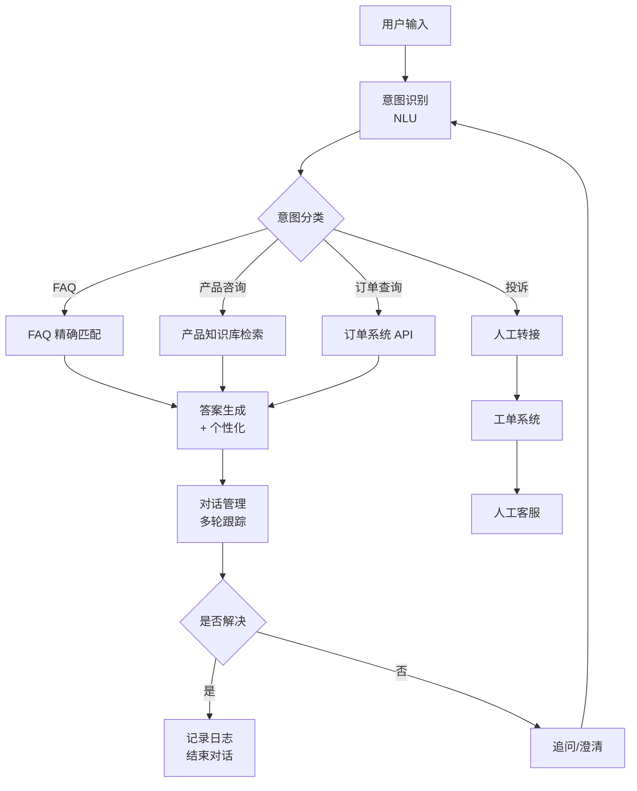

<Callout type="info" title="智能客服的核心挑战">
客服场景不同于文档问答：需要实时响应、理解上下文、识别用户意图、处理情绪、支持多语言。本文从实战角度打造生产级客服 RAG 系统，覆盖 FAQ 匹配、对话管理、工单集成等全流程。
</Callout>

# 客服问答系统

## 客服场景核心需求

### 典型应用场景

| 场景 | 核心需求 | 挑战 | SLA |
|------|---------|------|-----|
| **售前咨询** | 产品介绍、价格查询 | 多轮对话、推荐 | < 3s |
| **售后支持** | 故障排查、使用指导 | 技术深度、截图识别 | < 5s |
| **订单查询** | 物流状态、退换货 | 系统集成、实时性 | < 2s |
| **投诉处理** | 情绪识别、升级机制 | 敏感性、人工介入 | < 10s |
| **多语言支持** | 跨语言理解 | 翻译准确性 | < 5s |

### 客服 RAG vs 通用 RAG

| 维度 | 通用 RAG | 客服 RAG |
|------|---------|---------|
| **响应时间** | 5-10s 可接受 | < 3s（用户不耐烦） |
| **对话状态** | 无状态 | 多轮上下文管理 |
| **意图理解** | 直接问答 | 意图识别 + 槽位填充 |
| **知识来源** | 文档库 | FAQ + 产品库 + 工单历史 |
| **更新频率** | 低频 | 高频（产品迭代快） |
| **评估指标** | 准确率 | 准确率 + 解决率 + 满意度 |

## 项目映射与选型理由

<Callout type="info" title="客服优先级：SLA>质量>成本">
要求多轮对话与实时性，先确保稳定与时延，再追求更好的检索与生成质量。
</Callout>

- onyx（推荐优先）
  - 为何适配：天然支持 Slack/HTTP 接入、多租户/RBAC/审计，方便对接 CRM/工单系统；LangGraph 便于构建意图→检索→生成→追问的工作流。
  - 深入阅读：[onyx 深度解析](/docs/rag-project-analysis/04-key-projects-analysis/onyx)
  - 快速落地：
    1) 建“FAQ 精准命中”子链路；2) 建“知识检索+重排”子链路；3) 接工单系统，配置转人工阈值；4) 监控 P95/P99。

- SurfSense
  - 为何适配：在数据库内实现混合检索与轻量重排，保证 FAQ 与长尾问题的综合效果，响应时间易控。
  - 深入阅读：[SurfSense 深度解析](/docs/rag-project-analysis/04-key-projects-analysis/surfsense)

- LightRAG（基础兜底）
  - 为何适配：快速形成 baseline，确定 chunking/检索参数后迁移到 onyx 生产链路。
  - 深入阅读：[LightRAG 深度解析](/docs/rag-project-analysis/04-key-projects-analysis/lightrag)

- ragflow（附件/截图场景）
  - 为何适配：用户上传截图/表格/报告等工单附件的解析前置。
  - 深入阅读：[ragflow 深度解析](/docs/rag-project-analysis/04-key-projects-analysis/ragflow)

- Self-Corrective-Agentic-RAG（候选）
  - 为何适配：引入自纠正链路，处理模糊提问与多轮澄清。

<Cards>
  <Card title="onyx 深度解析" href="/docs/rag-project-analysis/04-key-projects-analysis/onyx"/>
  <Card title="SurfSense 深度解析" href="/docs/rag-project-analysis/04-key-projects-analysis/surfsense"/>
  <Card title="LightRAG 深度解析" href="/docs/rag-project-analysis/04-key-projects-analysis/lightrag"/>
  <Card title="ragflow 深度解析" href="/docs/rag-project-analysis/04-key-projects-analysis/ragflow"/>
</Cards>

## 实操清单

- 意图/槽位：定义意图集（FAQ/产品/订单/投诉）；为每类意图配置必需槽位
- 路由：FAQ 精准匹配优先；否则进入知识检索 + 重排；订单/投诉直连业务 API/转人工
- 检索：按意图选择索引（FAQ/知识库/产品库）；设置融合与重排上限
- 对话管理：多轮上下文跟踪；澄清与追问链路；不确定性高时降级
- SLA：P95/P99 预算；分阶段超时与降级（小模型/无重排）
- 集成：CRM/工单系统与客服平台；日志与监控对齐

## 参数网格模板

```yaml title="customer_service_param_grid.yaml" path=null start=null
intent:
  classifier_model: ["bert-intent-base", "roberta-intent-large"]
  threshold: [0.5, 0.7]
faq:
  exact_match: [true]
  fuzzy_threshold: [0.8, 0.9]
retrieval:
  top_k: [3, 5]
  hybrid_rrf_k: [30, 60]
rerank:
  enabled: [true, false]
  top_k: [20, 50]
sla:
  p95_target_ms: [2000, 3000]
  hard_timeout_ms: [2500, 3500]
clarify:
  confidence_threshold: [0.5, 0.65, 0.75]
  handoff_threshold: [0.3, 0.4]
```

## 架构设计
项目（占位）
- RAG-Anything：处理截图/表格等工单附件的解析前置
- kotaemon：客服知识库的组织与权限管理界面
- Verba：轻量将 FAQ/知识检索/生成拼装进现有客服系统
- UltraRAG：A/B 与参数探索脚手架（SLA-敏感实验）

## 架构设计

### 端到端架构



## 核心功能实现

### 1. 意图识别与槽位填充

```python title="intent_recognition.py" path=null start=null
from dataclasses import dataclass
from typing import List, Dict, Optional
from enum import Enum

class Intent(Enum):
    """意图枚举"""
    FAQ = "faq"  # 常见问题
    PRODUCT_INFO = "product_info"  # 产品咨询
    ORDER_QUERY = "order_query"  # 订单查询
    COMPLAINT = "complaint"  # 投诉
    CHITCHAT = "chitchat"  # 闲聊
    UNKNOWN = "unknown"  # 未知

@dataclass
class Slot:
    """槽位（实体）"""
    name: str
    value: str
    confidence: float

class IntentRecognizer:
    """意图识别器"""
    
    def __init__(self):
        self.intent_classifier = self._load_classifier()
        self.slot_extractor = self._load_slot_extractor()
    
    def recognize(self, text: str, context: dict = None) -> dict:
        """
        识别意图和槽位
        
        Returns:
            {
                "intent": Intent,
                "confidence": float,
                "slots": List[Slot],
                "需要补充": List[str]
            }
        """
        # 1. 意图分类
        intent, confidence = self._classify_intent(text, context)
        
        # 2. 槽位提取
        slots = self._extract_slots(text, intent)
        
        # 3. 检查必需槽位
        required_slots = self._get_required_slots(intent)
        missing_slots = [
            slot for slot in required_slots
            if slot not in [s.name for s in slots]
        ]
        
        return {
            "intent": intent,
            "confidence": confidence,
            "slots": slots,
            "missing_slots": missing_slots
        }
    
    def _classify_intent(
        self,
        text: str,
        context: dict = None
    ) -> tuple[Intent, float]:
        """意图分类"""
        # 使用预训练模型（BERT/RoBERTa）
        from transformers import pipeline
        
        classifier = pipeline(
            "text-classification",
            model="your-intent-model"
        )
        
        # 如果有上下文，拼接
        if context and "last_intent" in context:
            text = f"[上文：{context['last_intent'].value}] {text}"
        
        result = classifier(text)[0]
        
        # 映射到 Intent enum
        intent_map = {
            "faq": Intent.FAQ,
            "product": Intent.PRODUCT_INFO,
            "order": Intent.ORDER_QUERY,
            "complaint": Intent.COMPLAINT,
            "chitchat": Intent.CHITCHAT
        }
        
        intent = intent_map.get(result['label'], Intent.UNKNOWN)
        confidence = result['score']
        
        return intent, confidence
    
    def _extract_slots(self, text: str, intent: Intent) -> List[Slot]:
        """槽位提取（NER）"""
        from transformers import pipeline
        
        ner = pipeline("ner", model="your-ner-model")
        entities = ner(text)
        
        slots = []
        
        for entity in entities:
            # 根据意图过滤相关槽位
            if intent == Intent.ORDER_QUERY:
                if entity['entity'] == 'ORDER_ID':
                    slots.append(Slot(
                        name="order_id",
                        value=entity['word'],
                        confidence=entity['score']
                    ))
            
            elif intent == Intent.PRODUCT_INFO:
                if entity['entity'] == 'PRODUCT_NAME':
                    slots.append(Slot(
                        name="product_name",
                        value=entity['word'],
                        confidence=entity['score']
                    ))
        
        return slots
    
    def _get_required_slots(self, intent: Intent) -> List[str]:
        """获取必需槽位"""
        required_map = {
            Intent.ORDER_QUERY: ["order_id"],
            Intent.PRODUCT_INFO: ["product_name"],
            Intent.COMPLAINT: ["complaint_reason"]
        }
        
        return required_map.get(intent, [])

# 使用示例
recognizer = IntentRecognizer()

result = recognizer.recognize("我想查询订单 12345 的物流")
print(f"意图：{result['intent']}")
print(f"槽位：{result['slots']}")
```

### 2. FAQ 混合检索

```python title="faq_retrieval.py" path=null start=null
class FAQRetrieval:
    """FAQ 混合检索"""
    
    def __init__(self):
        self.vector_store = VectorStore()
        self.keyword_index = KeywordIndex()
        self.faq_cache = {}  # 热点 FAQ 缓存
    
    async def search(
        self,
        query: str,
        top_k: int = 3,
        threshold: float = 0.8
    ) -> List[dict]:
        """
        FAQ 检索
        
        策略：
        1. 精确匹配（关键词）
        2. 语义相似（向量）
        3. 模糊匹配（编辑距离）
        """
        # 1. 查缓存
        cache_key = self._normalize(query)
        if cache_key in self.faq_cache:
            return self.faq_cache[cache_key]
        
        # 2. 精确匹配（高置信度）
        exact_matches = self._exact_match(query)
        if exact_matches:
            return exact_matches
        
        # 3. 向量检索
        semantic_results = await self._semantic_search(query, top_k * 2)
        
        # 4. 关键词检索
        keyword_results = await self._keyword_search(query, top_k * 2)
        
        # 5. 融合排序
        fused_results = self._fuse(semantic_results, keyword_results)
        
        # 6. 过滤低分
        filtered = [
            r for r in fused_results
            if r['score'] >= threshold
        ]
        
        # 7. 缓存结果
        self.faq_cache[cache_key] = filtered[:top_k]
        
        return filtered[:top_k]
    
    def _exact_match(self, query: str) -> List[dict]:
        """精确匹配（高频 FAQ）"""
        normalized = self._normalize(query)
        
        # 预定义高频问题映射
        exact_map = {
            "退货流程": "faq_001",
            "发票怎么开": "faq_002",
            "支付方式": "faq_003"
        }
        
        if normalized in exact_map:
            faq_id = exact_map[normalized]
            faq = self._load_faq(faq_id)
            return [{
                "question": faq['question'],
                "answer": faq['answer'],
                "score": 1.0,
                "source": "exact"
            }]
        
        return []
    
    def _normalize(self, text: str) -> str:
        """文本归一化"""
        import re
        # 去除标点、空格、转小写
        text = re.sub(r'[^\w\s]', '', text)
        text = re.sub(r'\s+', '', text)
        return text.lower()
    
    async def _semantic_search(
        self,
        query: str,
        top_k: int
    ) -> List[dict]:
        """语义检索"""
        results = self.vector_store.search(
            query=query,
            n_results=top_k,
            collection="faq"
        )
        
        return [
            {
                "question": r['metadata']['question'],
                "answer": r['metadata']['answer'],
                "score": r['similarity'],
                "source": "semantic"
            }
            for r in results
        ]
    
    async def _keyword_search(
        self,
        query: str,
        top_k: int
    ) -> List[dict]:
        """关键词检索（BM25）"""
        from rank_bm25 import BM25Okapi
        
        # 假设已构建 BM25 索引
        scores = self.keyword_index.search(query)
        
        results = []
        for faq_id, score in sorted(
            scores.items(),
            key=lambda x: x[1],
            reverse=True
        )[:top_k]:
            faq = self._load_faq(faq_id)
            results.append({
                "question": faq['question'],
                "answer": faq['answer'],
                "score": score,
                "source": "keyword"
            })
        
        return results
    
    def _fuse(
        self,
        semantic_results: List[dict],
        keyword_results: List[dict]
    ) -> List[dict]:
        """融合排序（RRF）"""
        k = 60
        fused_scores = {}
        
        for rank, result in enumerate(semantic_results):
            q_id = result['question']
            if q_id not in fused_scores:
                fused_scores[q_id] = {"data": result, "score": 0.0}
            fused_scores[q_id]["score"] += 0.6 / (k + rank + 1)
        
        for rank, result in enumerate(keyword_results):
            q_id = result['question']
            if q_id not in fused_scores:
                fused_scores[q_id] = {"data": result, "score": 0.0}
            fused_scores[q_id]["score"] += 0.4 / (k + rank + 1)
        
        results = [
            {**data["data"], "score": data["score"]}
            for data in fused_scores.values()
        ]
        
        results.sort(key=lambda x: x['score'], reverse=True)
        return results
```

### 3. 多轮对话管理

```python title="dialogue_manager.py" path=null start=null
from dataclasses import dataclass, field
from typing import List, Optional
from datetime import datetime

@dataclass
class Message:
    """对话消息"""
    role: str  # "user" or "assistant"
    content: str
    timestamp: datetime = field(default_factory=datetime.now)
    metadata: dict = field(default_factory=dict)

@dataclass
class Session:
    """对话会话"""
    session_id: str
    user_id: str
    messages: List[Message] = field(default_factory=list)
    context: dict = field(default_factory=dict)
    created_at: datetime = field(default_factory=datetime.now)
    last_active: datetime = field(default_factory=datetime.now)

class DialogueManager:
    """对话管理器"""
    
    def __init__(self):
        self.sessions = {}  # {session_id: Session}
        self.max_history = 10  # 最多保留 10 轮对话
        self.session_timeout = 1800  # 30 分钟超时
    
    def get_or_create_session(
        self,
        session_id: str,
        user_id: str
    ) -> Session:
        """获取或创建会话"""
        if session_id in self.sessions:
            session = self.sessions[session_id]
            
            # 检查超时
            if (datetime.now() - session.last_active).seconds > self.session_timeout:
                # 超时，创建新会话
                session = Session(session_id=session_id, user_id=user_id)
                self.sessions[session_id] = session
        else:
            session = Session(session_id=session_id, user_id=user_id)
            self.sessions[session_id] = session
        
        session.last_active = datetime.now()
        return session
    
    def add_message(
        self,
        session_id: str,
        role: str,
        content: str,
        metadata: dict = None
    ):
        """添加消息到会话"""
        session = self.sessions[session_id]
        
        message = Message(
            role=role,
            content=content,
            metadata=metadata or {}
        )
        
        session.messages.append(message)
        
        # 限制历史长度
        if len(session.messages) > self.max_history * 2:  # user + assistant
            session.messages = session.messages[-self.max_history * 2:]
    
    def get_context(self, session_id: str) -> dict:
        """获取对话上下文"""
        session = self.sessions[session_id]
        
        # 构建上下文
        context = {
            "history": [
                {"role": m.role, "content": m.content}
                for m in session.messages
            ],
            "user_info": session.context.get("user_info", {}),
            "last_intent": session.context.get("last_intent"),
            "unresolved_slots": session.context.get("unresolved_slots", [])
        }
        
        return context
    
    def update_context(
        self,
        session_id: str,
        key: str,
        value: any
    ):
        """更新会话上下文"""
        session = self.sessions[session_id]
        session.context[key] = value
    
    def format_for_llm(self, session_id: str) -> List[dict]:
        """格式化为 LLM 输入"""
        session = self.sessions[session_id]
        
        # OpenAI 格式
        messages = []
        
        # 系统 prompt
        messages.append({
            "role": "system",
            "content": self._build_system_prompt(session)
        })
        
        # 历史对话
        for msg in session.messages:
            messages.append({
                "role": msg.role,
                "content": msg.content
            })
        
        return messages
    
    def _build_system_prompt(self, session: Session) -> str:
        """构建系统 prompt"""
        prompt = """你是一个专业的客服助手。

你的职责：
1. 礼貌、友好、专业地回答用户问题
2. 如果信息不足，主动追问
3. 如果无法解决，引导用户转人工
4. 保持对话自然流畅

回答要求：
- 简洁明了（不超过 100 字）
- 提供具体的解决方案
- 必要时提供相关链接或文档
"""
        
        # 添加用户信息（如VIP等级）
        if "user_info" in session.context:
            user_info = session.context["user_info"]
            if user_info.get("vip_level"):
                prompt += f"\n注意：当前用户是 {user_info['vip_level']} 会员，优先响应。"
        
        return prompt

# 使用示例
dialogue_mgr = DialogueManager()

# 创建会话
session = dialogue_mgr.get_or_create_session("sess_001", "user_123")

# 添加消息
dialogue_mgr.add_message("sess_001", "user", "我的订单还没发货")
dialogue_mgr.add_message("sess_001", "assistant", "请提供订单号，我帮您查询")

# 获取上下文
context = dialogue_mgr.get_context("sess_001")
print(f"历史消息：{len(context['history'])} 条")

# 格式化为 LLM 输入
messages = dialogue_mgr.format_for_llm("sess_001")
```

### 4. 智能答案生成

```python title="answer_generation.py" path=null start=null
class AnswerGenerator:
    """答案生成器"""
    
    def __init__(self, llm, faq_retrieval, dialogue_mgr):
        self.llm = llm
        self.faq_retrieval = faq_retrieval
        self.dialogue_mgr = dialogue_mgr
    
    async def generate(
        self,
        session_id: str,
        query: str,
        intent_result: dict
    ) -> dict:
        """生成答案"""
        intent = intent_result['intent']
        
        # 1. 根据意图选择策略
        if intent == Intent.FAQ:
            answer = await self._handle_faq(query)
        
        elif intent == Intent.ORDER_QUERY:
            answer = await self._handle_order_query(
                query,
                intent_result['slots']
            )
        
        elif intent == Intent.PRODUCT_INFO:
            answer = await self._handle_product_info(
                session_id,
                query,
                intent_result['slots']
            )
        
        elif intent == Intent.COMPLAINT:
            answer = await self._handle_complaint(query)
        
        else:
            answer = await self._handle_general(session_id, query)
        
        # 2. 个性化
        answer = self._personalize(answer, session_id)
        
        # 3. 添加相关推荐
        answer['recommendations'] = await self._get_recommendations(
            query, intent
        )
        
        return answer
    
    async def _handle_faq(self, query: str) -> dict:
        """处理 FAQ"""
        results = await self.faq_retrieval.search(query, top_k=1)
        
        if results and results[0]['score'] > 0.85:
            # 高置信度，直接返回
            return {
                "answer": results[0]['answer'],
                "confidence": results[0]['score'],
                "source": "faq",
                "related_questions": [r['question'] for r in results[1:]]
            }
        else:
            # 低置信度，转通用处理
            return await self._handle_general(None, query)
    
    async def _handle_order_query(
        self,
        query: str,
        slots: List[Slot]
    ) -> dict:
        """处理订单查询"""
        # 提取订单号
        order_id = next(
            (s.value for s in slots if s.name == "order_id"),
            None
        )
        
        if not order_id:
            # 缺少订单号，追问
            return {
                "answer": "请提供您的订单号，我帮您查询。",
                "需要补充": ["order_id"],
                "suggestions": ["在【我的订单】中查看订单号"]
            }
        
        # 调用订单系统 API
        order_info = await self._query_order_system(order_id)
        
        if order_info:
            # 生成友好的回复
            answer = f"""您的订单 {order_id} 状态如下：

📦 物流状态：{order_info['status']}
🚚 快递公司：{order_info['courier']}
📱 快递单号：{order_info['tracking_number']}
📍 当前位置：{order_info['location']}

预计 {order_info['estimated_delivery']} 送达。"""
            
            return {
                "answer": answer,
                "confidence": 1.0,
                "source": "order_system",
                "structured_data": order_info
            }
        else:
            return {
                "answer": f"抱歉，未找到订单 {order_id}。请确认订单号是否正确。",
                "confidence": 1.0
            }
    
    async def _handle_product_info(
        self,
        session_id: str,
        query: str,
        slots: List[Slot]
    ) -> dict:
        """处理产品咨询"""
        # 从产品知识库检索
        from product_kb import ProductKnowledgeBase
        
        product_kb = ProductKnowledgeBase()
        results = await product_kb.search(query)
        
        # 获取对话上下文
        context = self.dialogue_mgr.get_context(session_id)
        
        # 使用 LLM 生成答案
        messages = [
            {"role": "system", "content": "你是产品专家，用简洁语言介绍产品。"},
            *context['history'],
            {"role": "user", "content": f"产品信息：\n{results}\n\n问题：{query}"}
        ]
        
        answer = await self.llm.generate(messages)
        
        return {
            "answer": answer,
            "confidence": 0.9,
            "source": "product_kb",
            "related_products": [r['product_name'] for r in results]
        }
    
    async def _handle_complaint(self, query: str) -> dict:
        """处理投诉"""
        # 情绪识别
        emotion = self._detect_emotion(query)
        
        if emotion == "angry":
            # 安抚 + 转人工
            return {
                "answer": "非常抱歉给您带来不便。我已为您优先安排人工客服，请稍等。",
                "action": "transfer_to_human",
                "priority": "high"
            }
        else:
            return {
                "answer": "感谢您的反馈。请详细描述问题，我会尽快为您解决。",
                "需要补充": ["complaint_detail"]
            }
    
    async def _handle_general(self, session_id: str, query: str) -> dict:
        """通用处理（RAG）"""
        # 知识库检索
        kb_results = await self.knowledge_base.search(query)
        
        # 获取对话历史
        if session_id:
            messages = self.dialogue_mgr.format_for_llm(session_id)
        else:
            messages = [
                {"role": "system", "content": "你是客服助手。"},
                {"role": "user", "content": query}
            ]
        
        # 添加检索上下文
        context = "\n".join([r['content'] for r in kb_results])
        messages.append({
            "role": "user",
            "content": f"参考资料：\n{context}\n\n问题：{query}"
        })
        
        answer = await self.llm.generate(messages)
        
        return {
            "answer": answer,
            "confidence": 0.8,
            "source": "general_kb"
        }
    
    def _personalize(self, answer: dict, session_id: str) -> dict:
        """个性化答案"""
        session = self.dialogue_mgr.sessions.get(session_id)
        if not session:
            return answer
        
        user_info = session.context.get("user_info", {})
        
        # VIP 用户特殊处理
        if user_info.get("vip_level") == "diamond":
            answer['answer'] = f"尊敬的钻石会员，{answer['answer']}"
        
        # 添加用户名
        if user_info.get("name"):
            answer['answer'] = f"{user_info['name']}，{answer['answer']}"
        
        return answer
    
    async def _get_recommendations(
        self,
        query: str,
        intent: Intent
    ) -> List[str]:
        """获取相关推荐"""
        if intent == Intent.PRODUCT_INFO:
            # 推荐相关产品
            return ["iPhone 15 Pro", "AirPods Pro"]
        elif intent == Intent.FAQ:
            # 推荐相关问题
            return ["如何退货？", "发票怎么开？"]
        else:
            return []
```

## 实战优化

### 实时响应优化

```python title="performance_optimization.py" path=null start=null
# 1. 异步 + 流式输出
async def stream_response(query: str):
    """流式返回答案"""
    async for chunk in llm.stream_generate(query):
        yield chunk  # 实时返回给前端

# 2. 预加载热点 FAQ
class FAQCache:
    """FAQ 缓存"""
    
    def __init__(self):
        self.hot_faqs = self._load_hot_faqs()  # Top 100 FAQ
    
    def get(self, query: str):
        # 先查缓存
        normalized = normalize(query)
        if normalized in self.hot_faqs:
            return self.hot_faqs[normalized]
        return None

# 3. 并发检索
async def parallel_search(query: str):
    """并发检索多个知识源"""
    results = await asyncio.gather(
        faq_retrieval.search(query),
        product_kb.search(query),
        order_system.search(query)
    )
    return combine_results(results)
```

### 多语言支持

```python title="multilingual.py" path=null start=null
class MultilingualSupport:
    """多语言支持"""
    
    def __init__(self):
        self.translator = Translator()
        self.lang_detector = LanguageDetector()
    
    async def process_query(self, query: str) -> dict:
        """处理多语言查询"""
        # 1. 语言检测
        lang = self.lang_detector.detect(query)
        
        # 2. 翻译为中文（内部统一处理）
        if lang != "zh":
            query_zh = await self.translator.translate(
                query, source=lang, target="zh"
            )
        else:
            query_zh = query
        
        # 3. 检索 + 生成答案（中文）
        answer_zh = await rag_system.query(query_zh)
        
        # 4. 翻译答案回原语言
        if lang != "zh":
            answer = await self.translator.translate(
                answer_zh, source="zh", target=lang
            )
        else:
            answer = answer_zh
        
        return {
            "answer": answer,
            "detected_lang": lang,
            "original_query": query
        }
```

## 工单系统集成

```python title="ticket_integration.py" path=null start=null
class TicketSystem:
    """工单系统集成"""
    
    async def create_ticket(
        self,
        user_id: str,
        session_id: str,
        reason: str
    ) -> dict:
        """创建工单"""
        # 1. 从对话历史提取上下文
        dialogue_mgr = DialogueManager()
        session = dialogue_mgr.get_session(session_id)
        
        # 2. 构建工单
        ticket = {
            "user_id": user_id,
            "reason": reason,
            "dialogue_history": [
                {"role": m.role, "content": m.content}
                for m in session.messages
            ],
            "created_at": datetime.now(),
            "status": "open",
            "priority": self._calculate_priority(session)
        }
        
        # 3. 调用工单系统 API
        ticket_id = await self.ticket_api.create(ticket)
        
        return {
            "ticket_id": ticket_id,
            "estimated_response_time": "2 小时内"
        }
    
    def _calculate_priority(self, session: Session) -> str:
        """计算工单优先级"""
        # VIP 用户高优先级
        if session.context.get("user_info", {}).get("vip_level"):
            return "high"
        
        # 投诉类高优先级
        if session.context.get("last_intent") == Intent.COMPLAINT:
            return "high"
        
        # 长时间未解决
        if len(session.messages) > 10:
            return "medium"
        
        return "normal"
```

## 评估与监控

```python title="evaluation.py" path=null start=null
class CustomerServiceMetrics:
    """客服指标"""
    
    def __init__(self):
        self.metrics_db = MetricsDB()
    
    def log_interaction(
        self,
        session_id: str,
        query: str,
        answer: str,
        resolved: bool,
        satisfaction: int = None
    ):
        """记录交互"""
        self.metrics_db.insert({
            "session_id": session_id,
            "query": query,
            "answer": answer,
            "resolved": resolved,
            "satisfaction": satisfaction,
            "timestamp": datetime.now()
        })
    
    def calculate_metrics(self, start_date: str, end_date: str) -> dict:
        """计算指标"""
        logs = self.metrics_db.query(start_date, end_date)
        
        return {
            "total_queries": len(logs),
            "resolution_rate": sum(l['resolved'] for l in logs) / len(logs),
            "avg_satisfaction": sum(l['satisfaction'] for l in logs if l['satisfaction']) / len(logs),
            "avg_response_time": sum(l['response_time'] for l in logs) / len(logs),
            "human_transfer_rate": sum(l['transferred'] for l in logs) / len(logs)
        }
```

## 最佳实践

<Cards>
  <Card title="响应速度" href="#speed">
    <ul>
      <li>✅ FAQ 缓存（Top 100）</li>
      <li>✅ 流式输出（边生成边展示）</li>
      <li>✅ 并发检索（多源并行）</li>
      <li>✅ 预加载模型（常驻内存）</li>
    </ul>
  </Card>
  
  <Card title="准确性" href="#accuracy">
    <ul>
      <li>✅ 意图识别（避免答非所问）</li>
      <li>✅ 混合检索（精确 + 语义）</li>
      <li>✅ 多轮澄清（槽位填充）</li>
      <li>✅ 置信度过滤（低分转人工）</li>
    </ul>
  </Card>
  
  <Card title="用户体验" href="#ux">
    <ul>
      <li>✅ 个性化称呼（VIP/用户名）</li>
      <li>✅ 情绪识别（投诉优先）</li>
      <li>✅ 相关推荐（引导用户）</li>
      <li>✅ 友好提示（缺失信息）</li>
    </ul>
  </Card>
  
  <Card title="系统集成" href="#integration">
    <ul>
      <li>✅ 订单系统（实时查询）</li>
      <li>✅ 工单系统（人工转接）</li>
      <li>✅ CRM（用户画像）</li>
      <li>✅ 监控告警（异常检测）</li>
    </ul>
  </Card>
</Cards>

## 延伸阅读

- [企业知识库 RAG](/docs/rag-project-analysis/04-application-scenarios/01-企业知识库RAG) - 知识库构建
- [性能优化实战](/docs/rag-project-analysis/02-pipeline-deep-dive/05-性能优化实战) - 延迟优化

## 参考文献

- Rasa - 开源对话 AI 框架
- Dialogflow - Google 对话平台
- Azure Bot Service - 微软客服机器人

**恭喜！** 至此，Phase 3 应用场景实战全部完成。
