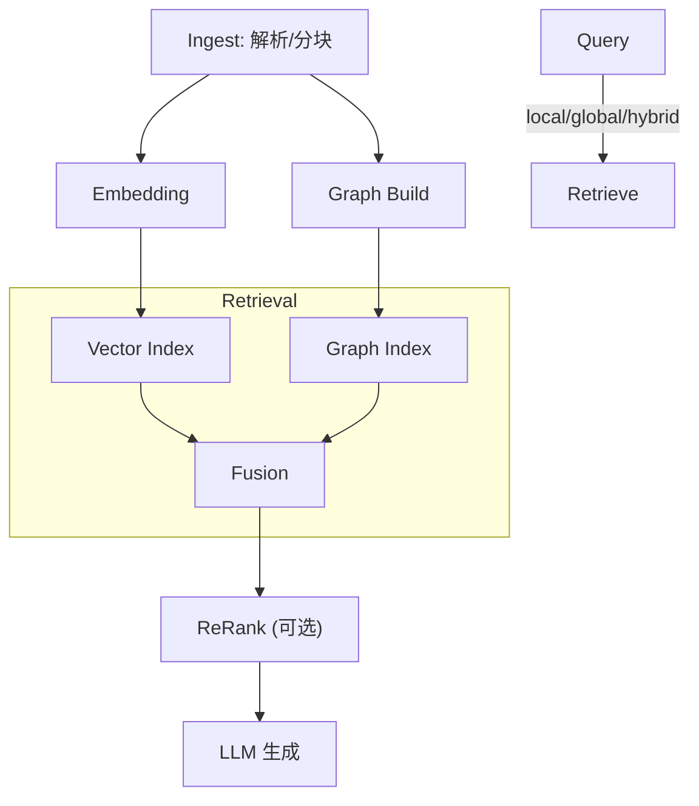

<Callout type="success" title="为什么是 LightRAG">
LightRAG 既是“通用基座”，又有“图索引 + 向量索引”的双层能力，扩展点充足、工程边界清晰，适合二开与迁移。
</Callout>

# LightRAG 深度解析

## 架构与运行路径



## 关键代码索引（核心路径）

- 分块（Chunking）：`lightrag/operate.py::chunking_by_token_size`
- 检索模式：`retrieval_modes.py::{naive_search, local_search, global_search, hybrid_search}`
- 图谱构建：`graph/build_graph.py::{extract_entities, extract_relations, build_graph}`
- 生成 Prompt 管理：`prompt_templates.py::LightRAGPromptManager`

### 分块（Token-aware + Overlap）

```python title="Token 分块（带 overlap）" path=null start=null
def chunking_by_token_size(tokenizer, content: str,
                          overlap_token_size: int = 128,
                          max_token_size: int = 1024,
                          split_by_character: str | None = None):
    tokens = tokenizer.encode(content)
    results = []
    if split_by_character:
        # 先按大粒度分隔符切，再做 token 限制
        for section in content.split(split_by_character):
            t = tokenizer.encode(section)
            for i in range(0, len(t), max_token_size - overlap_token_size):
                results.append(tokenizer.decode(t[i:i+max_token_size]).strip())
    else:
        for i in range(0, len(tokens), max_token_size - overlap_token_size):
            results.append(tokenizer.decode(tokens[i:i+max_token_size]).strip())
    return results
```

参数要点：
- max_token_size: 512/1024/2048（受 embedding/LLM 上限与延迟影响）
- overlap_token_size: 128/256（保持跨块上下文完整）
- split_by_character: `"\n\n"`/`"\n"` 推荐搭配中文标点（`"。"`）

调优建议：
- 文档长且结构清晰：优先 `split_by_character="\n\n"` + token 控制
- 代码/表格：考虑“结构化 chunker”（函数/类边界、表格行为单位）

### 双层检索与四模式

```python title="四种检索模式" path=null start=null
async def naive_search(query, top_k=10):
    q = await get_embedding(query)
    return await vector_db.query(q, top_k=top_k)

async def local_search(query, top_k=10):
    ents = await naive_search(query, top_k=top_k*2)
    neighbors = []
    for e in ents:
        neighbors += await graph_db.get_neighbors(e, depth=1)
    return await rank_by_relevance(query, neighbors)[:top_k]

async def global_search(query, top_k=10):
    q = await get_embedding(query)
    comms = await graph_db.find_relevant_communities(q, top_k=5)
    reps = []
    for c in comms: reps += await c.get_representatives()
    return await fuse_community_and_entity_scores(query, reps)[:top_k]

async def hybrid_search(query, top_k=10):
    qtype = await analyze_query_type(query)
    if qtype == 'specific':
        local = await local_search(query, top_k)
        glob = await global_search(query, int(top_k*0.3))
        return await weighted_fusion([local, glob], [0.7, 0.3])
    else:
        local = await local_search(query, int(top_k*0.3))
        glob = await global_search(query, top_k)
        return await weighted_fusion([local, glob], [0.3, 0.7])
```

模式选择：
- specific/局部问题（函数/定义/具体字段）→ local/或偏 local 的 hybrid
- 总结/趋势/对比 → global/或偏 global 的 hybrid

### 生成（Prompt 双模式）

```python title="Prompt 管理（全局/本地模式）" path=null start=null
class LightRAGPromptManager:
    def build_prompt(self, query: str, contexts: list[str], mode: str | None = None) -> str:
        mode = mode or self.select_mode(query)
        template = self.global_template if mode=='global' else self.local_template
        context_str = "\n".join([f"[doc_{i+1}]\n{c}" for i,c in enumerate(contexts)])
        return template.format(context=context_str, query=query)
```

全局模式（synthesis）vs 本地模式（precision）在“回答风格/来源引用”上有显著差别。

## 参数网格实验（建议复现实验）

- 分块：`chunk_size ∈ {512,1024}, overlap ∈ {128,256}`
- 模式：`naive/local/global/hybrid`
- 图谱增强：ON vs OFF（只用向量）

记录指标：Recall@10、NDCG@10、P95 延迟、生成引用覆盖率（被引用的 doc_n 覆盖率）。

预期：
- overlap 128→256：Recall 与引用覆盖有提升，但向量条目与索引时间上升
- hybrid 对“总结/对比”类问题优势明显，对具体定位问题 local 更稳

## 生产落地要点

- 分块缓存：避免重复分块（内容哈希）；embedding 也做缓存（语义哈希）
- 图谱一致性：解析→抽取→入库的事务边界与重放，避免“孤儿节点/悬挂关系”
- 多后端：存储/索引可插拔，注意统一接口（add/query/filters/batch）

## 风险与坑

- 图谱构建质量直接影响 global 模式效果（建议先做实体/关系的质量抽样）
- hybrid 权重没有一劳永逸数值，建议按场景（FAQ/TechDocs/代码）设置不同 profile
- 过大 chunk 让生成“跑偏”，过小 chunk 让检索“断章”，先做网格再定默认

## 迁移指南（到你的栈）

- 先固化 chunking 与 hybrid 的接口适配层（面向“检索器+融合器”的抽象）
- 图谱引擎（Neo4j/NetworkX）做薄适配：`get_neighbors`/`find_relevant_communities`
- Prompt 管理分层（system/task/context），统一引用标记（[doc_N]）规范

## 参考

- LangChain/LlamaIndex 分块与图谱工具
- RRF/混合检索资料、Graph-augmented retrieval 博文
- 向量库（Qdrant/FAISS/Milvus）与图数据库（Neo4j）调优指南
