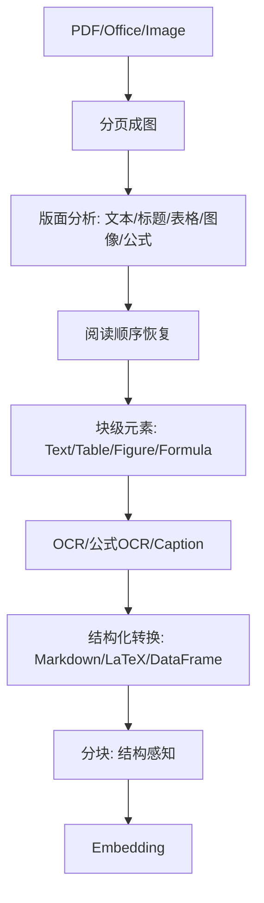

<Callout type="info" title="ragflow 的价值">
对“非纯文本”文档（财报/论文/技术手册），ragflow 的版面+结构化解析链路能显著提升 RAG 的可用上限。
</Callout>

# ragflow 深度解析

## 解析链路总览



## 关键实现要点

### 版面分析（Layout）

```python title="版面分析接口" path=null start=null
class DeepDocParser:
    def __init__(self, layout_model="layoutlmv3",
                 table_model="table-transformer",
                 ocr_engine="paddleocr",
                 enable_formula_ocr=True, enable_image_caption=True):
        self.layout_model = self._load_layout_model(layout_model)
        self.table_model = self._load_table_model(table_model)
        self.ocr = self._load_ocr(ocr_engine)
        if enable_formula_ocr: self.formula_ocr = self._load_formula_ocr()
        if enable_image_caption: self.captioner = self._load_captioner()

    def parse_pdf(self, pdf_path: str) -> list[dict]:
        pages = self._pdf_to_images(pdf_path)
        blocks = []
        for i, img in enumerate(pages, 1):
            regions = self.layout_model.detect(img)  # [{'type': 'text'|'table'|'figure'|'formula', 'bbox':...}]
            regions = self._sort_reading_order(regions)
            for order, r in enumerate(regions, 1):
                blocks += self._parse_region(img, r, i, order)
        return blocks
```

- LayoutLMv3/DocLayNet 族模型进行区域检测
- 低置信度过滤（score>0.5）+ 多栏检测（left→right, top→bottom）

### 表格结构识别（Structure + OCR）

```python title="表格结构识别 + OCR" path=null start=null
def _parse_table(self, table_image) -> dict:
    structure = self.table_model.detect_structure(table_image)
    rows, cols, cells = structure['rows'], structure['cols'], structure['cells']
    data = [["" for _ in range(cols)] for _ in range(rows)]
    for c in cells:
        text = self.ocr.read(self._crop(table_image, c['bbox']))
        for r in range(c['row'], c['row']+c['rowspan']):
            for k in range(c['col'], c['col']+c['colspan']):
                data[r][k] = text if (r==c['row'] and k==c['col']) else ""
    return {"data": data, "markdown": _to_markdown(data)}
```

- 处理合并单元格（rowspan/colspan）
- 输出 Markdown 表格（用于文本检索）+ 原图（用于视觉检索）

### 公式与图像

```python title="公式/图像处理" path=null start=null
def _parse_formula(self, image):
    latex = self.formula_ocr.predict(image) # Nougat/Pix2Tex
    return {"type": "formula", "content": f"$${latex}$$"}

def _parse_figure(self, image):
    caption = self.captioner.generate(image)  # BLIP2/ColPali caption
    return {"type": "image", "content": f"[Image: {caption}]", "image": encode(image)}
```

### 阅读顺序恢复（Reading Order）

- 多栏检测后，按栏内自上而下；标题跨栏需优先
- 复杂布局建议：先粗排（bbox y1/x1）后细排（列宽聚类）

## 策略对比：hi_res vs fast vs ocr_only

| 策略 | 速度 | 准确率 | 适用场景 |
|------|------|--------|---------|
| fast | 高 | 中 | 文本为主，无复杂表格 |
| hi_res | 中 | 高 | 财报/论文/技术手册 |
| ocr_only | 低 | 中 | 扫描件/图片 PDF |

建议：解析链路优先 hi_res；对纯文本/大批量走 fast；对扫描件兜底 ocr_only。

## 实验建议（可复现）

数据：公开财报 PDF（含表格/图表/公式页）

- 任务A：表格完整率 = 识别单元格/标注单元格（目标>95%）
- 任务B：文本字符准确率（目标>98%）
- 任务C：端到端问答的“引用覆盖率”（答案中提到的数字/术语能在解析内容中定位）

对比：hi_res vs fast；公式OCR ON/OFF；图像caption ON/OFF。

## 常见错误画廊（及修复）

- 表格错位：无边框表格 → table-transformer + 行列分割线检测
- 公式丢失：图片内公式 → Pix2Tex/Nougat + LaTeX
- 乱码：子集字体/编码问题 → 退回 OCR 模式（而非文本抽取）

## 生产落地清单

- 解析缓存（页级/区域级）+ 内容哈希去重
- 失败重试与死信队列（OCR/公式失败的重跑）
- 质量抽样：每 N 份文档抽样比对（字符准确率/表格完整率）

## 迁移与融合

- 将表格同时以“Markdown + 原图 + DataFrame”入库：文本检索 + 视觉检索 + 数据查询三用
- 与 ColPali 融合：页级向量 + 文本向量并行检索（RRF/加权融合）

## 参考

- LayoutLMv3 / Table-Transformer / Pix2Tex / BLIP2
- PDF 版面分析与读取顺序论文/实现
- ColPali 多模态检索资料