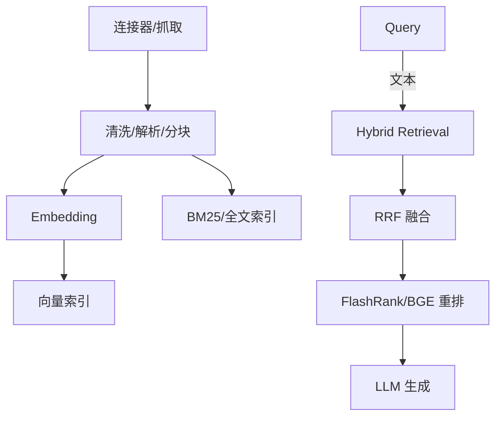

<Callout type="success" title="SurfSense 的工程化">
SurfSense 提供“从数据连接器→混检→重排→前端”的一体化链路，便于复用其 SQL/RRF/轻量重排实践。
</Callout>

# SurfSense 深度解析

## 架构路径



## Postgres 混检（向量 + 全文）

```python title="Postgres CTE + RRF" path=null start=null
async def postgres_hybrid_search(query_text: str, query_vec: list[float], user_id: int, top_k: int=10):
    sql = f"""
    WITH vector_results AS (
        SELECT id, content,
               1 - (embedding <=> :qv::vector) AS vector_score,
               ROW_NUMBER() OVER (ORDER BY embedding <=> :qv::vector) AS vector_rank
        FROM documents
        WHERE user_id = :uid
        LIMIT 50
    ),
    fulltext_results AS (
        SELECT id, content,
               ts_rank(to_tsvector('english', content), plainto_tsquery('english', :qt)) AS text_score,
               ROW_NUMBER() OVER (ORDER BY ts_rank(to_tsvector('english', content), plainto_tsquery('english', :qt)) DESC) AS text_rank
        FROM documents
        WHERE user_id = :uid AND to_tsvector('english', content) @@ plainto_tsquery('english', :qt)
        LIMIT 50
    )
    SELECT COALESCE(v.id,f.id) AS id,
           COALESCE(v.content,f.content) AS content,
           (COALESCE(1.0/(60+v.vector_rank),0) + COALESCE(1.0/(60+f.text_rank),0)) AS rrf
    FROM vector_results v
    FULL OUTER JOIN fulltext_results f ON v.id=f.id
    ORDER BY rrf DESC
    LIMIT :k;
    """
    # 执行略
```

要点：
- k=60 为常见 RRF 平滑常数，粗排 topN 建议 50/100 视延迟取舍
- BM25 语言需要与内容匹配（多语言可分字段/多索引）

## 轻量重排（FlashRank）与重型重排（BGE/Cohere）

```python title="FlashRank 重排" path=null start=null
from flashrank import Ranker, RerankRequest

def rerank_with_flashrank(query: str, passages: list[str], top_k: int=10):
    ranker = Ranker(model_name="ms-marco-MiniLM-L-12-v2")  # 轻量 CPU 友好
    req = RerankRequest(query=query, passages=[{"text": p} for p in passages])
    results = ranker.rerank(req)
    return [r for r in results[:top_k]]
```

对比建议：
- CPU-only 环境：FlashRank 延迟 ~10-20ms/20篇；BGE-base 需 GPU ~100ms/20篇
- 质量：BGE/Cohere > FlashRank（NDCG@10 +5~10%）

## RRF/TopN 灵敏度实验

- 变量：`RRF k ∈ {30, 60, 90}`, `粗排TopN ∈ {20, 50, 100}`
- 指标：NDCG@10、P95 延迟、总召回命中率
- 预期：TopN 越大→质量趋稳但延迟线性升；k 较小→提升头部文档权重

## 生成与引用

- 上下文拼接前保留来源 doc_id；答案内引用（[doc_N]）→ 前端跳转原文片段
- UI 侧展示：召回路径（向量/BM25）、RRF 得分、重排前后排序变化曲线（可解释）

## 生产落地要点

- SQL/索引：全文索引（tsvector）+ pgvector；必要字段创建 GIN/HNSW
- 参数：向量维度与归一化一致（cosine/inner），BM25 字段预清洗
- 缓存：热查询/热片段缓存 + Rerank 结果缓存（query-hash）

## 风险与坑

- 多语言全文搜索：需要多字典或分字段；错误分词导致 BM25 退化
- RRF 合并键问题：ID 不一致导致 FULL OUTER JOIN 未对齐 → 需预对齐
- 重排截断：长文 passage 切分策略直接影响重排质量

## 模板与清单

- SQL 模板：上文 CTE + FULL OUTER JOIN + RRF 计算
- FlashRank/BGE 切换：策略 `light|heavy` + 阈值（质量/延迟）
- 监控：每阶段延迟、RRF 得分分布、重排耗时、P95 动态看板

## 参考

- pgvector / PostgreSQL FTS 文档
- FlashRank 与 BGE reranker 资料
- RRF（Reciprocal Rank Fusion）论文与实现